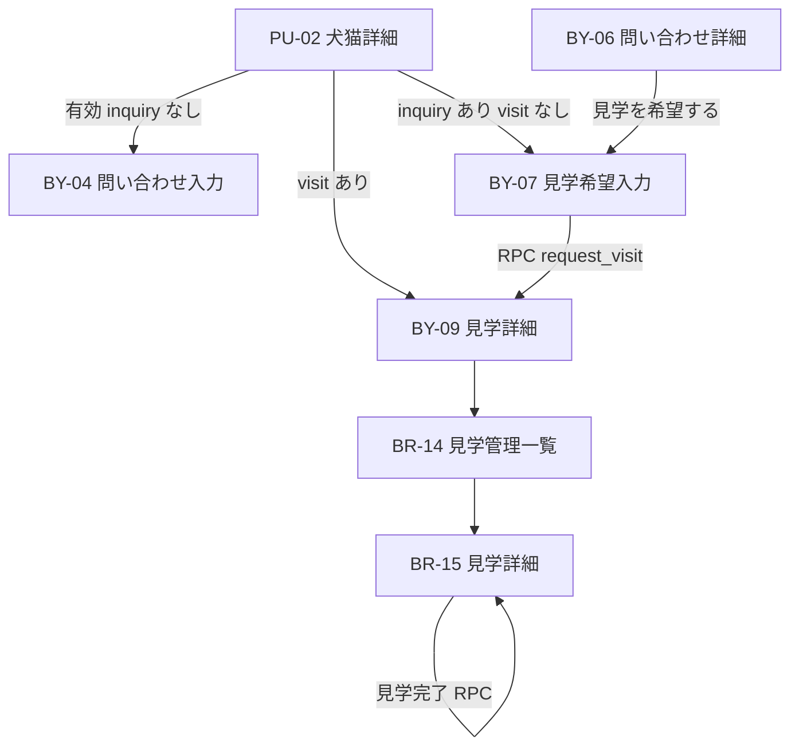
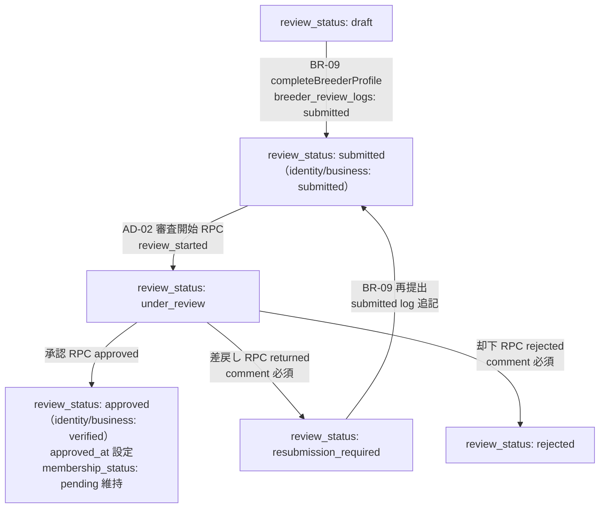

# 業務フロー

## 概要

WithTama における主要な業務フローを定義します。

## ブリーダー：犬猫登録〜掲載

```
ログイン
  → ダッシュボード（BR-06）
  → 犬猫管理一覧（BR-07 / BR-10）
  → 新規登録（BR-08 / BR-10）
  → 写真アップロード
  → 公開申請（draft → under_review）
  → 管理者審査待ち
  → 承認後 published / 差戻し後 draft で修正・再申請
```

## 購入希望者：犬猫探索・問い合わせ・見学

```
トップページ
  → 犬猫一覧（PU-01）
  → 犬猫詳細（PU-02）
  → 問い合わせ（BY-04）— 初回
  → 問い合わせ詳細（BY-06）— メッセージ継続
  → 見学希望（BY-07）— inquiry 必須・visit 未作成時
  → 見学詳細（BY-09）— 購入希望者確認
```

### 見学フロー（Decision No.117〜No.123）



| 段階         | 操作者                  | visits.status | inquiries.status              |
| ------------ | ----------------------- | ------------- | ----------------------------- |
| 見学希望送信 | 購入希望者              | `requested`   | `visit_requested`             |
| 日時確定     | ブリーダー              | `scheduled`   | `visit_scheduled`             |
| 見学完了     | ブリーダー              | `completed`   | `completed`                   |
| キャンセル   | 購入希望者 / ブリーダー | `canceled`    | `replied`（メッセージ継続可） |

**第1期で含まない:** 予約カレンダー、空き時間管理、サイト内売買契約、オンライン決済、詳細住所自動開示、電子署名。

## ブリーダー：見学管理

```
サイドバー / ダッシュボード
  → 見学管理一覧（BR-14）
  → 見学詳細（BR-15）
  → 日時確定 / 日程調整 / 現物確認・対面説明記録 / 見学完了
```

## ブリーダー：プロフィール申請〜審査

```
ログイン
  → プロフィール入力（BR-09 Step 1〜5）
  → 提出完了（review_status: submitted）
  → 管理者審査待ち
  → 差戻し時：修正・再提出（resubmission_required → submitted）
  → 承認後：review_status = approved（membership_status は pending のまま）
  → 将来：Stripe 月額課金開始後 membership_status = active
```

### ブリーダー審査ステータス遷移（Decision No.125〜134）



| 段階     | 操作者     | review_status           | verification status（第1期） | ログ action      |
| -------- | ---------- | ----------------------- | ---------------------------- | ---------------- |
| 初回提出 | ブリーダー | `submitted`             | `submitted`                  | `submitted`      |
| 審査開始 | 管理者     | `under_review`          | `submitted` 維持             | `review_started` |
| 承認     | 管理者     | `approved`              | `verified`                   | `approved`       |
| 差戻し   | 管理者     | `resubmission_required` | **`submitted` 維持**         | `returned`       |
| 却下     | 管理者     | `rejected`              | 変更なし（第1期）            | `rejected`       |
| 再提出   | ブリーダー | `submitted`             | `submitted`                  | `submitted`      |

**第1期で含まない:** `rejected` からの再申請、メール通知、Stripe 連携、登録期限の自動監視。

**Stripe 境界（Decision No.130）:** 審査承認だけでは `membership_status = active` にならず、PU-01/02 の一般公開条件を満たさない。

## 管理者：ブリーダー審査

```
管理画面（AD-00）
  → ブリーダー審査一覧（AD-01）
  → ブリーダー審査詳細（AD-02）
  → 審査開始 / 承認 / 差戻し / 却下
```

## 管理者：犬猫掲載審査

```
管理画面（AD-00）
  → 犬猫掲載審査一覧（AD-10）
  → 犬猫掲載審査詳細（AD-11）
  → 承認して公開 / 差戻し
```

### 犬猫掲載ステータス遷移（Decision No.96, No.97, No.98, No.105）

```
draft
  ↓ ブリーダー公開申請
  │   pets.status: draft → under_review
  │   pet_review_logs: action = submitted
under_review
  ├─ 管理者承認
  │   pets.status: under_review → published
  │   pet_review_logs: action = approved
  │   ↓
  │ published
  │
  └─ 管理者差戻し（理由必須）
      pets.status: under_review → draft
      pet_review_logs: action = returned, comment = 差戻し理由
      ↓ ブリーダー修正
     draft
      ↓ 再申請
     under_review
      pet_review_logs: action = submitted（再追記）
```

公開申請・承認・差戻しのたびに `pet_review_logs` へ追記する。申請日時は最新の `action = submitted` の `created_at` を使用する（Decision No.98）。

### 公開承認の前提（Decision No.101）

犬猫を `published` にできるのは、当該ブリーダーが管理者審査で承認済みかつ、第一種動物取扱業登録が有効な場合に限る。具体条件は実 DB 定義確認後に実装する。

## 関連ドキュメント

- [画面設計](../04_画面設計/README.md)
- [BY-07 見学希望入力](../04_画面設計/BY-07_見学希望入力.md)
- [BR-09 ブリーダープロフィール](../04_画面設計/BR-09_ブリーダープロフィール.md)
- [BR-14 見学管理一覧](../04_画面設計/BR-14_見学管理一覧.md)
- [visits テーブル](../05_データベース設計/visits.md)
- [AD-01 ブリーダー審査一覧](../04_画面設計/AD-01_ブリーダー審査一覧.md)
- [AD-02 ブリーダー審査詳細](../04_画面設計/AD-02_ブリーダー審査詳細.md)
- [breeder_review_logs テーブル](../05_データベース設計/breeder_review_logs.md)
- [AD-10 犬猫掲載審査一覧](../04_画面設計/AD-10_犬猫掲載審査一覧.md)
- [AD-11 犬猫掲載審査詳細](../04_画面設計/AD-11_犬猫掲載審査詳細.md)
- [pet_review_logs テーブル](../05_データベース設計/pet_review_logs.md)
- [要件定義](../02_要件定義/第1期要件定義.md)
