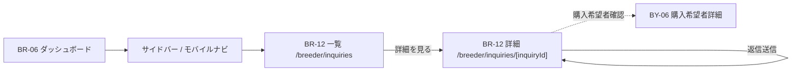

# BR-12 ブリーダー問い合わせ

| 項目            | 内容                                            |
| --------------- | ----------------------------------------------- |
| 画面 ID         | BR-12（一覧・詳細共通）                         |
| 画面名          | 問い合わせ一覧 / 問い合わせ詳細・返信           |
| URL（一覧）     | `/breeder/inquiries`                            |
| URL（詳細）     | `/breeder/inquiries/[inquiryId]`                |
| 種別            | 一覧 = 表示 / 詳細 = 編集 URL（Decision No.72） |
| 対象ロール      | breeder                                         |
| 状態            | **設計確定・未実装**                            |
| Feature（予定） | `src/features/inquiries/`                       |
| 認証            | **必須**（breeder layout ガード）               |
| 共通レイアウト  | `src/app/breeder/layout.tsx`                    |

本設計書は **一覧** と **詳細・返信** を 1 ファイルにまとめる（README 上同一 BR-12 ID のため）。

---

## 画面目的

ブリーダーが購入希望者からの問い合わせを **確認・返信** する。

第1期は非同期テキストメッセージ。ダッシュボード（BR-06）上では返信せず、本 URL で操作する（Decision No.71）。

## 遷移

---

## BR-12 問い合わせ一覧

### URL

`/breeder/inquiries`

### データ取得

1. `auth.uid()` → `breeders.id`
2. `inquiries` WHERE `breeder_id` 一致 AND **`deleted_at IS NULL`**
3. 並び: `last_message_at DESC NULLS LAST`, `created_at DESC`
4. pet 名 — pet テーブルまたは管理用 DTO（ブリーダーは本人 pet を READ 可）
5. buyer 表示名 — [Decision No.112](#buyer-情報開示) 参照
6. 未読 — 当該 inquiry に **buyer 送信** かつ `is_read = false` の message が 1 件以上

### 一覧表示項目

| #   | 表示項目           | 備考                                 |
| --- | ------------------ | ------------------------------------ |
| 1   | 犬猫名             | `public_display_name` または管理名   |
| 2   | 購入希望者表示名   | **`display_name` のみ**              |
| 3   | 問い合わせ状態     | 日本語ラベル                         |
| 4   | 最終メッセージ日時 | `last_message_at` / `created_at`     |
| 5   | 未読               | Badge「未読」等（未読 0 件は非表示） |
| 6   | 詳細を見る         | → 詳細 URL                           |

### Empty State

| 要素   | 内容                                                     |
| ------ | -------------------------------------------------------- |
| 見出し | 問い合わせはまだありません。                             |
| 説明   | 購入希望者からの問い合わせが届くと、ここに表示されます。 |

### レスポンシブ

| デバイス       | レイアウト                         |
| -------------- | ---------------------------------- |
| スマートフォン | 1 カラム Card。未読 Badge 目立たせ |
| PC             | テーブルまたは Card 一覧           |

---

## BR-12 問い合わせ詳細・返信

### URL

`/breeder/inquiries/[inquiryId]`

### 上部サマリー

| #   | 表示項目           | 備考                    |
| --- | ------------------ | ----------------------- |
| 1   | 犬猫情報           | 名称・種別等（簡潔）    |
| 2   | 購入希望者表示名   | **`display_name` のみ** |
| 3   | 問い合わせ状態     | 日本語ラベル            |
| 4   | 問い合わせ開始日時 | `created_at`            |

### 表示しない buyer 情報（第1期）

| 項目           | 理由                                      |
| -------------- | ----------------------------------------- |
| メールアドレス | `auth.users` / PII 非開示                 |
| 電話番号       | `buyers.phone` — 問い合わせ画面では非表示 |
| 住所           | 非表示                                    |

問い合わせ画面上の **テキストやり取り** を基本とする（Decision No.112）。

### メッセージ履歴

BY-06 と同型の **非チャット過剰 UI**:

- 時系列昇順
- buyer / breeder ラベル + 視覚的区別
- 送信日時表示

### 返信入力

| 項目     | 仕様                                  |
| -------- | ------------------------------------- |
| 入力     | textarea（2000 文字上限・新規設計値） |
| ボタン   | 「返信する」                          |
| 二重送信 | disabled + 「送信中…」                |

### 返信処理

1. inquiry が本人 breeder に属することを Server 確認
2. status が送信可能（BY-06 と同じ closed / completed 除外）
3. `inquiry_messages` INSERT（`sender_type = breeder`）
4. `inquiries.last_message_at` 更新
5. **初回 breeder 返信時** `inquiries.status` → `replied`（[inquiry_messages.md](../05_データベース設計/inquiry_messages.md) 方針）
6. revalidate

### 既読

詳細を breeder が開いた時点で、**buyer 送信分の未読** を既読化（Decision No.116）。

### 送信不可 status

BY-06 と同様 — `closed` / `completed` では返信入力非表示。

---

## buyer 情報開示

[Decision No.112](../01_設計変更管理/DecisionLog.md#decision-no112)

| 第1期方針    | 内容                                                  |
| ------------ | ----------------------------------------------------- |
| 開示する     | 購入希望者 **`display_name`（表示名）のみ**           |
| 開示しない   | メール・電話・住所・`full_name`（設計上は非表示）     |
| RLS（第1期） | **`buyers` テーブルへの breeder SELECT は追加しない** |

### 表示名の取得（Decision No.112 確定）

**`public.get_inquiry_buyer_display_name(inquiry_id)` RPC** を使用する（Migration `20260821153000`、**作成済み・未適用**）。

| 案  | 概要                                                                      | 状態       |
| --- | ------------------------------------------------------------------------- | ---------- |
| A   | 問い合わせ作成時に `inquiries` へ `buyer_display_name` をスナップショット | **不採用** |
| B   | SECURITY DEFINER RPC                                                      | **採用**   |

Service Role クライアント経由の一括取得は **禁止**。

---

## 権限

| ロール  | 一覧                | 詳細・返信     |
| ------- | ------------------- | -------------- |
| breeder | 本人宛 inquiry のみ | 本人宛のみ返信 |
| buyer   | アクセス不可        | —              |
| admin   | 第1期 UI 対象外     | RLS 上は可能   |

## ステータス

第1期 UI から **新規に** `visit_requested` / `visit_scheduled` / `completed` / `closed` を設定 **しない**。

`replied` は breeder 初回返信時に Server 自動設定。

[問い合わせ status 表示定義](./README.md#問い合わせ-status-表示定義)

## エラー

BY-06 と同型 + breeder 向け文言。内部 DB エラーは表示しない。

## 第1期スコープ外

- buyer 連絡先開示
- 見学管理
- status 手動変更 UI
- メール通知
- Realtime

## 関連 Decision

- [No.71](../01_設計変更管理/DecisionLog.md#decision-no71) — ダッシュボード表示専用
- [No.72](../01_設計変更管理/DecisionLog.md#decision-no72) — 詳細 URL で返信
- [No.112](../01_設計変更管理/DecisionLog.md#decision-no112) — buyer 開示範囲
- [No.113](../01_設計変更管理/DecisionLog.md#decision-no113) — Realtime 不使用

## 関連ドキュメント

- [BR-06 ブリーダーダッシュボード](./BR-06_ブリーダーダッシュボード.md)
- [BY-06 購入希望者問い合わせ詳細](./BY-06_購入希望者問い合わせ詳細.md)
- [inquiries テーブル](../05_データベース設計/inquiries.md)
