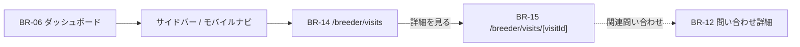

# BR-14 見学管理一覧

| 項目            | 内容                              |
| --------------- | --------------------------------- |
| 画面 ID         | BR-14                             |
| 画面名          | 見学管理一覧                      |
| URL             | `/breeder/visits`                 |
| 種別            | 表示（一覧）                      |
| 対象ロール      | breeder                           |
| 状態            | **実装済み**                      |
| Feature（予定） | `src/features/visits/`            |
| 認証            | **必須**（breeder layout ガード） |
| 共通レイアウト  | `src/app/breeder/layout.tsx`      |

## 画面目的

ブリーダーが **自分が管理する犬猫に紐づく見学** を一覧確認し、詳細（BR-15）へ誘導する。

第1期は非同期管理。ダッシュボード（BR-06）上では操作せず、本 URL で管理する（Decision No.71 整合）。

## 遷移

## データ取得

1. `auth.uid()` → `breeders.id`
2. `visits` WHERE `breeder_id` 一致 AND **`deleted_at IS NULL`**
3. pet 名 — 本人管理 pet（ブリーダーは本人 pet を READ 可）
4. buyer 表示名 — `get_inquiry_buyer_display_name(inquiry_id)` RPC（Decision No.112）
5. 関連 `inquiries.status`

### 並び順

| 優先 | ソートキー                                                         |
| ---- | ------------------------------------------------------------------ |
| 1    | `status = requested` を優先（未対応を上に — UI ソートまたは CASE） |
| 2    | `scheduled_at ASC NULLS LAST`（近い確定日時順）                    |
| 3    | `requested_at DESC`                                                |
| 4    | `created_at DESC`                                                  |

## 一覧表示項目

| #   | 表示項目         | 備考                                   |
| --- | ---------------- | -------------------------------------- |
| 1   | 犬猫名           | `public_display_name` または管理名     |
| 2   | 購入希望者表示名 | **`display_name` のみ**（RPC）         |
| 3   | 見学状態         | `visits.status` ラベル                 |
| 4   | 日時             | 確定 `scheduled_at` / 未確定は第一希望 |
| 5   | 問い合わせ状態   | 参考表示                               |
| 6   | 詳細を見る       | → BR-15                                |

### 状態 Badge（例）

| status      | 表示               |
| ----------- | ------------------ |
| `requested` | 見学希望（要対応） |
| `scheduled` | 見学予定           |
| `completed` | 見学完了           |
| `canceled`  | キャンセル         |

## Empty State

| 要素   | 内容                                                 |
| ------ | ---------------------------------------------------- |
| 見出し | 見学希望はまだありません。                           |
| 説明   | 購入希望者から見学希望が届くと、ここに表示されます。 |

## 権限

| ロール  | 操作                                   |
| ------- | -------------------------------------- |
| breeder | 本人 `breeder_id` の visit のみ SELECT |
| buyer   | アクセス不可                           |
| admin   | 第1期 UI 対象外                        |

## レスポンシブ

| デバイス       | レイアウト                               |
| -------------- | ---------------------------------------- |
| スマートフォン | 1 カラム Card。`requested` は Badge 強調 |
| PC             | テーブルまたは Card 一覧                 |

## 第1期スコープ外

- カレンダー UI
- buyer 連絡先開示
- 一覧からの一括操作
- メール通知

## 関連 Decision

- [No.71](../01_設計変更管理/DecisionLog.md#decision-no71) — ダッシュボード表示専用
- [No.112](../01_設計変更管理/DecisionLog.md#decision-no112) — buyer 表示名 RPC
- [No.117](../01_設計変更管理/DecisionLog.md#decision-no117) — 画面 ID（BR-11 重複解消）

## 関連ドキュメント

- [BR-15 見学詳細](./BR-15_見学詳細.md)
- [BR-12 ブリーダー問い合わせ](./BR-12_ブリーダー問い合わせ.md)
- [visits テーブル](../05_データベース設計/visits.md)
