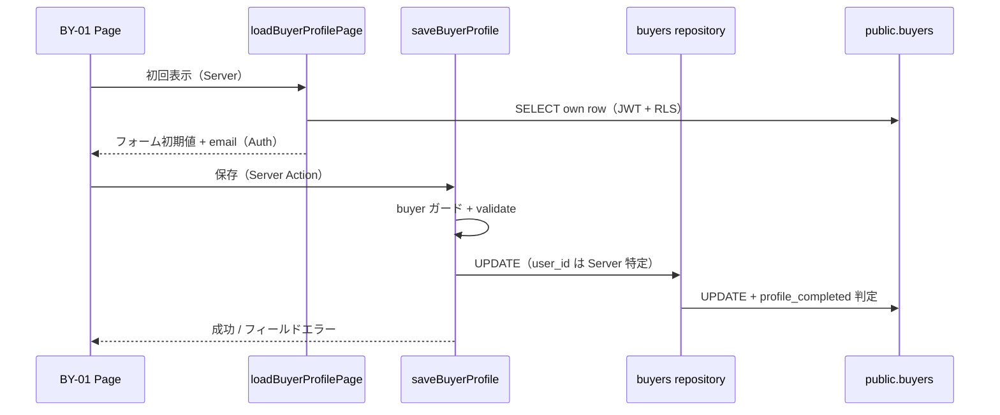

# BY-01 購入希望者プロフィール

| 項目       | 内容                                                             |
| ---------- | ---------------------------------------------------------------- |
| 画面 ID    | BY-01                                                            |
| 画面名     | 購入希望者プロフィール                                           |
| URL        | `/buyer/profile`                                                 |
| 種別       | 編集（単一フォーム。多段階 Wizard は第1期対象外）                |
| 対象ロール | buyer（`user_metadata.role === "buyer"`）                        |
| 状態       | **設計確定**（未実装）                                           |
| 想定実装   | `src/app/(buyer)/buyer/profile/`、`src/features/buyers/`（新規） |

## 目的

問い合わせ・見学希望などを利用する前提として、購入希望者本人の基本プロフィールを **登録・編集** できるようにする。

第1期では **単一 URL・単一フォーム** とし、ブリーダー BR-09 のような多段階 Wizard は採用しない。

## 権限・認証（本実装時）

Server 側で buyer 専用ガードを設ける。既存の認証・ロール判定（`src/features/auth/`）を再利用し、新しい独自認証方式は作らない。**Service Role は使用しない。**

| 状態       | 遷移先・動作           |
| ---------- | ---------------------- |
| 未ログイン | `/login` へ redirect   |
| buyer      | 本画面を利用可能       |
| breeder    | `/breeder` へ redirect |
| admin      | `/admin` へ redirect   |
| ロール不明 | `/login` へ redirect   |

更新対象の `buyers` レコードは **Server 側で `auth.uid()` から特定** する。フォーム・request body・hidden input の `user_id` / `buyer_id` は信用しない。

## 初回登録と編集の共用（Decision No.62 連携）

`/buyer/profile` を **初回プロフィール登録** と **プロフィール編集** の共通 URL とする。

| `profile_completed` | 表示モード | ページ見出し（案） | 説明文トーン       |
| ------------------- | ---------- | ------------------ | ------------------ |
| `false`             | 初回登録   | プロフィール登録   | 初めての入力を促す |
| `true`              | 編集       | プロフィール       | 更新・確認を促す   |

入口 `/buyer` は既存どおり `profile_completed` に応じて本画面または `/buyer/dashboard` へリダイレクトする（Decision No.62）。

### 保存成功後の遷移

| 条件     | 遷移先             | 備考                                |
| -------- | ------------------ | ----------------------------------- |
| 保存成功 | `/buyer/dashboard` | BY-02 は **現時点プレースホルダー** |

将来、公開犬猫詳細（PU-02）→ 問い合わせ前に本画面へ誘導された場合の「元ページへ戻る」仕様は **問い合わせ画面設計時の検討事項** とし、本設計の実装仕様には含めない。

## UI / UX

### デザインシステム

[デザインシステム](../08_デザインシステム/README.md) に従う。

- Tailwind CSS + shadcn/ui（`Input`, `Textarea`, `Select`, `Button`, `Card`, `Label`, `Switch` 等）
- lucide-react アイコン
- スマートフォン優先（`max-w-*` + 縦積み。PC でも単一カラム中心）
- ブランドカラー（`--primary` 等）を踏襲

### レイアウト構成

第1期は buyer 専用 Header / Sidebar **未整備** のため、公開系と同系の **`SiteHeader`**（`src/components/layout/site-header.tsx`）を上部に配置する。buyer 専用ナビの完成形は [未決定事項](#未決定事項) とする。

```
SiteHeader
└─ main（max-w-2xl 程度、px-4 py-6 sm:py-10）
   ├─ 画面 ID ラベル（BY-01）
   ├─ ページタイトル
   ├─ 説明文（WithTama の目的が自然に伝わる短文）
   ├─ Card: 基本情報
   ├─ Card: 希望・自己紹介
   ├─ Card: 通知設定
   └─ 保存ボタン（フル幅または右寄せ）
```

### 説明文（案）

事務的な会員情報画面ではなく、次のトーンを基本とする（過度な演出はしない）。

> 大切な家族との出会いのために、あなたの基本情報を登録してください。ブリーダーとのやりとりや見学のご連絡に使用します。

`profile_completed = true` の編集時は、例:

> 登録内容を確認・更新できます。変更は保存ボタンで反映されます。

## 入力項目

### 基本情報

| #   | ラベル   | DB カラム      | 必須 | UI          | 備考                                      |
| --- | -------- | -------------- | ---- | ----------- | ----------------------------------------- |
| 1   | 氏名     | `full_name`    | 必須 | Input       | 本名                                      |
| 2   | 表示名   | `display_name` | 必須 | Input       | bootstrap 仮値をユーザーが変更可能        |
| 3   | メール   | —              | —    | 表示のみ    | Supabase Auth `user.email`。編集不可      |
| 4   | 電話番号 | `phone`        | 必須 | Input `tel` | 日本国内の一般的な電話番号入力を想定      |
| 5   | 都道府県 | `prefecture`   | 必須 | Select      | 47 都道府県。既存定数を再利用（後述）     |
| 6   | 市区町村 | `city`         | 必須 | Input       | 番地・建物名カラムは第1期 DB に存在しない |

### 希望・自己紹介

| #   | ラベル             | DB カラム           | 必須 | UI       | 備考                   |
| --- | ------------------ | ------------------- | ---- | -------- | ---------------------- |
| 7   | 自己紹介           | `profile_text`      | 任意 | Textarea | 家族として迎える想い等 |
| 8   | 希望する種類       | `preferred_species` | 任意 | Select   | `dog` / `cat` / `both` |
| 9   | 希望する犬種・猫種 | `preferred_breed`   | 任意 | Input    | 自由入力               |

### 通知設定

| #   | ラベル     | DB カラム              | 必須 | UI     | 備考                              |
| --- | ---------- | ---------------------- | ---- | ------ | --------------------------------- |
| 10  | メール通知 | `notification_enabled` | —    | Switch | DB default `true` を尊重。boolean |

### 表示ラベル（希望する種類）

| DB 値  | 表示ラベル     |
| ------ | -------------- |
| `dog`  | 犬             |
| `cat`  | 猫             |
| `both` | 犬・猫どちらも |

未選択（NULL）を許容する。空の Select プレースホルダーは「選択しない」等。

### 画面に出さない項目

以下は UI に表示・編集させない。

- `user_id`
- `membership_status`
- `profile_completed`（UI から直接操作不可。Server 側で判定・更新）
- `created_at` / `updated_at` / `deleted_at`
- `id`（buyers 主キー）
- その他内部管理情報

## 都道府県定数

既存の `JAPAN_PREFECTURES`（`src/features/breeder-profile/prefectures.ts`）を **再利用** する。

実装時は `features/buyers` から import するか、共通化先（例: `src/lib/constants/prefectures.ts`）へ移すかは実装工程で判断する。**本設計では再利用方針のみ確定** とする。

## profile_completed の成立条件

以下 **5 項目がすべて有効な値** で保存された場合のみ、`profile_completed = true` とする。

| 項目           | 有効な値の定義                             |
| -------------- | ------------------------------------------ |
| `full_name`    | 前後空白除去後、1 文字以上                 |
| `display_name` | 前後空白除去後、1 文字以上                 |
| `phone`        | 前後空白除去後、1 文字以上（形式検証別途） |
| `prefecture`   | `JAPAN_PREFECTURES` に含まれる             |
| `city`         | 前後空白除去後、1 文字以上                 |

- **任意項目**（`profile_text`, `preferred_species`, `preferred_breed`, `notification_enabled`）の有無は完了条件に **含めない**。
- DB UPDATE が失敗した場合、`profile_completed` を `true` に **しない**。
- 既に `profile_completed = true` のユーザーが編集する場合も、上記 5 項目を **空にできない**（バリデーションで拒否）。保存成功時は `true` を維持。
- `profile_completed` をユーザーが操作するチェックボックス等には **しない**。

## バリデーション

既存プロジェクトの方式（`src/features/breeder-profile/validation.ts`）に合わせ、**フィールド単位のエラーオブジェクト** を返す関数で設計する。

- 保存前に文字列項目は **前後空白を除去**（`trim`）してから検証・DB 保存
- クライアント側でも同一ルールを適用可能だが、**正本は Server Action / Server 側 validation**
- `hasFieldErrors(errors)` 相当で送信可否を判定

### 項目別ルール

| 項目                   | ルール                                                                                                                            |
| ---------------------- | --------------------------------------------------------------------------------------------------------------------------------- |
| `full_name`            | 必須。trim 後 1 文字以上。**最大 80 文字（BY-01 設計値。** DB に CHECK なし）                                                     |
| `display_name`         | 必須。trim 後 1 文字以上。**最大 40 文字（BY-01 設計値。** DB に CHECK なし）                                                     |
| `phone`                | 必須。trim 後 1 文字以上。日本国内の一般的な電話番号入力を想定（下記「電話番号（設計案）」）。**保存形式は未決定**（§未決定事項） |
| `prefecture`           | 必須。`JAPAN_PREFECTURES` に含まれること（BR-10 と同様）                                                                          |
| `city`                 | 必須。trim 後 1 文字以上。**最大 100 文字（BY-01 設計値。** DB に CHECK なし）                                                    |
| `profile_text`         | 任意。入力時 **最大 1000 文字（BY-01 設計値。** DB に CHECK なし）。trim 後空なら NULL 保存                                       |
| `preferred_species`    | 任意。NULL または `dog` / `cat` / `both` のみ（DB CHECK 準拠）                                                                    |
| `preferred_breed`      | 任意。**最大 100 文字（BY-01 設計値。** DB に CHECK なし）。trim 後空なら NULL                                                    |
| `notification_enabled` | boolean。未送信時は DB 既存値または default `true` を維持                                                                         |
| メール（Auth）         | 編集不可。表示のみ Server 側 `getUser()` から取得                                                                                 |

### 電話番号（設計案・保存形式は未決定）

第1期 UI バリデーション案（実装時に [未決定事項](#未決定事項) と整合）:

1. trim 後、空でないこと
2. 許可文字: 数字、`-`、スペース、`(` `)`（一般的な日本の入力）
3. 数字のみ抽出した桁数が **10〜11 桁** であること（携帯・固定の目安）

**保存形式（未決定）:**

- **案 A:** ユーザー入力を trim のみして `text` として保存
- **案 B:** 数字のみ正規化して保存（表示時にフォーマット）

本設計では **案 A を第1期の実装推奨** とするが、Decision 確定前に勝手に正本化しない。

### エラーメッセージ（例）

| 条件                   | メッセージ（例）                   |
| ---------------------- | ---------------------------------- |
| 氏名未入力             | 氏名を入力してください。           |
| 表示名未入力           | 表示名を入力してください。         |
| 電話番号未入力         | 電話番号を入力してください。       |
| 電話番号形式不正       | 電話番号の形式が正しくありません。 |
| 都道府県未選択         | 都道府県を選択してください。       |
| 市区町村未入力         | 市区町村を入力してください。       |
| 文字数超過             | {N}文字以内で入力してください。    |
| preferred_species 不正 | 希望する種類の値が不正です。       |

## 保存処理（本実装時）

### データフロー



### Server Action 方針

| 項目                | 方針                                                                |
| ------------------- | ------------------------------------------------------------------- |
| モジュール          | `src/features/buyers/service.ts`（`"use server"`）                  |
| Repository          | `src/features/buyers/repository.ts`（Server Client、RLS 準拠）      |
| Loader              | `src/features/buyers/loaders.ts`                                    |
| UPDATE 対象         | ログイン buyer の `buyers` 行 1 件のみ                              |
| INSERT              | 本画面では行わない（bootstrap は既存 `createBuyer`）                |
| `profile_completed` | Server 側で 5 必須項目から算出。クライアント入力を受け付けない      |
| `email`             | `buyers` へ保存 **しない**                                          |
| 成功時              | `/buyer/dashboard` へ redirect または revalidate + クライアント遷移 |

## エラー・状態設計

| 状態            | UI の振る舞い                                                                   |
| --------------- | ------------------------------------------------------------------------------- |
| 初回ロード      | Server Component で Loader 実行。取得中はスケルトンまたはページ全体ローディング |
| 保存中          | 保存ボタン disabled + 「保存中…」表示。**二重送信防止**                         |
| 保存成功        | 成功メッセージ（toast または Alert）の後 `/buyer/dashboard` へ遷移              |
| 必須エラー      | フィールド下にエラー文。フォーム全体にも要約 Alert 可                           |
| 形式エラー      | 該当フィールド下に表示。入力値は **消さない**                                   |
| Auth 取得失敗   | 「ログイン情報を取得できませんでした」+ `/login` 誘導                           |
| buyers 取得失敗 | エラー Alert + 再読み込み案内（bootstrap 未完了の rare case は別途）            |
| buyers 更新失敗 | 「保存に失敗しました。時間をおいて再度お試しください。」入力値維持              |
| 未認証          | Server ガードで `/login`                                                        |
| ロール不一致    | buyer 以外は各入口へ redirect                                                   |

## 問い合わせとの関係

第1期方針として、**問い合わせ送信には `profile_completed = true` を必要条件** とする（[Decision No.114](../01_設計変更管理/DecisionLog.md#decision-no114)）。

| 項目                   | 本設計での位置づけ                                                 |
| ---------------------- | ------------------------------------------------------------------ |
| 問い合わせ UI          | [BY-04](../04_画面設計/BY-04_購入希望者問い合わせ入力.md) 等で実装 |
| 問い合わせ API / RLS   | **変更しない**（第1期）                                            |
| profile_completed 強制 | **Server 側必須**（RLS 追加は第1期対象外）                         |

PU-02 公開犬猫詳細に問い合わせ CTA を配置する（[PU-02](./PU-02_公開犬猫詳細.md) 設計更新済み）。

## ブリーダーへの個人情報開示

**本 BY-01 設計・実装によって、ブリーダーが `buyers` テーブルを直接 SELECT できるようにしない。**

維持する既存 RLS（`20260804164648_create_buyers.sql`）:

| 操作   | 方針     |
| ------ | -------- |
| SELECT | 本人のみ |
| INSERT | 本人のみ |
| UPDATE | 本人のみ |

**第1期で行わないこと:**

- `buyers` への breeder SELECT RLS 追加
- `buyers` の public View 作成
- 電話番号等の一般公開

問い合わせ成立後の buyer 情報開示は [Decision No.112](../01_設計変更管理/DecisionLog.md#decision-no112) に従う。第1期 BR-12 では **表示名（`display_name`）のみ**。

## セキュリティ

| 項目                          | 方針                                     |
| ----------------------------- | ---------------------------------------- |
| `buyers` READ/UPDATE          | 本人のみ（RLS）                          |
| Service Role                  | **不使用**                               |
| メール正本                    | Supabase Auth。`buyers` へ重複保存しない |
| `profile_completed`           | UI から直接指定させない。Server 側算出   |
| `user_id`                     | フォーム送信させない                     |
| 更新対象 buyer                | Server 側で `auth.uid()` から特定        |
| hidden input の ID            | 信用しない                               |
| 他 buyer ID の指定            | URL / body から受け付けない              |
| ブリーダーへの buyer PII 公開 | 本設計では行わない                       |
| 公開 View への buyer 情報追加 | 行わない                                 |

## 関連 DB

| テーブル        | 用途               |
| --------------- | ------------------ |
| `public.buyers` | プロフィール保存先 |
| `auth.users`    | 認証・メール表示   |

詳細: [buyers テーブル](../05_データベース設計/buyers.md)

## 関連 Decision

- [Decision No.61](../01_設計変更管理/DecisionLog.md#decision-no61) — 仮登録・`profile_completed`
- [Decision No.62](../01_設計変更管理/DecisionLog.md#decision-no62) — 入口 URL リダイレクト
- [Decision No.73](../01_設計変更管理/DecisionLog.md#decision-no73) — `features/` モジュール構成

## 未決定事項

| #   | 論点                                                                                                                                                 |
| --- | ---------------------------------------------------------------------------------------------------------------------------------------------------- |
| 1   | ブリーダーへ buyer 情報を開示する具体方式（表示名取得の migration / RPC） — [Decision No.112](../01_設計変更管理/DecisionLog.md#decision-no112) 参照 |
| 2   | ~~問い合わせ時の `profile_completed` をアプリ層のみで保証するか RLS でも保証するか~~ → **Decision No.114 で Server 側必須に確定**                    |
| 3   | 問い合わせから BY-01 へ来た場合の戻り先                                                                                                              |
| 4   | buyer 専用 Header / Navigation の完成形                                                                                                              |
| 5   | ログアウト UI の配置                                                                                                                                 |
| 6   | 1 `auth.user` が buyer / breeder 両方を持てるか                                                                                                      |
| 7   | 電話番号の正規化・保存形式（本設計では案 A 推奨だが未確定）                                                                                          |
| 8   | `preferred_breed` を将来マスタ選択化するか                                                                                                           |

## 関連ドキュメント

- [着手前調査](../09_開発履歴/2026-08-17_BY-01購入希望者プロフィール着手前調査.md)
- [buyers テーブル](../05_データベース設計/buyers.md)
- [認証 API](../06_API設計/auth.md)
- [権限設計](../07_権限設計/README.md)
- [BY-02 購入希望者ダッシュボード](./README.md#購入希望者画面)（プレースホルダー）
- [デザインシステム](../08_デザインシステム/README.md)
