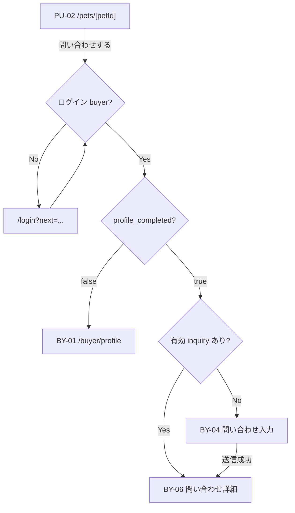

# BY-04 購入希望者問い合わせ入力

| 項目            | 内容                                                 |
| --------------- | ---------------------------------------------------- |
| 画面 ID         | BY-04                                                |
| 画面名          | 問い合わせ入力                                       |
| URL             | `/buyer/inquiries/new?petId={petId}`                 |
| 種別            | 編集（新規問い合わせ送信）                           |
| 対象ロール      | buyer（`profile_completed = true` 必須）             |
| 状態            | **設計確定・BY-04 実装済み**（BY-05 / BY-06 未実装） |
| Feature（予定） | `src/features/inquiries/`                            |
| 認証            | **必須**                                             |
| 共通レイアウト  | `(buyer)/layout.tsx` — `requireBuyer()`              |

## 画面目的

公開中の犬猫（PU-02）について、購入希望者がブリーダーへ **初回問い合わせメッセージ** を送信する。

第1期では **非同期テキストメッセージ** のみ。リアルタイムチャット・添付・見学登録は対象外。

## 遷移

### 入口

| 入口                    | 条件                                                           | 遷移先                                           |
| ----------------------- | -------------------------------------------------------------- | ------------------------------------------------ |
| PU-02「問い合わせする」 | 未ログイン                                                     | `/login?next=/buyer/inquiries/new?petId={petId}` |
| PU-02「問い合わせする」 | ログイン済み・プロフィール未完了                               | `/buyer/profile`                                 |
| PU-02「問い合わせする」 | 有効 inquiry 既存（[再利用ルール](#同一犬猫への再問い合わせ)） | `/buyer/inquiries/[inquiryId]`（BY-06）          |
| 直接 URL アクセス       | 上記と同様                                                     | 同上                                             |

## 表示項目

問い合わせ対象であることが分かる **確認カード** をフォーム上部に表示する。

| #   | 表示ラベル   | データソース                         | 備考                       |
| --- | ------------ | ------------------------------------ | -------------------------- |
| 1   | 犬猫写真     | PU-02 同等（Signed URL・メイン写真） | 0 枚時はプレースホルダー   |
| 2   | 犬猫名       | `public_display_name`                |                            |
| 3   | 種別・品種等 | species / breed / sex / 月齢         | PU-01 属性行と同型         |
| 4   | ブリーダー名 | `breeders.business_name`             | 公開プロフィール View 経由 |

**表示しない:** 価格を主役にしない（参考表示可）、buyer 自身の連絡先、内部 ID。

## 入力項目

| 項目           | 必須 | 型       | 備考                                            |
| -------------- | ---- | -------- | ----------------------------------------------- |
| 問い合わせ本文 | ✅   | textarea | 購入希望者が入力。`subject` は **入力させない** |

### 本文バリデーション

| ルール     | 内容                                                                 |
| ---------- | -------------------------------------------------------------------- |
| 必須       | 空・空白のみ不可（DB CHECK と整合: `length(trim(message)) > 0`）     |
| 最大文字数 | **2000 文字**（**新規設計値**。DB 上の上限なし。Server + UI で担保） |
| 改行       | 許可（`whitespace-pre-wrap` 表示）                                   |

## 送信処理（設計）

1. Server Action で `auth.uid()` → `buyers.id` を解決（クライアントから `buyer_id` を受け取らない）
2. `profile_completed = true` を Server 側で確認
3. `petId` の公開可否を Server 側で確認（`published` + 公開 View 条件。RLS のみに依存しない）
4. 有効 inquiry の有無を再確認（競合防止）
5. `inquiries` INSERT — `status = open`、`subject` は Server 自動生成（[Decision No.111](../01_設計変更管理/DecisionLog.md#decision-no111)）
6. `inquiry_messages` INSERT — `sender_type = buyer`、初回本文
7. `inquiries.last_message_at` を更新
8. 成功 → BY-06 へ redirect

## ボタン

| ボタン               | 動作                         |
| -------------------- | ---------------------------- |
| 問い合わせを送信する | 上記 Server Action 実行      |
| キャンセル / 戻る    | PU-02 `/pets/[petId]` へ戻る |

### 二重送信防止

- 送信中はボタン `disabled` + 「送信中…」表示（BY-01 / お気に入りと同型）
- Server 側でも短時間の冪等性を意識（同一リクエストの重複 INSERT 防止）

## 同一犬猫への再問い合わせ

[Decision No.110](../01_設計変更管理/DecisionLog.md#decision-no110) を参照。

**有効 inquiry** の定義（第1期）:

| 条件         | 内容                               |
| ------------ | ---------------------------------- |
| `deleted_at` | `IS NULL`                          |
| `status`     | `closed` / `completed` **以外**    |
| 当事者       | 現在の `buyers.id` × 対象 `pet_id` |

有効 inquiry が存在する場合、本画面（BY-04）へは進まず **BY-06** へ redirect する。

## 権限

| ロール     | 本画面                                     |
| ---------- | ------------------------------------------ |
| buyer      | 本人・プロフィール完了時のみアクセス・送信 |
| breeder    | アクセス不可（`/breeder` へ redirect）     |
| admin      | 第1期 UI 対象外                            |
| 未ログイン | `/login?next=...`                          |

## エラー・例外

| ケース                | ユーザー向け方針                                         |
| --------------------- | -------------------------------------------------------- |
| 未ログイン            | `/login?next=...`                                        |
| buyer 以外            | 各ロール入口へ redirect                                  |
| プロフィール未完了    | BY-01 へ redirect + 必要なら説明 toast                   |
| `petId` 不正 / 未存在 | 404 または「対象の犬猫が見つかりません」+ 犬猫一覧導線   |
| pet 非公開 / 削除済み | 「現在お問い合わせできない犬猫です」+ 犬猫一覧導線       |
| 空本文                | フィールド下エラー「問い合わせ内容を入力してください」   |
| 文字数超過            | 「2000文字以内で入力してください」                       |
| 送信失敗              | 「送信に失敗しました。時間をおいて再度お試しください。」 |
| DB エラー             | 上記汎用メッセージ。内部エラー詳細は表示しない           |

## レスポンシブ

| デバイス       | レイアウト                                                         |
| -------------- | ------------------------------------------------------------------ |
| スマートフォン | 1 カラム。確認カード → 本文 textarea（十分な高さ）→ 送信ボタン全幅 |
| PC             | `max-w-2xl` 中央。確認カードとフォームを縦積み                     |

## 第1期スコープ外

- `subject` 入力 UI
- 添付・画像
- 見学希望日
- メール通知
- Supabase Realtime

## 関連 Decision

- [No.54](../01_設計変更管理/DecisionLog.md#decision-no54) — inquiries / inquiry_messages 分離
- [No.55](../01_設計変更管理/DecisionLog.md#decision-no55) — テキストのみ
- [No.109](../01_設計変更管理/DecisionLog.md#decision-no109) — 画面 ID / URL
- [No.110](../01_設計変更管理/DecisionLog.md#decision-no110) — 同一 pet 再利用
- [No.111](../01_設計変更管理/DecisionLog.md#decision-no111) — subject 自動生成
- [No.114](../01_設計変更管理/DecisionLog.md#decision-no114) — profile_completed 必須

## 関連ドキュメント

- [BY-06 問い合わせ詳細](./BY-06_購入希望者問い合わせ詳細.md)
- [PU-02 公開犬猫詳細](./PU-02_公開犬猫詳細.md)
- [BY-01 購入希望者プロフィール](./BY-01_購入希望者プロフィール.md)
- [inquiries テーブル](../05_データベース設計/inquiries.md)
