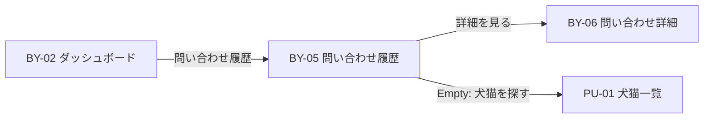

# BY-05 購入希望者問い合わせ履歴

| 項目            | 内容                                    |
| --------------- | --------------------------------------- |
| 画面 ID         | BY-05                                   |
| 画面名          | 問い合わせ履歴                          |
| URL             | `/buyer/inquiries`                      |
| 種別            | 表示（一覧）                            |
| 対象ロール      | buyer                                   |
| 状態            | **設計確定・実装済み**                  |
| Feature（予定） | `src/features/inquiries/`               |
| 認証            | **必須**                                |
| 共通レイアウト  | `(buyer)/layout.tsx` — `requireBuyer()` |

## 画面目的

購入希望者本人の問い合わせ案件を一覧表示し、詳細（BY-06）へ誘導する。

## 遷移

## データ取得

1. `auth.uid()` → `buyers.id`
2. `inquiries` から `buyer_id` 一致かつ **`deleted_at IS NULL`** のみ
3. 関連 pet 情報 — 公開 View または Server 側 JOIN（非公開化済み pet も **既存 inquiry は表示** — [Decision No.115](../01_設計変更管理/DecisionLog.md#decision-no115)）
4. ブリーダー表示名 — 公開 breeder View
5. 最終メッセージ概要 — 最新 `inquiry_messages.message` を truncate

### 並び順

| 優先 | ソートキー                                        |
| ---- | ------------------------------------------------- |
| 1    | `last_message_at DESC NULLS LAST`                 |
| 2    | `created_at DESC`（`last_message_at` が NULL 時） |

**`last_message_at` が NULL の場合:** 初回送信前の rare case。`created_at` で並べ、カード上は「メッセージなし」または初回本文プレビューとしない（作成直後は BY-06 へ遷移する想定のため通常は発生しない）。

## 一覧カード表示項目

| #   | 表示項目           | データソース                                                   |
| --- | ------------------ | -------------------------------------------------------------- |
| 1   | 犬猫写真           | pet メイン写真 Signed URL                                      |
| 2   | 犬猫名             | `public_display_name`                                          |
| 3   | ブリーダー表示名   | `business_name`                                                |
| 4   | 問い合わせ状態     | `inquiries.status` → 日本語ラベル                              |
| 5   | 最終メッセージ日時 | `last_message_at` または `created_at`                          |
| 6   | 最終メッセージ概要 | 最新 message 先頭 N 文字（**新規設計値: 80 文字** + 省略記号） |
| 7   | 詳細を見る         | → `/buyer/inquiries/[inquiryId]`                               |

## Empty State

問い合わせ 0 件（`deleted_at IS NULL` 含む有効件数 0）:

| 要素   | 内容                                                         |
| ------ | ------------------------------------------------------------ |
| 見出し | 問い合わせはまだありません。                                 |
| 説明   | 気になる犬猫を見つけて、ブリーダーに問い合わせてみましょう。 |
| CTA    | 「犬猫を探す」→ PU-01 `/pets`                                |

## 権限

| ロール     | 操作                       |
| ---------- | -------------------------- |
| buyer      | 本人の inquiry のみ SELECT |
| breeder    | アクセス不可               |
| admin      | 第1期 UI 対象外            |
| 未ログイン | `/login`                   |

## ステータス表示

[問い合わせ status 表示定義](./README.md#問い合わせ-status-表示定義) を参照。

## レスポンシブ

| デバイス       | レイアウト                                                |
| -------------- | --------------------------------------------------------- |
| スマートフォン | 1 カラム Card 縦積み。タップ領域を十分に確保              |
| PC             | 1 カラムまたは 2 カラム Card グリッド（`max-w-4xl` 前後） |

## BY-02 接続

`/buyer/dashboard` の「問い合わせ履歴」カード — `comingSoon` を解除し `href: /buyer/inquiries` を設定。

## 第1期スコープ外

- 一覧からの一括操作・削除
- フィルタ・検索
- リアルタイム更新

## 関連ドキュメント

- [BY-02（README 購入希望者画面）](./README.md#購入希望者画面)
- [BY-06 問い合わせ詳細](./BY-06_購入希望者問い合わせ詳細.md)
- [inquiries テーブル](../05_データベース設計/inquiries.md)
