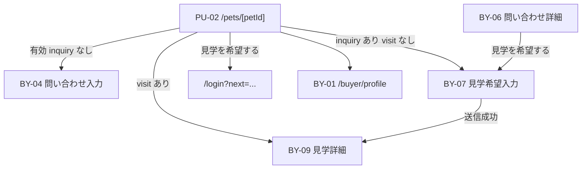

# BY-07 見学希望入力

| 項目            | 内容                                      |
| --------------- | ----------------------------------------- |
| 画面 ID         | BY-07                                     |
| 画面名          | 見学希望入力                              |
| URL             | `/buyer/visits/new?inquiryId={inquiryId}` |
| 種別            | 編集（見学希望送信）                      |
| 対象ロール      | buyer（`profile_completed = true` 必須）  |
| 状態            | **設計確定・未実装**                      |
| Feature（予定） | `src/features/visits/`                    |
| 認証            | **必須**                                  |
| 共通レイアウト  | `(buyer)/layout.tsx` — `requireBuyer()`   |

## 画面目的

**既存の問い合わせ（inquiry）に紐づく** 見学希望を、希望日時（最大 3 候補）とメッセージとともにブリーダーへ送信する。

第1期では **非同期テキスト** のみ。予約カレンダー・空き時間管理・サイト内契約・決済は対象外。

## 前提（Decision No.118）

| 条件         | 内容                                                                                                                          |
| ------------ | ----------------------------------------------------------------------------------------------------------------------------- |
| inquiry 必須 | 見学希望には **有効な `inquiries` レコードが必須**。`visits.inquiry_id` UNIQUE により 1 inquiry につき visit は **最大 1 件** |
| visit 未作成 | 当該 inquiry に **既存 visit がない** こと（`deleted_at IS NULL` の active visit）                                            |
| 当事者       | inquiry の `buyer_id` がログイン buyer と一致                                                                                 |

## 遷移

### 入口

| 入口                    | 条件                              | 遷移先                                                      |
| ----------------------- | --------------------------------- | ----------------------------------------------------------- |
| PU-02「見学を希望する」 | 未ログイン                        | `/login?next=/pets/[petId]`（見学分岐はログイン後に再評価） |
| PU-02「見学を希望する」 | ログイン済み・プロフィール未完了  | `/buyer/profile`                                            |
| PU-02「見学を希望する」 | 有効 inquiry **なし**             | BY-04 `/buyer/inquiries/new?petId={petId}`                  |
| PU-02「見学を希望する」 | 有効 inquiry あり・visit **なし** | BY-07 `/buyer/visits/new?inquiryId={id}`                    |
| PU-02「見学を希望する」 | visit **あり**                    | BY-09 `/buyer/visits/[visitId]`                             |
| BY-06「見学を希望する」 | visit なし・status 送信可能       | BY-07                                                       |
| BY-06「見学を希望する」 | visit あり                        | BY-09                                                       |
| 直接 URL                | inquiry 不正 / 他人 / visit 既存  | 404 または BY-09 へ redirect                                |

**有効 inquiry** の定義は [BY-04](./BY-04_購入希望者問い合わせ入力.md#同一犬猫への再問い合わせ) と同型（`deleted_at IS NULL`、`status` が `closed` / `completed` 以外）。

## 表示項目

フォーム上部に **問い合わせ・犬猫確認カード**（BY-04 / BY-06 サマリーと同型）:

| #   | 表示ラベル     | データソース              |
| --- | -------------- | ------------------------- |
| 1   | 犬猫写真       | pet メイン写真            |
| 2   | 犬猫名         | `public_display_name`     |
| 3   | ブリーダー名   | `business_name`           |
| 4   | 問い合わせ状態 | `inquiries.status` ラベル |

## 入力項目

| 項目         | 必須 | 型             | 備考                                      |
| ------------ | ---- | -------------- | ----------------------------------------- |
| 第一希望日時 | ✅   | datetime-local | `visits.requested_at`                     |
| 第二希望日時 | —    | datetime-local | `visits.requested_at_second`              |
| 第三希望日時 | —    | datetime-local | `visits.requested_at_third`               |
| メッセージ   | ✅   | textarea       | **`inquiry_messages` へ保存**（本文のみ） |

### 日時バリデーション

| ルール       | 内容                                                                |
| ------------ | ------------------------------------------------------------------- |
| 第一希望     | 必須。未来日時（Server 側で `now()` より後を確認）                  |
| 第二・第三   | 任意。入力時は第一希望より後を推奨（Server 側で重複・順序チェック） |
| タイムゾーン | DB は `timestamptz`。UI はユーザー端末ローカル → Server で UTC 保存 |

### メッセージバリデーション

BY-04 と同型:

| ルール     | 内容             |
| ---------- | ---------------- |
| 必須       | 空・空白のみ不可 |
| 最大文字数 | **2000 文字**    |
| 改行       | 許可             |

## 送信処理（設計）

**SECURITY DEFINER RPC `request_visit` を呼び出す**（Decision No.121）。Service Role クライアントは **使用しない**。

RPC 内で `auth.uid()` により buyer 本人確認を行い、以下を **原子性をもって** 実行:

1. inquiry が本人 buyer に属し、有効 status であることを確認
2. 当該 inquiry に active visit が **存在しない** ことを確認
3. `visits` INSERT — `status = requested`、`result = pending`、希望日時 3 項目
4. `inquiries.status` → `visit_requested`（Decision No.119）
5. `inquiry_messages` INSERT — `sender_type = buyer`、入力メッセージ（Decision No.120）
6. `inquiries.last_message_at` 更新

成功 → BY-09 `/buyer/visits/[visitId]` へ redirect。

## ボタン

| ボタン            | 動作                      |
| ----------------- | ------------------------- |
| 見学希望を送る    | 上記 RPC 実行             |
| キャンセル / 戻る | BY-06 または PU-02 へ戻る |

### 二重送信防止

- 送信中はボタン `disabled` + 「送信中…」
- UNIQUE(`inquiry_id`) による DB 層の重複防止

## 権限

| ロール     | 本画面                         |
| ---------- | ------------------------------ |
| buyer      | 本人 inquiry・visit 未作成のみ |
| breeder    | アクセス不可                   |
| admin      | 第1期 UI 対象外                |
| 未ログイン | `/login?next=...`              |

## エラー・例外

| ケース                            | ユーザー向け方針                           |
| --------------------------------- | ------------------------------------------ |
| inquiry 不存在 / 他人             | 404                                        |
| visit 既存                        | BY-09 へ redirect                          |
| inquiry が `closed` / `completed` | 「この問い合わせでは見学希望を送れません」 |
| 第一希望未入力                    | フィールドエラー                           |
| 日時不正                          | 「有効な日時を入力してください」           |
| 送信失敗                          | 汎用エラー。入力値維持                     |

## レスポンシブ

| デバイス       | レイアウト                                      |
| -------------- | ----------------------------------------------- |
| スマートフォン | 1 カラム。確認カード → 日時 → メッセージ → 送信 |
| PC             | `max-w-2xl` 中央                                |

## 第1期スコープ外

- 予約カレンダー・空き時間選択 UI
- inquiry なしでの見学希望（PU-02 からは BY-04 へ誘導）
- 詳細住所の自動開示
- メール通知
- Realtime

## 関連 Decision

- [No.56](../01_設計変更管理/DecisionLog.md#decision-no56) — 見学希望時 visits 作成
- [No.57](../01_設計変更管理/DecisionLog.md#decision-no57) — 1 inquiry 1 visit
- [No.117](../01_設計変更管理/DecisionLog.md#decision-no117) — 画面 ID
- [No.118](../01_設計変更管理/DecisionLog.md#decision-no118) — inquiry 必須・PU-02 導線
- [No.119](../01_設計変更管理/DecisionLog.md#decision-no119) — inquiries 連動
- [No.120](../01_設計変更管理/DecisionLog.md#decision-no120) — メッセージ保存先
- [No.121](../01_設計変更管理/DecisionLog.md#decision-no121) — RPC 方針

## 関連ドキュメント

- [BY-06 問い合わせ詳細](./BY-06_購入希望者問い合わせ詳細.md)
- [BY-09 見学詳細](./BY-09_見学詳細.md)
- [PU-02 公開犬猫詳細](./PU-02_公開犬猫詳細.md)
- [visits テーブル](../05_データベース設計/visits.md)
