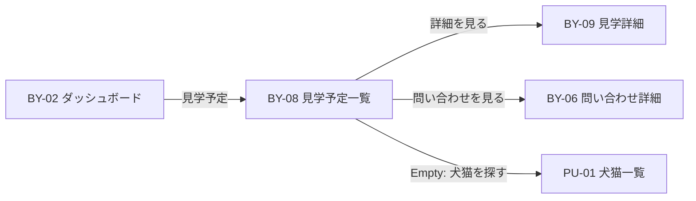

# BY-08 見学予定一覧

| 項目            | 内容                                    |
| --------------- | --------------------------------------- |
| 画面 ID         | BY-08                                   |
| 画面名          | 見学予定一覧                            |
| URL             | `/buyer/visits`                         |
| 種別            | 表示（一覧）                            |
| 対象ロール      | buyer                                   |
| 状態            | **実装済み**                            |
| Feature（予定） | `src/features/visits/`                  |
| 認証            | **必須**                                |
| 共通レイアウト  | `(buyer)/layout.tsx` — `requireBuyer()` |

## 画面目的

購入希望者本人の見学（`visits`）を一覧表示し、詳細（BY-09）または関連問い合わせ（BY-06）へ誘導する。

## 遷移

## データ取得

1. `auth.uid()` → `buyers.id`
2. `visits` WHERE `buyer_id` 一致 AND **`deleted_at IS NULL`**
3. 関連 pet 情報 — inquiry 経由または JOIN（非公開 pet も **既存 visit は表示** — Decision No.115 整合）
4. ブリーダー表示名 — 公開 breeder View
5. 関連 `inquiries.status` — 日本語ラベル用

### 並び順

| 優先 | ソートキー |
| ---- | ---------- |
| 1    | `scheduled_at DESC NULLS LAST`（確定日時優先） |
| 2    | `requested_at DESC`（未確定は希望日時） |
| 3    | `created_at DESC` |

## 一覧カード表示項目

| #   | 表示項目       | データソース                          |
| --- | -------------- | ------------------------------------- |
| 1   | 犬猫写真       | pet メイン写真                        |
| 2   | 犬猫名         | `public_display_name`                 |
| 3   | ブリーダー名   | `business_name`                       |
| 4   | 見学状態       | `visits.status` → [表示定義](./README.md#見学-status-表示定義) |
| 5   | 日時           | `scheduled_at` 確定時 / 未確定時は第一希望 `requested_at` |
| 6   | 問い合わせ状態 | `inquiries.status` ラベル（参考）     |
| 7   | 詳細を見る     | → `/buyer/visits/[visitId]`           |

## Empty State

見学 0 件:

| 要素   | 内容                                                         |
| ------ | ------------------------------------------------------------ |
| 見出し | 見学予定はまだありません。                                   |
| 説明   | 気になる犬猫について問い合わせのうえ、見学を希望できます。     |
| CTA    | 「犬猫を探す」→ PU-01 `/pets`                                |

## 権限

| ロール     | 操作                      |
| ---------- | ------------------------- |
| buyer      | 本人の visit のみ SELECT  |
| breeder    | アクセス不可              |
| admin      | 第1期 UI 対象外           |
| 未ログイン | `/login`                  |

## BY-02 接続

`/buyer/dashboard` の「見学予定」カード — 実装時に `comingSoon` を解除し `href: /buyer/visits` を設定。

## レスポンシブ

| デバイス       | レイアウト                           |
| -------------- | ------------------------------------ |
| スマートフォン | 1 カラム Card 縦積み                 |
| PC             | 1 カラムまたは 2 カラム（`max-w-4xl`） |

## 第1期スコープ外

- カレンダー表示
- フィルタ・検索
- 一覧からの一括操作

## 関連 Decision

- [No.117](../01_設計変更管理/DecisionLog.md#decision-no117) — 画面 ID

## 関連ドキュメント

- [BY-02（README 購入希望者画面）](./README.md#購入希望者画面)
- [BY-09 見学詳細](./BY-09_見学詳細.md)
- [visits テーブル](../05_データベース設計/visits.md)
