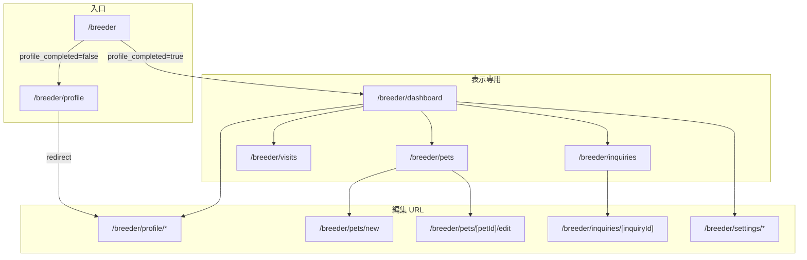
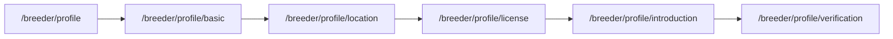
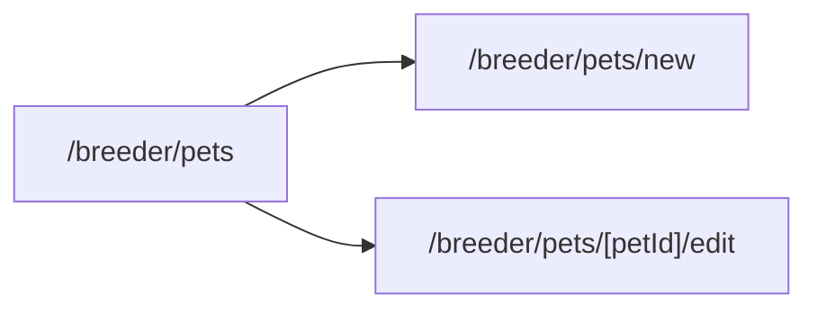
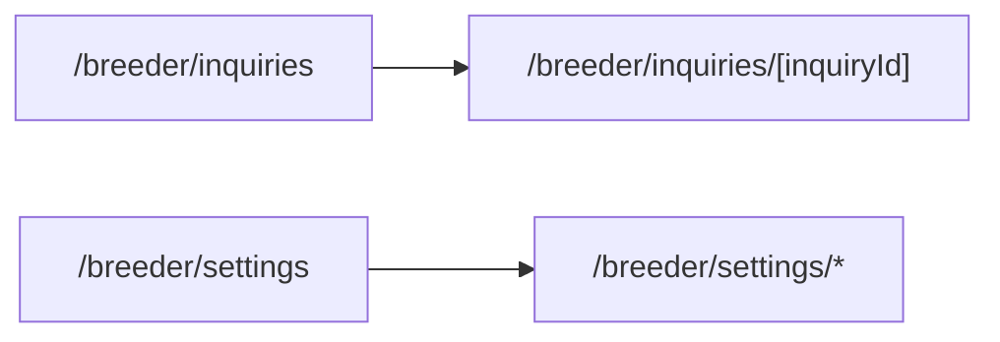
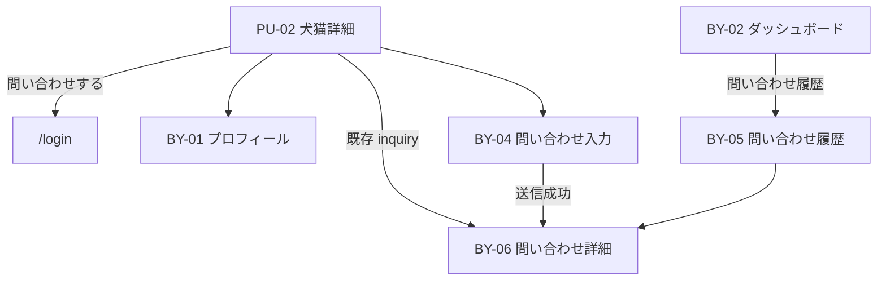
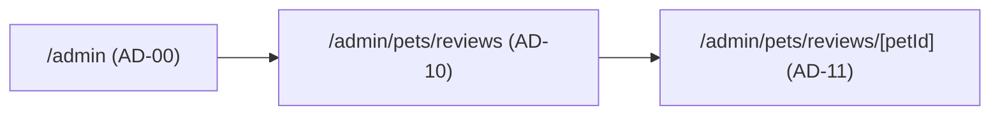

# 画面設計

## 概要

WithTama の画面設計書一覧です。画面 ID は `{ロール略称}-{連番}` 形式とします。

## 設計原則

| Decision                                                 | 内容                                                                  |
| -------------------------------------------------------- | --------------------------------------------------------------------- |
| [No.70](../01_設計変更管理/DecisionLog.md#decision-no70) | ブリーダー画面の最終構成を本 README に集約する                        |
| [No.71](../01_設計変更管理/DecisionLog.md#decision-no71) | ダッシュボードは表示専用。編集 UI を持たない                          |
| [No.72](../01_設計変更管理/DecisionLog.md#decision-no72) | 編集画面は URL 単位で管理する（プロフィール・犬猫・問い合わせ・設定） |
| [No.73](../01_設計変更管理/DecisionLog.md#decision-no73) | `src/features/` を機能単位に整理する                                  |
| [No.99](../01_設計変更管理/DecisionLog.md#decision-no99) | 管理者画面は AD-* で採番する                                          |

### 表示と編集の分離（Decision No.71 / No.72）

- **表示専用画面** … サマリー・一覧・詳細の閲覧。ダッシュボードはここに属し、フォームによるデータ更新は行わない。
- **編集画面** … 入力・更新・登録。機能ごとに独立 URL を持つ。モーダルや同一 URL 上のタブ切替で編集しない。

## 画面遷移

### ロール別入口（Decision No.62）

| 入口 URL   | 条件                        | 遷移先               |
| ---------- | --------------------------- | -------------------- |
| `/breeder` | `profile_completed = false` | `/breeder/profile`   |
| `/breeder` | `profile_completed = true`  | `/breeder/dashboard` |
| `/buyer`   | `profile_completed = false` | `/buyer/profile`     |
| `/buyer`   | `profile_completed = true`  | `/buyer/dashboard`   |

- ログイン成功後は入口 URL へ遷移し、上記ルールでリダイレクトする
- 未認証で入口 URL にアクセスした場合は `/login` へリダイレクトする
- 実装: `src/features/auth/entry-redirect.ts`

### ブリーダー画面全体（Decision No.70）



## ブリーダー画面 — 最終構成

### URL 一覧

| 種別 | URL                              | 画面 ID | 画面名                               | 状態                 |
| ---- | -------------------------------- | ------- | ------------------------------------ | -------------------- |
| 入口 | `/breeder`                       | —       | ブリーダー入口                       | リダイレクト         |
| 表示 | `/breeder/dashboard`             | BR-06   | ブリーダーダッシュボード             | **実装済み**         |
| 表示 | `/breeder/pets`                  | BR-07   | 犬猫管理一覧                         | Phase 7 基盤         |
| 編集 | `/breeder/pets/new`              | BR-10   | 犬猫登録                             | 基本情報実装済み     |
| 編集 | `/breeder/pets/[petId]/edit`     | BR-11   | 犬猫情報編集                         | 基本情報実装済み     |
| 表示 | `/breeder/visits`                | BR-11   | 見学管理                             | 未実装               |
| 表示 | `/breeder/inquiries`             | BR-12   | 問い合わせ一覧                       | **設計確定・未実装** |
| 編集 | `/breeder/inquiries/[inquiryId]` | BR-12   | 問い合わせ詳細・返信                 | **設計確定・未実装** |
| 入口 | `/breeder/profile`               | BR-09   | プロフィール入口                     | リダイレクト         |
| 編集 | `/breeder/profile/basic`         | BR-09   | プロフィール Step 1 基本情報         | **実装済み**         |
| 編集 | `/breeder/profile/location`      | BR-10   | プロフィール Step 2 所在地           | **実装済み**         |
| 編集 | `/breeder/profile/license`       | BR-09   | プロフィール Step 3 第一種動物取扱業 | 実装済み             |
| 編集 | `/breeder/profile/introduction`  | BR-09   | プロフィール Step 4 ブリーダー紹介   | 実装済み             |
| 編集 | `/breeder/profile/verification`  | BR-09   | プロフィール Step 5 本人確認         | 実装済み             |
| 編集 | `/breeder/settings`              | BR-13   | 設定                                 | 未実装               |

### プロフィール遷移（Decision No.67）



共通 UI は `src/app/breeder/profile/layout.tsx`（Decision No.68）。

### 犬猫遷移（Decision No.72）



一覧（BR-07）は表示専用。新規登録・編集は個別 URL。

### 問い合わせ・設定（Decision No.72）



問い合わせ返信・設定変更は一覧 URL 上では行わず、詳細 URL / 設定 URL で編集する。

### App Router ディレクトリ構成

```
src/app/breeder/
├── layout.tsx                 # ブリーダー共通レイアウト（サイドバー・ヘッダー）
├── page.tsx                   # 入口 → dashboard / profile
├── dashboard/
│   └── page.tsx               # BR-06 表示専用
├── profile/
│   ├── layout.tsx             # プロフィール共通 UI（Step・Progress）
│   ├── page.tsx               # 入口 → basic
│   ├── basic/page.tsx
│   ├── location/page.tsx
│   ├── license/page.tsx
│   ├── introduction/page.tsx
│   └── verification/page.tsx
├── pets/
│   ├── page.tsx               # BR-07 一覧（表示）
│   ├── new/page.tsx           # BR-08 新規（編集）
│   └── [petId]/
│       └── edit/page.tsx      # BR-11 編集（未実装）
├── visits/
│   └── page.tsx               # BR-11（未実装）
├── inquiries/
│   ├── page.tsx               # BR-12 一覧（未実装）
│   └── [inquiryId]/
│       └── page.tsx           # BR-12 詳細・返信（未実装）
└── settings/
    └── page.tsx               # BR-13（未実装）
```

### 機能モジュール対応（Decision No.73）

| 機能                       | Feature モジュール                          | 主な App パス                                |
| -------------------------- | ------------------------------------------- | -------------------------------------------- |
| 認証・初回プロフィール作成 | `src/features/auth/`                        | `/login`, `/signup`, 入口リダイレクト        |
| ブリーダープロフィール編集 | `src/features/breeder-profile/`             | `/breeder/profile/*`                         |
| 犬猫管理                   | `src/features/pets/`                        | `/breeder/pets/*`                            |
| 問い合わせ                 | 未実装（`src/features/inquiries/`）         | `/buyer/inquiries/*`, `/breeder/inquiries/*` |
| 設定                       | 未実装（将来 `features/breeder-settings/`） | `/breeder/settings/*`                        |

詳細: [src/features/README.md](../../src/features/README.md)

## 設計書一覧

| 画面 ID | 画面名                        | 設計書                                                                |
| ------- | ----------------------------- | --------------------------------------------------------------------- |
| BR-06   | ブリーダーダッシュボード      | [BR-06_ブリーダーダッシュボード](./BR-06_ブリーダーダッシュボード.md) |
| BR-07   | 犬猫管理一覧                  | [BR-07_犬猫管理一覧](./BR-07_犬猫管理一覧.md)                         |
| BR-08   | 犬猫新規登録                  | [BR-08_犬猫新規登録](./BR-08_犬猫新規登録.md)                         |
| BR-09   | ブリーダープロフィール        | [BR-09_ブリーダープロフィール](./BR-09_ブリーダープロフィール.md)     |
| BR-10   | 所在地（プロフィール Step 2） | [BR-10_所在地](./BR-10_所在地.md)                                     |
| BR-11   | 犬猫編集                      | [BR-11_犬猫編集](./BR-11_犬猫編集.md)                                 |
| BR-12   | ブリーダー問い合わせ          | [BR-12_ブリーダー問い合わせ](./BR-12_ブリーダー問い合わせ.md)         |

## 購入希望者画面

| 画面 ID | 画面名                   | URL                                  | 状態                          |
| ------- | ------------------------ | ------------------------------------ | ----------------------------- |
| —       | 購入希望者入口           | `/buyer`                             | リダイレクト                  |
| BY-01   | 購入希望者プロフィール   | `/buyer/profile`                     | **実装済み**（データ層 + UI） |
| BY-02   | 購入希望者ダッシュボード | `/buyer/dashboard`                   | **実装済み**                  |
| BY-03   | お気に入り               | `/buyer/favorites`                   | **実装済み**                  |
| BY-04   | 問い合わせ入力           | `/buyer/inquiries/new?petId={petId}` | **設計確定・未実装**          |
| BY-05   | 問い合わせ履歴           | `/buyer/inquiries`                   | **設計確定・未実装**          |
| BY-06   | 問い合わせ詳細           | `/buyer/inquiries/[inquiryId]`       | **設計確定・未実装**          |

### 購入希望者 — 問い合わせ遷移



| 画面 ID | 設計書                                                                |
| ------- | --------------------------------------------------------------------- |
| BY-01   | [BY-01_購入希望者プロフィール](./BY-01_購入希望者プロフィール.md)     |
| BY-03   | [BY-03_購入希望者お気に入り一覧](./BY-03_購入希望者お気に入り一覧.md) |
| BY-04   | [BY-04_購入希望者問い合わせ入力](./BY-04_購入希望者問い合わせ入力.md) |
| BY-05   | [BY-05_購入希望者問い合わせ履歴](./BY-05_購入希望者問い合わせ履歴.md) |
| BY-06   | [BY-06_購入希望者問い合わせ詳細](./BY-06_購入希望者問い合わせ詳細.md) |

## 問い合わせ status 表示定義

DB 値（`inquiries.status`）は変更しない。UI 表示名は以下とする。

| DB 値             | 画面表示名   | 第1期 UI での主な扱い                                      |
| ----------------- | ------------ | ---------------------------------------------------------- |
| `open`            | 問い合わせ中 | 一覧・詳細表示。メッセージ送信可                           |
| `replied`         | 返信あり     | 同上                                                       |
| `visit_requested` | 見学希望     | 表示のみ（見学機能で設定。問い合わせ UI からは設定しない） |
| `visit_scheduled` | 見学予定     | 同上                                                       |
| `completed`       | 完了         | 表示のみ。メッセージ送信 **不可**                          |
| `closed`          | 終了         | 表示のみ。メッセージ送信 **不可**                          |

## 管理者画面（Decision No.99）

| 画面 ID | 画面名               | URL                           | 状態                                     |
| ------- | -------------------- | ----------------------------- | ---------------------------------------- |
| AD-00   | 管理者ダッシュボード | `/admin`                      | プレースホルダー（admin ガード実装済み） |
| AD-10   | 犬猫掲載審査一覧     | `/admin/pets/reviews`         | **実装済み**                             |
| AD-11   | 犬猫掲載審査詳細     | `/admin/pets/reviews/[petId]` | **実装済み**（承認・差戻し含む）         |

### 管理者画面遷移



| 画面 ID | 設計書                                                        |
| ------- | ------------------------------------------------------------- |
| AD-00   | [AD-00_管理者ダッシュボード](./AD-00_管理者ダッシュボード.md) |
| AD-10   | [AD-10_犬猫掲載審査一覧](./AD-10_犬猫掲載審査一覧.md)         |
| AD-11   | [AD-11_犬猫掲載審査詳細](./AD-11_犬猫掲載審査詳細.md)         |

## 公開画面

| 画面         | パス            | 画面 ID | 状態     |
| ------------ | --------------- | ------- | -------- |
| トップページ | `/`             | —       | 実装済み |
| 犬猫一覧     | `/pets`         | PU-01   | 実装済み |
| 犬猫詳細     | `/pets/[petId]` | PU-02   | 実装済み |

| 画面 ID | 設計書                                        |
| ------- | --------------------------------------------- |
| PU-01   | [PU-01_公開犬猫一覧](./PU-01_公開犬猫一覧.md) |
| PU-02   | [PU-02_公開犬猫詳細](./PU-02_公開犬猫詳細.md) |

## 関連ドキュメント

- [デザインシステム](../08_デザインシステム/README.md)
- [Decision Log](../01_設計変更管理/DecisionLog.md)
- [features モジュール構成](../../src/features/README.md)
