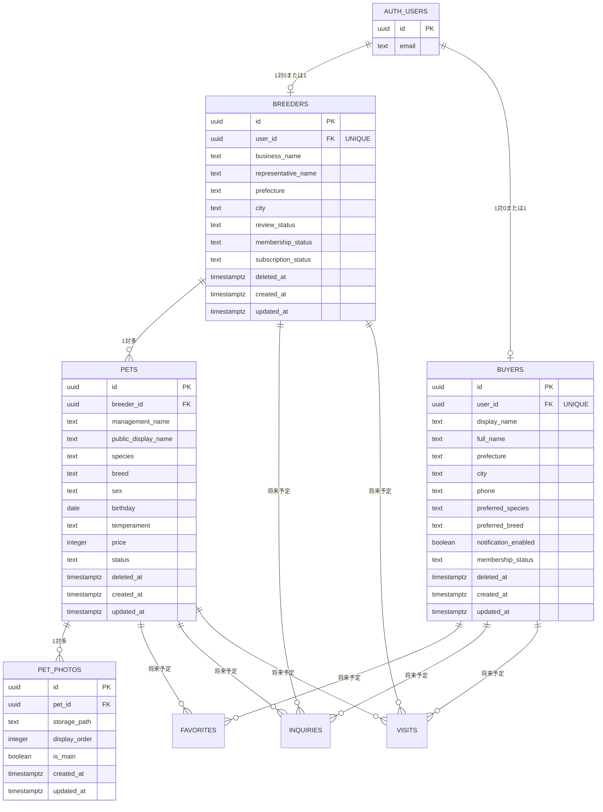

# ER図

| 項目 | 内容 |
|------|------|
| Version | 1.0 |
| 対象 | 第1期データベース構造 |
| 状態 | 確定済みテーブルと設計予定テーブルを区別して記載 |

## 概要

WithTama 第1期の主要テーブルとリレーションを示す。設計が確定しているテーブルは主要カラムを記載し、未設計のテーブルは関係のみ示しカラムは確定扱いにしない。

### 対象テーブル

**設計確定済み**

- `auth.users`
- `public.breeders`
- `public.buyers`
- `public.pets`
- `public.pet_photos`

**設計予定**

- `public.favorites`
- `public.inquiries`
- `public.visits`
- `public.audit_logs`

## Mermaid ER図

> **凡例:** カラム定義があるエンティティ（`AUTH_USERS`〜`PET_PHOTOS`）は設計確定済み。`FAVORITES` / `INQUIRIES` / `VISITS` はリレーションのみ示す設計予定テーブル（カラム未確定）。`AUDIT_LOGS` は設計予定だが Version 1.0 ではリレーション未定義。`将来予定` のリレーションは将来追加予定の関係を示す。

## リレーション一覧

### 設計確定済み

| 親 | 関係 | 子 | 備考 |
|----|------|-----|------|
| `auth.users` | 1 対 0 または 1 | `breeders` | `breeders.user_id` → `auth.users.id` |
| `auth.users` | 1 対 0 または 1 | `buyers` | `buyers.user_id` → `auth.users.id` |
| `breeders` | 1 対多 | `pets` | `pets.breeder_id` → `breeders.id`（最終方針） |
| `pets` | 1 対多 | `pet_photos` | `pet_photos.pet_id` → `pets.id` |

### 将来予定

| 親 | 関係 | 子 | 備考 |
|----|------|-----|------|
| `buyers` | 1 対多 | `favorites` | 設計予定 |
| `pets` | 1 対多 | `favorites` | 設計予定 |
| `buyers` | 1 対多 | `inquiries` | 設計予定 |
| `pets` | 1 対多 | `inquiries` | 設計予定 |
| `breeders` | 1 対多 | `inquiries` | 設計予定 |
| `buyers` | 1 対多 | `visits` | 設計予定 |
| `pets` | 1 対多 | `visits` | 設計予定 |
| `breeders` | 1 対多 | `visits` | 設計予定 |

## 設計上の注意事項

1. `auth.users` は Supabase Auth が管理する。
2. `breeders.id` と `buyers.id` は、`auth.users.id` とは別の UUID を使用する。
3. `breeders.user_id` および `buyers.user_id` は `auth.users.id` を参照する。
4. 1 つの `auth.users` レコードが `breeders` と `buyers` の両方を持てるかは未決定事項とする。
5. `pets.breeder_id` は最終的に `breeders.id` を参照する。
6. 既存 `pets` データの `breeder_id` が NULL または `auth.users.id` の場合は、データ移行後に外部キー制約を設定する。
7. `pet_photos` の画像本体は Supabase Storage に保存し、DB には `storage_path` のみ保存する。
8. `deleted_at` が NULL のデータを通常表示対象とする。
9. 一般公開用データは View または API 経由で必要項目だけ返す。
10. `favorites`、`inquiries`、`visits`、`audit_logs` は未設計のため、Version 1.0 では関係のみを示し、カラムは確定扱いにしない。

## テーブル一覧（補足）

| テーブル | 状態 | 主な役割 |
|---------|------|---------|
| `auth.users` | Supabase 管理 | 認証 |
| `breeders` | 設計確定 | ブリーダー情報・審査・課金状態 |
| `buyers` | 設計確定 | 購入希望者プロフィール |
| `pets` | 設計確定 | 犬猫情報 |
| `pet_photos` | 設計確定 | 犬猫写真 |
| `favorites` | 設計予定 | お気に入り |
| `inquiries` | 設計予定 | 問い合わせ |
| `visits` | 設計予定 | 見学管理 |
| `audit_logs` | 設計予定 | 操作履歴 |

## 関連ドキュメント

- [breeders テーブル](./breeders.md)
- [pets テーブル](./pets.md)
- [pet_photos テーブル](./pet_photos.md)
- [データベース設計 README](./README.md)
