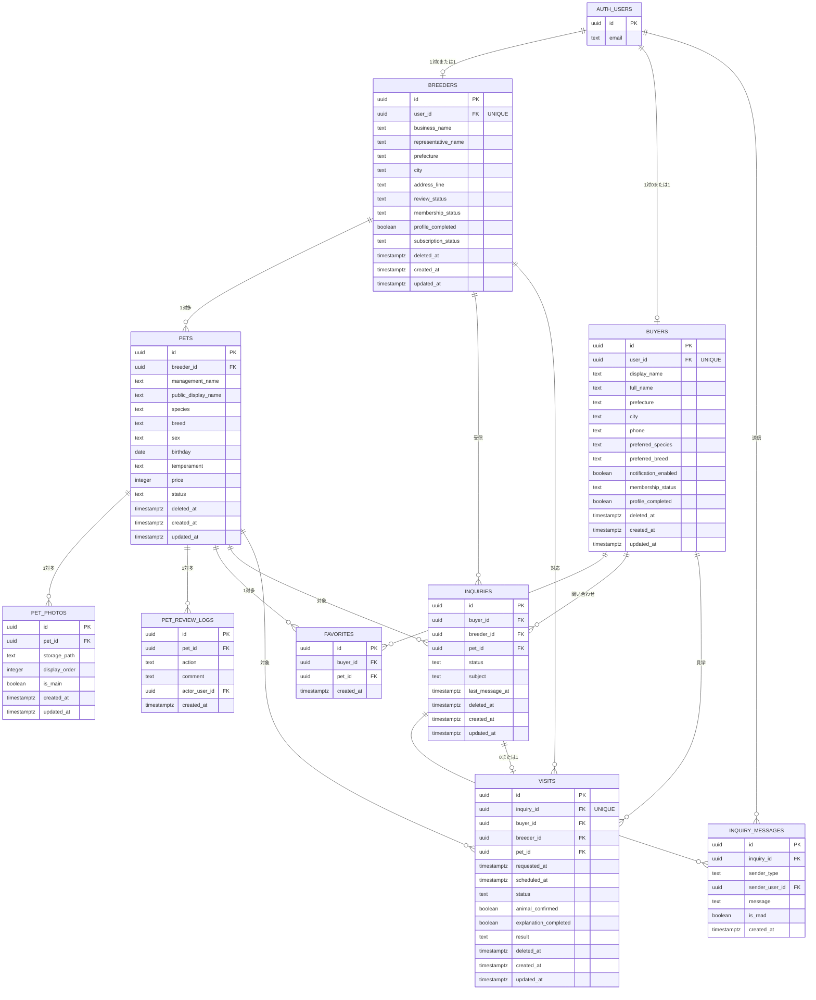

# ER図

| 項目    | 内容                                             |
| ------- | ------------------------------------------------ |
| Version | 1.4                                              |
| 対象    | 第1期データベース構造                            |
| 状態    | 確定済みテーブルと設計予定テーブルを区別して記載 |

## 概要

WithTama 第1期の主要テーブルとリレーションを示す。設計が確定しているテーブルは主要カラムを記載し、未設計のテーブルは関係のみ示しカラムは確定扱いにしない。

### 対象テーブル

**設計確定済み**

- `auth.users`
- `public.breeders`
- `public.buyers`
- `public.pets`
- `public.pet_photos`
- `public.pet_review_logs`（Migration 作成済み・未適用）
- `public.favorites`
- `public.inquiries`
- `public.inquiry_messages`
- `public.visits`

**設計予定**

- `public.audit_logs`

## Mermaid ER図

> **凡例:** カラム定義があるエンティティは設計確定済み。`AUDIT_LOGS` は設計予定だが Version 1.2 ではリレーション未定義。

## リレーション一覧

### 設計確定済み

| 親           | 関係            | 子                 | 備考                                                |
| ------------ | --------------- | ------------------ | --------------------------------------------------- |
| `auth.users` | 1 対 0 または 1 | `breeders`         | `breeders.user_id` → `auth.users.id`                |
| `auth.users` | 1 対 0 または 1 | `buyers`           | `buyers.user_id` → `auth.users.id`                  |
| `breeders`   | 1 対多          | `pets`             | `pets.breeder_id` → `breeders.id`（最終方針）       |
| `pets`       | 1 対多          | `pet_photos`       | `pet_photos.pet_id` → `pets.id`                     |
| `buyers`     | 1 対多          | `favorites`        | `favorites.buyer_id` → `buyers.id`                  |
| `pets`       | 1 対多          | `favorites`        | `favorites.pet_id` → `pets.id`                      |
| `buyers`     | 1 対多          | `inquiries`        | `inquiries.buyer_id` → `buyers.id`                  |
| `breeders`   | 1 対多          | `inquiries`        | `inquiries.breeder_id` → `breeders.id`              |
| `pets`       | 1 対多          | `inquiries`        | `inquiries.pet_id` → `pets.id`                      |
| `inquiries`  | 1 対多          | `inquiry_messages` | `inquiry_messages.inquiry_id` → `inquiries.id`      |
| `auth.users` | 1 対多          | `inquiry_messages` | `inquiry_messages.sender_user_id` → `auth.users.id` |
| `inquiries`  | 1 対 0 または 1 | `visits`           | `visits.inquiry_id` → `inquiries.id`（UNIQUE）      |
| `buyers`     | 1 対多          | `visits`           | `visits.buyer_id` → `buyers.id`                     |
| `breeders`   | 1 対多          | `visits`           | `visits.breeder_id` → `breeders.id`                 |
| `pets`       | 1 対多          | `visits`           | `visits.pet_id` → `pets.id`                         |

## 設計上の注意事項

1. `auth.users` は Supabase Auth が管理する。
2. `breeders.id` と `buyers.id` は、`auth.users.id` とは別の UUID を使用する。
3. `breeders.user_id` および `buyers.user_id` は `auth.users.id` を参照する。
4. 1 つの `auth.users` レコードが `breeders` と `buyers` の両方を持てるかは未決定事項とする。
5. `pets.breeder_id` は最終的に `breeders.id` を参照する。
6. 既存 `pets` データの `breeder_id` が NULL または `auth.users.id` の場合は、データ移行後に外部キー制約を設定する。
7. `pet_photos` の画像本体は Supabase Storage に保存し、DB には `storage_path` のみ保存する。
8. `deleted_at` が NULL のデータを通常表示対象とする。
9. 一般公開用データは View または API 経由で必要項目だけ返す。
10. `inquiries` には `visit_id` を持たせない。見学は `visits.inquiry_id`（UNIQUE）で 1 問い合わせ 0 または 1 件に関連付ける。
11. 第1期ではリアルタイムチャットは実装せず、`inquiry_messages` でテキスト履歴を管理する。
12. `breeders` / `buyers` は初回ログイン時に仮レコード（`user_id` のみ、または buyers は `display_name` 付き）を作成し、`profile_completed = false` で開始する（Decision No.61）。
13. `audit_logs` は未設計のため、Version 1.4 ではリレーション未定義。

## テーブル一覧（補足）

| テーブル           | 状態          | 主な役割                       |
| ------------------ | ------------- | ------------------------------ |
| `auth.users`       | Supabase 管理 | 認証                           |
| `breeders`         | 設計確定      | ブリーダー情報・審査・課金状態 |
| `buyers`           | 設計確定      | 購入希望者プロフィール         |
| `pets`             | 設計確定      | 犬猫情報                       |
| `pet_photos`       | 設計確定      | 犬猫写真                       |
| `favorites`        | 設計確定      | お気に入り（犬猫）             |
| `inquiries`        | 設計確定      | 問い合わせ案件                 |
| `inquiry_messages` | 設計確定      | 問い合わせメッセージ履歴       |
| `visits`           | 設計確定      | 見学管理                       |
| `audit_logs`       | 設計予定      | 操作履歴                       |

## 関連ドキュメント

- [breeders テーブル](./breeders.md)
- [pets テーブル](./pets.md)
- [pet_photos テーブル](./pet_photos.md)
- [favorites テーブル](./favorites.md)
- [buyers テーブル](./buyers.md)
- [inquiries テーブル](./inquiries.md)
- [inquiry_messages テーブル](./inquiry_messages.md)
- [visits テーブル](./visits.md)
- [データベース設計 README](./README.md)
