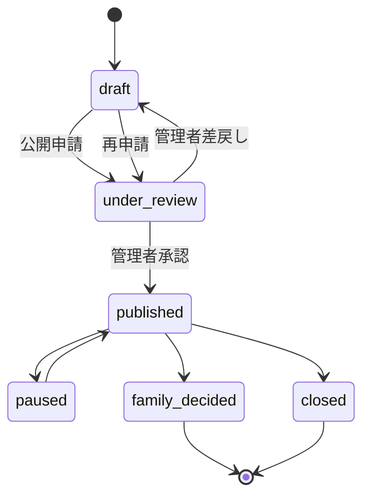

# pets テーブル

| 項目       | 内容          |
| ---------- | ------------- |
| テーブル名 | `public.pets` |
| Version    | 1.1           |
| 状態       | 確定          |

## 目的

ブリーダーが登録する犬猫の基本情報、公開情報、掲載状態を管理する。

## カラム定義

| カラム名              | 型          | NULL     | 初期値              | 説明                                                          |
| --------------------- | ----------- | -------- | ------------------- | ------------------------------------------------------------- |
| `id`                  | uuid        | NOT NULL | `gen_random_uuid()` | 犬猫ID、主キー                                                |
| `breeder_id`          | uuid        | NOT NULL | なし                | ブリーダーID。`auth.users` または `breeders` への外部キー候補 |
| `management_name`     | text        | NOT NULL | なし                | ブリーダー内部用の管理名                                      |
| `public_display_name` | text        | NOT NULL | なし                | 購入希望者へ表示する名前                                      |
| `species`             | text        | NOT NULL | なし                | `dog` または `cat`                                            |
| `breed`               | text        | NOT NULL | なし                | 犬種・猫種。第1期は自由入力                                   |
| `sex`                 | text        | NOT NULL | なし                | `male` または `female`                                        |
| `birthday`            | date        | NULL     | `null`              | 誕生日                                                        |
| `color`               | text        | NULL     | `null`              | 毛色                                                          |
| `temperament`         | text        | NULL     | `null`              | 性格・気質（紹介文 `description` とは別管理）                 |
| `description`         | text        | NULL     | `null`              | ブリーダーが確認・修正した公開紹介文                          |
| `ai_description`      | text        | NULL     | `null`              | AI が作成した紹介文の下書き                                   |
| `ai_generated_at`     | timestamptz | NULL     | `null`              | AI 紹介文を生成した日時                                       |
| `price`               | integer     | NULL     | `null`              | 税込販売価格、円単位。0 以上                                  |
| `price_comment`       | text        | NULL     | `null`              | ワクチン費用込み等の価格補足                                  |
| `status`              | text        | NOT NULL | `draft`             | 掲載状態                                                      |
| `published_at`        | timestamptz | NULL     | `null`              | 初回公開日時                                                  |
| `display_order`       | integer     | NOT NULL | `0`                 | 一覧表示順（0 以上）                                          |
| `deleted_at`          | timestamptz | NULL     | `null`              | 論理削除日時。NULL の行を通常表示対象とする                   |
| `created_by`          | uuid        | NULL     | `null`              | 作成者ユーザーID                                              |
| `updated_by`          | uuid        | NULL     | `null`              | 最終更新者ユーザーID                                          |
| `created_at`          | timestamptz | NOT NULL | `now()`             | 作成日時                                                      |
| `updated_at`          | timestamptz | NOT NULL | `now()`             | 更新日時（UPDATE 時にトリガーで自動更新）                     |

## TypeScript 対応（参考）

| DB カラム（snake_case） | TypeScript（camelCase） |
| ----------------------- | ----------------------- |
| `management_name`       | `managementName`        |
| `public_display_name`   | `publicDisplayName`     |
| `breeder_id`            | `breederId`             |
| `ai_description`        | `aiDescription`         |
| `ai_generated_at`       | `aiGeneratedAt`         |
| `price_comment`         | `priceComment`          |
| `published_at`          | `publishedAt`           |
| `display_order`         | `displayOrder`          |
| `deleted_at`            | `deletedAt`             |
| `created_by`            | `createdBy`             |
| `updated_by`            | `updatedBy`             |
| `created_at`            | `createdAt`             |
| `updated_at`            | `updatedAt`             |

## 制約

### キー

- **Primary Key:** `id`

### CHECK 制約

| カラム          | 許可値 / 条件         |
| --------------- | --------------------- |
| `species`       | `dog`, `cat` のみ     |
| `sex`           | `male`, `female` のみ |
| `price`         | NULL または `0` 以上  |
| `status`        | 下記 6 種類のみ       |
| `display_order` | `0` 以上              |

### status 許可値

| 値               | 説明     |
| ---------------- | -------- |
| `draft`          | 下書き   |
| `under_review`   | 審査中   |
| `published`      | 掲載中   |
| `paused`         | 一時停止 |
| `family_decided` | 家族決定 |
| `closed`         | クローズ |

### ビジネスルール

- `management_name` はブリーダー内部管理用。購入希望者向け画面には表示しない。
- `public_display_name` は公開用。購入希望者向け画面で使用する。
- `temperament` は性格・気質を管理する。公開紹介文 `description` とは別フィールドとする（Decision No.37）。
- `breed` は第1期では自由入力とする（Decision No.30）。
- サイトは犬猫代金の決済・契約・代金預かりを行わない。
- `price` は情報表示目的であり、売買契約はブリーダーと購入者間で行う。
- AI 紹介文は `ai_description` に保存し、生成日時は `ai_generated_at` に記録する（Decision No.40）。
- ブリーダーが確認・修正した公開紹介文は `description` に保存する。
- AI 下書き（`ai_description`）を自動公開しない。
- **論理削除:** 犬猫データは物理削除せず、`deleted_at` を設定して論理削除する（Decision No.36）。`deleted_at IS NULL` の行を通常の一覧・公開表示対象とする。
- **表示順:** ブリーダー向け一覧は `display_order` 昇順、同順位は `created_at` 降順（Decision No.38）。
- **監査:** 作成者・更新者は `created_by` / `updated_by` で追跡する（Decision No.39）。

### 新規登録（下書き）

- ブリーダーが `/breeder/pets/new` から基本情報を登録する際、`status` は必ず `draft` とする（Decision No.83）。
- `breeder_id` はクライアントから受け取らず、ログインユーザーの `auth.users.id` から `public.breeders.user_id` を検索し、取得した `breeders.id` を保存する（Decision No.84）。
- `published_at` は NULL、`display_order` は 0 で作成する。
- 実装: `createPetDraft` / `createPet`（`src/features/pets/`）

## ステータス遷移

### 掲載審査フロー（Decision No.96, No.97, No.98, No.105）

```
draft
  ↓ ブリーダー公開申請（submitPetForReview）
under_review
  ├─ 管理者承認 → published
  └─ 管理者差戻し → draft → 修正 → 再申請 → under_review
```

- 公開申請・承認・差戻しのたびに [pet_review_logs](./pet_review_logs.md) へ追記する
- 申請日時は `pet_review_logs` の最新 `action = submitted` の `created_at` を使用する（`submitted_at` 等の専用カラムは追加しない）

### DB 層での status 遷移制御（トリガー）

`status` 列が変わる UPDATE の直前に `BEFORE UPDATE OF status` トリガー `pets_enforce_status_transition` が発火し、`public.enforce_pets_status_transition()` で許可遷移のみを通す。

| レイヤー | 役割         |
| -------- | ------------ |
| RLS      | 操作可能な行 |
| トリガー | status 遷移  |

**第1期で許可する status 変更（1 件のみ）**

| 主体            | 遷移                     | 条件                                                 |
| --------------- | ------------------------ | ---------------------------------------------------- |
| breeder（本人） | `draft` → `under_review` | `pets.breeder_id` がログインユーザーの `breeders.id` |

- `OLD.status = NEW.status` の場合は許可（通常の犬猫情報編集）
- `auth.uid() IS NULL` で status が変わる UPDATE は拒否
- admin による status 変更は **今回未実装**（AD-10 / AD-11 実装時に一体設計）
- `paused` / `family_decided` / `closed` への遷移も将来対応
- 関数は `SECURITY INVOKER`、`search_path = public`

Migration: `20260807130000_enforce_pets_status_transition.sql`（作成済み・未適用）

### 公開後フロー

`published` からは以下へ遷移可能:

- `paused`
- `family_decided`
- `closed`

`paused` から `published` へ戻せる。

`family_decided`、`closed` は原則として公開一覧へ戻さない。ただし管理者による訂正運用は将来検討。



## マイグレーション

| ファイル                                              | 内容                                                             |
| ----------------------------------------------------- | ---------------------------------------------------------------- |
| `20260804132200_update_pets_v1_1.sql`                 | Version 1.0 → 1.1（`name` リネーム、カラム追加、制約、トリガー） |
| `20260807120000_harden_pets_rls.sql`                  | RLS 本番化（Decision No.103、作成済み・未適用）                  |
| `20260807130000_enforce_pets_status_transition.sql`   | status 遷移トリガー（作成済み・未適用。RLS 本番化の後に適用）    |
| `20260814120000_add_public_pet_list_read_access.sql`  | PU-01 公開一覧 View + `is_publicly_listable_pet` + 写真 RLS      |
| `20260814130000_add_public_pet_detail_read_views.sql` | PU-02 公開詳細 View（RLS / Storage 変更なし）                    |

既存データを保持する。`DROP TABLE` / `TRUNCATE` / `DELETE` は使用しない。

## 一般公開 READ（View）

anon / authenticated の公開画面（PU-01 / PU-02）は **テーブル直接 SELECT ではなく View 経由**で取得する。公開条件は `public.is_publicly_listable_pet(uuid)` および一覧 / 詳細 View の WHERE 句で **同一** とする。

| View                             | 画面  | 公開列                                                                                                                                             |
| -------------------------------- | ----- | -------------------------------------------------------------------------------------------------------------------------------------------------- |
| `published_pets_public`          | PU-01 | `id`, `public_display_name`, `species`, `breed`, `sex`, `birthday`, `price`, `breeder_id`（サーバー JOIN 用）                                      |
| `published_pet_detail_public`    | PU-02 | 上記 + `color`, `temperament`, `description`, `price_comment`, `breeder_id`（サーバー JOIN 用）                                                    |
| `breeder_public_profiles`        | PU-01 | `id`, `business_name`, `prefecture`                                                                                                                |
| `breeder_public_detail_profiles` | PU-02 | `id`, `business_name`, `prefecture`, `city`, `profile_text`, `breeding_policy`, `health_policy`, `breeding_environment`（`id` はサーバー JOIN 用） |

**View に含めない列:** `management_name`, `status`, `ai_description`, `ai_generated_at`, 監査カラム, `deleted_at` 等。

セキュリティテスト: `npm run test:public-pet-read`, `npm run test:public-pet-detail`

## 関連テーブル

- [pet_photos](./pet_photos.md) … 1 匹につき複数写真（`pet_id` → `pets.id`）
- [pet_review_logs](./pet_review_logs.md) … 掲載審査履歴（`pet_id` → `pets.id`）

## 関連 Decision

- [Decision No.30](../01_設計変更管理/DecisionLog.md#decision-no30) — 犬種・猫種は自由入力
- [Decision No.31](../01_設計変更管理/DecisionLog.md#decision-no31) — 管理名と公開表示名の分離
- [Decision No.32](../01_設計変更管理/DecisionLog.md#decision-no32) — species で dog / cat を保持
- [Decision No.33](../01_設計変更管理/DecisionLog.md#decision-no33) — status は 6 種類に固定
- [Decision No.34](../01_設計変更管理/DecisionLog.md#decision-no34) — price と price_comment の分離
- [Decision No.36](../01_設計変更管理/DecisionLog.md#decision-no36) — 論理削除（deleted_at）
- [Decision No.37](../01_設計変更管理/DecisionLog.md#decision-no37) — temperament
- [Decision No.38](../01_設計変更管理/DecisionLog.md#decision-no38) — display_order
- [Decision No.39](../01_設計変更管理/DecisionLog.md#decision-no39) — created_by / updated_by
- [Decision No.40](../01_設計変更管理/DecisionLog.md#decision-no40) — ai_generated_at
- [Decision No.83](../01_設計変更管理/DecisionLog.md#decision-no83) — 新規登録は draft
- [Decision No.84](../01_設計変更管理/DecisionLog.md#decision-no84) — breeder_id サーバー解決
- [Decision No.96](../01_設計変更管理/DecisionLog.md#decision-no96) — 差戻しは under_review → draft
- [Decision No.98](../01_設計変更管理/DecisionLog.md#decision-no98) — 申請日時は pet_review_logs
- [Decision No.103](../01_設計変更管理/DecisionLog.md#decision-no103) — pets RLS 本番化

## 関連画面

- [BR-07 犬猫管理一覧](../04_画面設計/BR-07_犬猫管理一覧.md)
- [BR-10 犬猫登録](../04_画面設計/BR-10_犬猫登録.md)
- [BR-11 犬猫編集](../04_画面設計/BR-11_犬猫編集.md)
- [AD-10 犬猫掲載審査一覧](../04_画面設計/AD-10_犬猫掲載審査一覧.md)
- [AD-11 犬猫掲載審査詳細](../04_画面設計/AD-11_犬猫掲載審査詳細.md)
