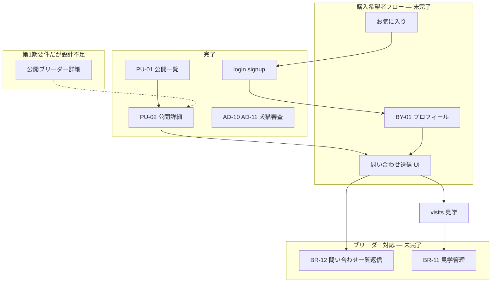

# PU-02 完了後 第1期次工程調査

| 項目   | 内容                                                                   |
| ------ | ---------------------------------------------------------------------- |
| 作業日 | 2026-08-14                                                             |
| 種別   | **調査のみ**（アプリコード・Migration・DB 変更なし）                   |
| 前提   | PU-01 / PU-02 実装完了、commit / push / GitHub Actions quality Success |

---

## 1. 現在の第1期実装状況

### 1.1 完了（事実）

| 領域           | 内容                                                                                 | 根拠                                                                      |
| -------------- | ------------------------------------------------------------------------------------ | ------------------------------------------------------------------------- |
| 認証           | `/login`, `/signup`、ロール別入口リダイレクト                                        | `src/app/(auth)/`, `src/features/auth/`                                   |
| ブリーダー     | BR-06 ダッシュボード、BR-09 プロフィール Step 1〜5、BR-07/10/11 犬猫管理・公開申請   | `src/app/breeder/`, `src/features/breeder-profile/`, `src/features/pets/` |
| 管理者         | AD-10 審査一覧、AD-11 審査詳細（承認・差戻し含む）                                   | `src/app/(admin)/admin/pets/reviews/`, `src/features/admin/`              |
| 公開           | トップ、`/pets`（PU-01）、`/pets/[petId]`（PU-02）                                   | `src/app/(public)/`                                                       |
| 公開 READ 基盤 | View + anon RLS + Signed URL                                                         | `20260814120000`, `20260814130000`                                        |
| DB（主要）     | pets, pet_photos, breeders, buyers, favorites, inquiries, visits, pet_review_logs 等 | `supabase/migrations/`（23 本）                                           |

### 1.2 未完了・プレースホルダー（事実）

| 領域                     | URL / ID                     | 状態                                        |
| ------------------------ | ---------------------------- | ------------------------------------------- |
| 公開ブリーダー詳細       | `/breeders/[breederId]`      | ID 表示のみ                                 |
| 購入希望者プロフィール   | BY-01 `/buyer/profile`       | プレースホルダー                            |
| 購入希望者ダッシュボード | BY-02 `/buyer/dashboard`     | プレースホルダー                            |
| 管理者ダッシュボード     | AD-00 `/admin`               | ガード済み・AD-10 導線なし                  |
| ブリーダー見学管理       | BR-11 `/breeder/visits`      | ルート未作成                                |
| ブリーダー問い合わせ     | BR-12 `/breeder/inquiries/*` | ルート未作成                                |
| ブリーダー設定           | BR-13 `/breeder/settings`    | ルート未作成                                |
| お気に入り UI            | —                            | feature 未作成                              |
| 購入希望者→問い合わせ UI | —                            | feature 未作成                              |
| 管理者ブリーダー審査     | —                            | 画面 ID 未設計（AD-00「今後追加予定」のみ） |
| Stripe 月額課金          | —                            | `lib/stripe/` 未作成                        |
| Dify AI 紹介文           | —                            | コード TODO のみ                            |

---

## 2. 残機能一覧（第1期要件・業務フロー・DB 設計より）

| #   | 機能                           | 第1期要件 | 業務フロー     | DB 設計                                      |
| --- | ------------------------------ | --------- | -------------- | -------------------------------------------- |
| 1   | 公開ブリーダー詳細             | ✅ 記載   | —              | View 一部（PU-02 で breeder 詳細列利用済み） |
| 2   | 購入希望者プロフィール         | 暗黙      | 問い合わせ前   | `buyers` ✅                                  |
| 3   | 問い合わせ（ご縁）             | 暗黙      | ✅ 記載        | `inquiries`, `inquiry_messages` ✅           |
| 4   | 見学希望・見学管理             | —         | 問い合わせ連動 | `visits` ✅                                  |
| 5   | お気に入り                     | —         | —              | `favorites` ✅                               |
| 6   | 管理者ブリーダー審査           | —         | —              | `breeders` 列あり                            |
| 7   | Stripe 月額課金                | —         | —              | `breeders.stripe_*` 列あり                   |
| 8   | AI 紹介文（Dify）              | —         | —              | `pets.ai_description` 列あり                 |
| 9   | ブリーダー問い合わせ一覧・返信 | —         | —              | RLS ✅                                       |
| 10  | ブリーダー設定                 | —         | —              | —                                            |
| 11  | AD-00 運用導線                 | —         | 管理者審査     | —                                            |

---

## 3. 各機能の設計状況

| 機能                      | 設計状況                             | 根拠                                                                        |
| ------------------------- | ------------------------------------ | --------------------------------------------------------------------------- |
| PU-01 / PU-02             | **設計済み**                         | `PU-01_*.md`, `PU-02_*.md`                                                  |
| AD-10 / AD-11             | **設計済み**                         | `AD-10_*.md`, `AD-11_*.md`                                                  |
| AD-00                     | **設計済み**（プレースホルダー定義） | `AD-00_*.md`                                                                |
| BY-01 / BY-02             | **一部設計**                         | `docs/04_画面設計/README.md` に ID・URL のみ。**専用設計書ファイルなし**    |
| BR-12 問い合わせ          | **一部設計**                         | README に URL・画面 ID。**専用設計書ファイルなし**                          |
| BR-11 見学管理            | **一部設計**                         | README に URL・画面 ID（犬猫編集 BR-11 と ID 重複記載あり）                 |
| BR-13 設定                | **一部設計**                         | README に URL・画面 ID のみ                                                 |
| 公開ブリーダー詳細        | **未設計**                           | 第1期要件・ProjectStructure に URL のみ。**画面 ID 未付与**、専用設計書なし |
| 購入希望者→問い合わせ送信 | **未設計**                           | PU-02 は第1期で問い合わせ CTA **除外**                                      |
| お気に入り（buyer UI）    | **未設計**                           | `favorites.md`（DB）のみ                                                    |
| 管理者ブリーダー審査      | **未設計**                           | AD-00「今後追加予定」、Decision No.100「将来」                              |
| Stripe 課金 UI            | **未設計**                           | Decision No.45（DB 保持方針のみ）                                           |
| Dify AI                   | **未設計**                           | `introduction-fields.ts` に Phase 2+ コメント、service に TODO              |

---

## 4. DB 実装状況

| テーブル / オブジェクト            | Migration | RLS  | 備考                                                                        |
| ---------------------------------- | --------- | ---- | --------------------------------------------------------------------------- |
| `pets`, `pet_photos`, Storage      | ✅        | ✅   | 公開 READ View 追加済み                                                     |
| `breeders`, `buyers`               | ✅        | ✅   |                                                                             |
| `favorites`                        | ✅        | ✅   | `20260804161228`                                                            |
| `inquiries`, `inquiry_messages`    | ✅        | ✅   | `20260804163239`                                                            |
| `visits`                           | ✅        | ✅   | 同上                                                                        |
| `pet_review_logs`                  | ✅        | ✅   |                                                                             |
| `published_pets_public` 等（一覧） | ✅        | View | `20260814120000`                                                            |
| `published_pet_detail_public` 等   | ✅        | View | `20260814130000`                                                            |
| `is_publicly_listable_pet`         | ✅        | 関数 | 公開条件共用                                                                |
| 公開ブリーダー専用 View            | ❌        | —    | 未作成（PU-02 は `breeder_public_detail_profiles` を Pet 詳細 JOIN に利用） |
| Stripe Webhook 用テーブル          | ❌        | —    | 設計書に記載なし                                                            |

---

## 5. アプリ実装状況

| 機能                   | Repository / Loader | UI                   | API 設計書                      |
| ---------------------- | ------------------- | -------------------- | ------------------------------- |
| 公開犬猫一覧・詳細     | ✅                  | ✅                   | `pets.md` 公開 READ 節          |
| ブリーダー犬猫管理     | ✅                  | ✅                   | `pets.md`                       |
| 管理者犬猫審査         | ✅                  | ✅                   | `pets.md`（一覧記載は一部古い） |
| ブリーダープロフィール | ✅                  | ✅                   | `breeder-profile.md`            |
| 認証                   | ✅                  | ✅                   | `auth.md`                       |
| お気に入り             | ❌                  | ❌                   | なし                            |
| 問い合わせ             | ❌                  | ❌                   | なし                            |
| 見学                   | ❌                  | ❌                   | なし                            |
| 購入希望者プロフィール | ❌                  | プレースホルダーのみ | なし                            |
| 公開ブリーダー詳細     | ❌                  | プレースホルダーのみ | なし                            |
| Stripe                 | ❌                  | ❌                   | なし                            |
| Dify                   | ❌                  | ❌                   | なし                            |

**補足:** `src/lib/stripe/`, `src/lib/dify/` は ProjectStructure に「予約」とあるが **ディレクトリ未作成**。`ai_description` は `src/types/pet.ts` に型のみ存在し、編集 UI からの AI 生成は未実装。

---

## 6. 公開ブリーダー詳細（調査結果）

| 項目           | 内容                                                                                                                           |
| -------------- | ------------------------------------------------------------------------------------------------------------------------------ |
| 第1期要件      | 「ブリーダー詳細」を公開機能に含む（`docs/02_要件定義/第1期要件定義.md`）                                                      |
| URL            | `/breeders/[breederId]`（`ProjectStructure.md`, プレースホルダー `page.tsx`）                                                  |
| 画面 ID        | **未決定** — `docs/04_画面設計/README.md` 公開画面一覧に **記載なし**                                                          |
| 専用設計書     | **なし**                                                                                                                       |
| PU-02 との関係 | PU-02 でブリーダー長文を **Pet 詳細内**に表示。ブリーダー詳細ページへのリンクは **第1期で置かない**（`PU-02_公開犬猫詳細.md`） |
| データ         | `breeder_public_detail_profiles` View は PU-02 詳細用に **既存**（ブリーダー単体ページ用の追加 View は未設計）                 |

---

## 7. お気に入り・問い合わせ・見学（調査結果）

### 7.1 お気に入り

| 層       | 状態                                         |
| -------- | -------------------------------------------- |
| DB       | `favorites` テーブル + RLS（Decision No.52） |
| 画面     | **未設計**（buyer 向け画面 ID なし）         |
| Feature  | 未作成                                       |
| PU-01/02 | 第1期スコープ外                              |

### 7.2 問い合わせ

| 層           | 状態                                                                  |
| ------------ | --------------------------------------------------------------------- |
| DB           | `inquiries`, `inquiry_messages` + RLS                                 |
| 画面         | BR-12（一覧・詳細 URL）が README に **一部定義**。専用設計書 **なし** |
| 購入希望者側 | 送信 UI の画面 ID・URL・設計書 **なし**                               |
| 業務フロー   | 犬猫詳細 → 問い合わせ（`docs/03_業務フロー/README.md`）               |
| PU-02        | 問い合わせフォーム **第1期未実装**                                    |

### 7.3 見学

| 層   | 状態                                                                   |
| ---- | ---------------------------------------------------------------------- |
| DB   | `visits` + RLS（Decision No.53〜58）                                   |
| 画面 | BR-11 `/breeder/visits` が README に **一部定義**。専用設計書 **なし** |
| 依存 | 問い合わせ（`visits.inquiry_id`）                                      |

---

## 8. 購入希望者・Stripe・AI・管理者（調査結果）

### 8.1 購入希望者

| 項目           | 状態                                                         |
| -------------- | ------------------------------------------------------------ |
| 会員登録       | `/signup` で buyer 選択可（`auth.md`）                       |
| ログイン       | `/login` 実装済み                                            |
| 初回 bootstrap | `ensureUserProfile` で `buyers` 仮レコード（Decision No.61） |
| BY-01          | プレースホルダーのみ                                         |
| BY-02          | プレースホルダーのみ                                         |

### 8.2 Stripe

| 項目           | 状態                                               |
| -------------- | -------------------------------------------------- |
| DB 列          | `breeders.stripe_customer_id` 等（Decision No.45） |
| `.env.example` | `STRIPE_*` プレースホルダー                        |
| アプリ         | **未実装**                                         |
| 画面設計       | **なし**                                           |

### 8.3 Dify / AI 紹介文

| 項目           | 状態                                                         |
| -------------- | ------------------------------------------------------------ |
| DB             | `pets.ai_description`, `ai_generated_at`                     |
| 方針           | AI 下書きは自動公開しない（pets.md, Decision No.40）         |
| コード         | `breeder-profile/service.ts` — 「第1期では Dify 未実装」TODO |
| `.env.example` | `DIFY_API_*` のみ                                            |
| 公開画面       | `ai_description` は **表示禁止**（PU-02）                    |

### 8.4 管理者（残）

| 機能                 | 設計                      | 実装                                  |
| -------------------- | ------------------------- | ------------------------------------- |
| AD-00 ダッシュボード | AD-00.md                  | プレースホルダー（AD-10 リンクなし）  |
| 犬猫掲載審査         | AD-10/11                  | **完了**                              |
| ブリーダー審査       | **未設計**                | 未実装（SEC-TEST 準備スクリプトのみ） |
| 問い合わせ管理       | AD-00「今後追加予定」のみ | 未実装                                |
| 会員管理             | AD-00「今後追加予定」のみ | 未実装                                |

### 8.5 ブリーダー（残）

| 機能                 | 設計     | 実装                                      |
| -------------------- | -------- | ----------------------------------------- |
| 見学管理             | 一部     | 未実装                                    |
| 問い合わせ           | 一部     | 未実装                                    |
| 設定 BR-13           | 一部     | 未実装                                    |
| BR-06 ダッシュボード | 設計済み | 実装済み（問い合わせは **ダミーデータ**） |

---

## 9. 依存関係

| 依存                       | 内容                                                         |
| -------------------------- | ------------------------------------------------------------ |
| 問い合わせ → buyer 認証    | `inquiries.buyer_id` 必須、RLS は buyer 本人 INSERT          |
| 問い合わせ → published Pet | 設計書上、INSERT 時 `pets` 整合チェックあり（Migration RLS） |
| 見学 → 問い合わせ          | `visits.inquiry_id` UNIQUE                                   |
| お気に入り → buyer 認証    | `favorites.buyer_id`                                         |
| 公開ブリーダー詳細         | PU-02 と表示項目 **重複**（設計上リンクなし）                |
| Stripe / Dify              | 第1期主フローから **独立**                                   |

### セキュリティ上の注意（既存方針の整理 — 新提案なし）

- 公開 READ は **View + anon** が正本（PU-01/02 実績）。`breeders` / `pets` 直接 anon SELECT は避ける。
- 問い合わせ実装時も **購入希望者 JWT + RLS** が前提（Service Role による公開取得は採用しない）。
- `ai_description` は公開 DTO / HTML に含めない（PU-02 確定）。

---

## 10. 優先順位案

| 順位 | 候補                                          | 設計            | 規模   | 備考                                                                     |
| :--: | --------------------------------------------- | --------------- | ------ | ------------------------------------------------------------------------ |
|  1   | **BY-01 購入希望者プロフィール（設計→実装）** | 一部→要詳細設計 | 中     | 問い合わせの **RLS 前提**。signup/bootstrap は済み                       |
|  2   | **問い合わせ送信 UI（設計→実装）**            | 未設計          | 大     | 業務フロー上 PU-02 の次。**PU-02 設計では CTA 未実装**のため設計追加が先 |
|  3   | **BR-12 ブリーダー問い合わせ（設計→実装）**   | 一部            | 大     | 上記 2 に依存                                                            |
|  4   | **AD-00 → AD-10 導線**                        | 設計済み        | **小** | 管理者 UX のみ。第1期購入フローには非必須                                |
|  5   | 公開ブリーダー詳細                            | 未設計          | 中     | 第1期要件にあるが **PU-02 で情報一部表示済み**                           |
|  6   | お気に入り                                    | 未設計          | 中     | DB のみ                                                                  |
|  7   | 見学（visits）                                | 一部            | 大     | 問い合わせ後                                                             |
|  8   | 管理者ブリーダー審査                          | 未設計          | 大     | AD-11 から「将来」参照                                                   |
|  9   | Stripe 課金                                   | 未設計          | 大     | DB 列のみ                                                                |
|  10  | Dify AI                                       | 未設計          | 中     | 第1期コードコメント上 Phase 2+                                           |

---

## 11. 次に実装すべき最小 1 単位の提案

### 提案: **AD-00 管理者ダッシュボードから AD-10 犬猫掲載審査一覧への導線追加**

| 項目        | 内容                                                                                 |
| ----------- | ------------------------------------------------------------------------------------ |
| 対象        | `src/app/(admin)/admin/page.tsx`（AD-00）                                            |
| 内容        | AD-10 `/admin/pets/reviews` へのリンク（設計書 AD-00 §今後追加予定「犬猫掲載審査」） |
| 新規画面 ID | **なし**                                                                             |
| Migration   | **不要**                                                                             |
| RLS 変更    | **不要**                                                                             |

### 理由

1. **設計書が存在する**（AD-00, AD-10）— 未決定仕様を補完しない。
2. **実装規模が最小** — 1 画面の導線追加のみ。
3. AD-10 / AD-11 は **実装済み**だが AD-00 から到達できず、運用上の欠落が残る。
4. Service Role / RLS 緩和が **不要**。

### 第1期業務フロー上の「本流」について

`docs/03_業務フロー/` の購入希望者フローは **犬猫詳細 → 問い合わせ** が次段階である。ただし:

- 問い合わせ送信 UI の **専用画面設計書がない**
- PU-02 は **問い合わせ CTA を第1期に含めない**
- BY-01 は **専用設計書がない**（README の ID/URL のみ）

そのため、**購入希望者向けの次の実装単位**としては、先に **BY-01 画面設計の作成** → **BY-01 実装** → **問い合わせ画面設計** → **問い合わせ実装** の順が妥当である（本調査では実装提案の最小単位として AD-00 導線を採用し、本流は設計完了後に着手）。

---

## 12. 未決定事項

| #   | 項目                                                      | 根拠                                                                 |
| --- | --------------------------------------------------------- | -------------------------------------------------------------------- |
| 1   | 公開ブリーダー詳細の画面 ID                               | 設計書に **記載なし**                                                |
| 2   | 公開ブリーダー詳細の URL 以外の仕様                       | 専用設計書 **なし**                                                  |
| 3   | 購入希望者→問い合わせ送信の画面 ID / URL                  | 設計書 **なし**                                                      |
| 4   | BY-01 / BY-02 の入力項目・完了条件                        | 専用設計書 **なし**（`buyers.md` に DB 列のみ）                      |
| 5   | BR-12 / 見学 BR-11 の詳細 UI 仕様                         | 専用設計書 **なし**                                                  |
| 6   | お気に入り登録対象 Pet の status 条件                     | `favorites.md` — **未決定**（推奨のみ）                              |
| 7   | Stripe 第1期スコープに含めるか                            | 要件定義 **明記なし**                                                |
| 8   | Dify 第1期スコープに含めるか                              | コード上 Phase 2+ 表記                                               |
| 9   | 管理者ブリーダー審査の画面 ID                             | **未設計**                                                           |
| 10  | `docs/06_API設計/README.md` の AD-11 承認 Action 記載     | 実装済みだが README が「今後追加予定」のまま（**ドキュメント乖離**） |
| 11  | `docs/00_アーキテクチャ/ProjectStructure.md` のルート状態 | PU-01/02・AD-10/11 実装済みと **不一致**                             |

---

## 13. 今回コード変更を行っていないことの確認

| 対象                   | 変更     |
| ---------------------- | -------- |
| `src/`                 | **なし** |
| `supabase/migrations/` | **なし** |
| DB / RLS / View        | **なし** |
| `package.json`         | **なし** |
| git commit / push      | **なし** |

---

## 14. 変更したファイル（本調査）

| ファイル                                                     | 操作                   |
| ------------------------------------------------------------ | ---------------------- |
| `docs/09_開発履歴/2026-08-14_PU-02完了後_第1期次工程調査.md` | 新規作成（本報告）     |
| `docs/09_開発履歴/README.md`                                 | 調査リンク追記（予定） |
| `docs/09_開発履歴/2026-08.md`                                | 調査リンク追記（予定） |

---

## 関連ドキュメント

- [第1期要件定義](../02_要件定義/第1期要件定義.md)
- [業務フロー](../03_業務フロー/README.md)
- [画面設計 README](../04_画面設計/README.md)
- [2026-08-12_第1期実装状況調査](./2026-08-12_第1期実装状況調査.md)
- [PU-02 公開犬猫詳細 UI 実装完了報告](./2026-08-14_PU-02_公開犬猫詳細UI実装完了報告.md)
