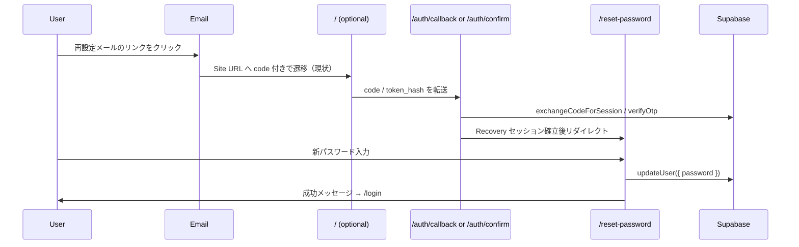

# パスワード再設定機能 実装完了報告

| 項目   | 内容                                        |
| ------ | ------------------------------------------- |
| 作業日 | 2026-08-19                                  |
| 対象   | パスワード再設定（`/reset-password`）       |
| 種別   | 認証 UI + Auth callback（既存認証への追加） |

---

## 1. 目的

Supabase Auth + Resend Custom SMTP で送信済みのパスワード再設定メールについて、リンククリック後にトップ画面へ遷移してしまう問題を解消し、Recovery セッションを用いたパスワード変更画面を実装する。

---

## 2. 実装内容

| 項目           | 内容                                                                |
| -------------- | ------------------------------------------------------------------- |
| 再設定画面     | `/reset-password` — 新パスワード + 確認入力                         |
| Auth callback  | `/auth/callback` — PKCE `code` をセッションに交換                   |
| Auth confirm   | `/auth/confirm` — `token_hash` + `type` を `verifyOtp` で検証       |
| トップページ   | メールリンクの `code` / `token_hash` を callback へ転送（最小変更） |
| パスワード更新 | `supabase.auth.updateUser({ password })`                            |
| 成功時         | 「パスワードを変更しました」表示 → ログイン画面へリンク             |
| 無効リンク     | 日本語エラーメッセージ + ログインへ戻る導線                         |

---

## 3. 変更ファイル

| 種別 | パス                                                     |
| ---- | -------------------------------------------------------- |
| 新規 | `src/app/(auth)/reset-password/page.tsx`                 |
| 新規 | `src/app/(auth)/reset-password/reset-password-form.tsx`  |
| 新規 | `src/app/auth/callback/route.ts`                         |
| 新規 | `src/app/auth/confirm/route.ts`                          |
| 新規 | `src/lib/supabase/update-password.ts`                    |
| 新規 | 本報告書                                                 |
| 変更 | `src/app/(public)/page.tsx`（auth パラメータの転送のみ） |
| 変更 | `src/features/auth/README.md`                            |
| 変更 | `docs/09_開発履歴/README.md`                             |
| 変更 | `docs/09_開発履歴/2026-08.md`                            |

---

## 4. フロー



---

## 5. Supabase 設定（確認済み・ローカル）

2026-08-19 の実メール E2E で以下の設定を使用し、動作を確認した。

| 項目            | 値                                                         |
| --------------- | ---------------------------------------------------------- |
| Site URL        | `http://localhost:3000`                                    |
| Redirect URL    | `http://localhost:3000/auth/callback?next=/reset-password` |
| Redirect URL    | `http://localhost:3000/reset-password`                     |
| Recovery メール | **token_hash 方式**（`/auth/confirm` 経由）                |

Recovery メールテンプレート（採用済み）:

```html
<a
  href="{{ .SiteURL }}/auth/confirm?token_hash={{ .TokenHash }}&type=recovery&next=/reset-password"
>
  パスワードを再設定
</a>
```

`resetPasswordForEmail` をアプリから呼ぶ場合の `redirectTo` 例（将来用）:

```typescript
redirectTo: `${process.env.NEXT_PUBLIC_APP_URL}/auth/callback?next=/reset-password`;
```

**PKCE 注意:** アプリから `resetPasswordForEmail()` を呼ぶ場合は、再設定要求とメールリンクを **同一ブラウザ** で行う必要がある。Dashboard 送信・別端末では **token_hash 方式**（`/auth/confirm`）を使用する。

---

## 6. セキュリティ・既存認証への影響

- 既存 `/login` / `/signup` / ロール別ガードは **変更なし**
- Service Role 不使用
- 成功後 `signOut()` し、新パスワードで再ログインを促す
- `next` パラメータは同一オリジン相対パスのみ許可（オープンリダイレクト防止）

---

## 7. 品質確認

| コマンド            | 結果 |
| ------------------- | ---- |
| `npm run lint`      | PASS |
| `npm run typecheck` | PASS |
| `npm run build`     | PASS |

---

## 8. 実メール E2E（2026-08-19 確認済み・PASS）

| #   | 確認項目                                       | 結果 |
| --- | ---------------------------------------------- | ---- |
| 1   | Supabase Dashboard から Password Recovery 送信 | PASS |
| 2   | Resend 経由で Gmail 受信                       | PASS |
| 3   | 日本語のパスワード再設定メール表示             | PASS |
| 4   | メールリンクから `/auth/confirm` へ遷移        | PASS |
| 5   | `token_hash` による Recovery 認証              | PASS |
| 6   | `/reset-password` 画面表示                     | PASS |
| 7   | 新しいパスワードへの変更                       | PASS |
| 8   | 「パスワードを変更しました。」表示             | PASS |
| 9   | ログイン画面への遷移                           | PASS |
| 10  | 新しいパスワードでログイン                     | PASS |
| 11  | 購入希望者プロフィール画面への遷移             | PASS |

---

## 9. 未確認事項

- 別端末からの再設定メール（PKCE 制約）での動作
- 本番環境 Supabase Redirect URL / メールテンプレートの反映

---

## 10. 追記（2026-08-19）Recovery リンク調査

### 調査結果: `resetPasswordForEmail` は未使用

`src/` 全体を検索した結果、**アプリから `supabase.auth.resetPasswordForEmail()` を呼び出している箇所はない**。
Recovery メールは Supabase Dashboard の「Send password recovery」から送信されている想定。

### 観測された Recovery URL

メール内リンク末尾: `type=recovery&redirect_to=http://localhost:3000`

- `redirect_to` が **Site URL のルートのみ**（パスなし）
- Dashboard 送信では `redirectTo` をアプリ側で指定できない
- 検証後 Supabase が `http://localhost:3000` へ着地 → hash フラグメント（`#...&type=recovery`）の場合、**サーバー側 `page.tsx` では検知不可** → トップ表示のまま

### 実施した修正

| 対応                               | 内容                                                                                              |
| ---------------------------------- | ------------------------------------------------------------------------------------------------- |
| `RecoveryLinkHandler`              | ルート layout に配置。`/` 着地時の hash / query を検知し `/reset-password` または callback へ転送 |
| `getPasswordRecoveryRedirectUrl()` | 将来のアプリからの再設定要求用（`/auth/callback?next=/reset-password`）                           |
| `resetPasswordForEmail()`          | 上記 redirectTo を指定するヘルパー（UI 未接続・将来用）                                           |
| `/auth/confirm`                    | `type=recovery` かつ `next=/` のとき `/reset-password` へ                                         |

### Dashboard テスト時の推奨設定（Supabase）

上記 **§5 Supabase 設定（確認済み・ローカル）** のとおり設定し、2026-08-19 の実メール E2E で PASS を確認した。

1. **Authentication → URL Configuration → Redirect URLs** に追加:
   - `http://localhost:3000/auth/callback?next=/reset-password`
   - `http://localhost:3000/reset-password`
2. **Recovery email テンプレート**を token_hash 方式に変更（**採用済み**）:

```html
<a
  href="{{ .SiteURL }}/auth/confirm?token_hash={{ .TokenHash }}&type=recovery&next=/reset-password"
>
  パスワードを再設定
</a>
```

3. **本番運用**: ログイン画面から `resetPasswordForEmail()` を呼ぶ（同一ブラウザで PKCE 完結）。ヘルパーは `src/lib/supabase/reset-password-email.ts` に用意済み。

### PKCE 注意（Dashboard 送信）

Dashboard「Send password recovery」はブラウザで code verifier を生成しないため、`?code=` 方式の `exchangeCodeForSession` は **失敗しやすい**。Dashboard テストは **token_hash テンプレート** を推奨。

---

## 11. 次工程

- ログイン画面への「パスワードをお忘れですか？」リンク + `resetPasswordForEmail` UI（任意）
- Supabase メールテンプレート・Redirect URL の **本番環境** 反映
- 別端末からの Recovery 動作確認（任意）
