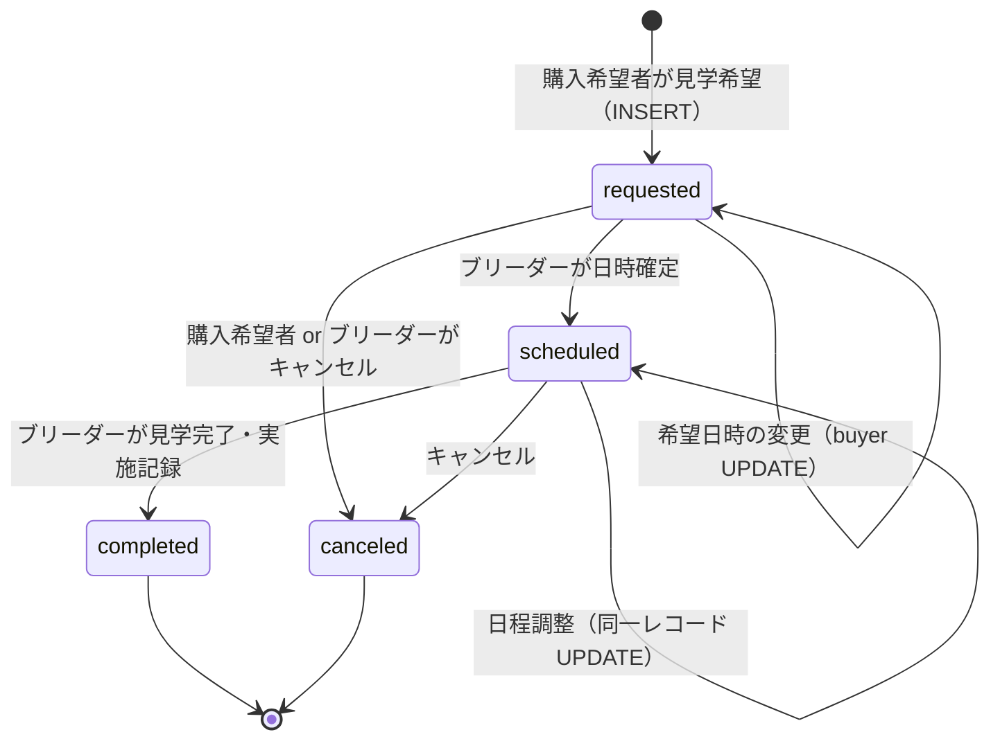

# 見学希望・見学管理 実装前調査

| 項目   | 内容                                                                 |
| ------ | -------------------------------------------------------------------- |
| 作業日 | 2026-08-24                                                           |
| 対象   | 購入希望者の見学希望 → ブリーダーの見学管理（第1期）                 |
| 種別   | **調査のみ**（コード・DB・migration・commit 変更なし）               |
| 前提   | PU-01 / PU-02、BY-01〜BY-06、BR-12 問い合わせ、inquiries feature 実装済み |

---

## 1. 結論

| 観点           | 結論                                                                                                                                 |
| -------------- | ------------------------------------------------------------------------------------------------------------------------------------ |
| DB             | **`public.visits` は migration 済み・RLS 有効**。第1期見学の中核スキーマは **既存のまま利用可能**（新 status 値の追加は不要）         |
| アプリ         | **見学関連の feature / 画面 / Server Action は未実装**（`src/features/visits/` なし、`/breeder/visits`・`/buyer/visits` ルートなし） |
| 画面設計       | **見学専用の画面設計書は未作成**（BR-11 ID が犬猫編集と重複。購入希望者側の見学画面 ID も未付与）                                    |
| 問い合わせ連携 | **`visits.inquiry_id` UNIQUE により問い合わせとの紐付けは必須**（Decision No.53, 56, 57）                                            |
| DB 変更        | **判定: A（既存 DB で実装可能）**。ただし **原子性・整合性のため RPC（軽微な B）を推奨**                                              |
| 第1期スコープ  | 予約カレンダー・リアルタイム空き時間管理・オンライン決済・Service Role 迂回は **対象外**                                              |
| 次工程         | **画面設計書の作成・確定 → `features/visits/` 実装**（inquiries feature と同パターン）                                              |

---

## 2. 現在の `visits` テーブル構造

**Migration:** `supabase/migrations/20260804163239_create_inquiries_messages_visits.sql`（**visits 専用の追加 migration はなし**）

**設計書:** [visits.md](../05_データベース設計/visits.md)（Version 1.0・確定）

### 2.1 カラム一覧

| カラム名                  | 型          | NULL     | Default             | 説明                         |
| ------------------------- | ----------- | -------- | ------------------- | ---------------------------- |
| `id`                      | uuid        | NOT NULL | `gen_random_uuid()` | PK                           |
| `inquiry_id`              | uuid        | NOT NULL | —                   | FK → `inquiries.id`（UNIQUE）|
| `buyer_id`                | uuid        | NOT NULL | —                   | FK → `buyers.id`             |
| `breeder_id`              | uuid        | NOT NULL | —                   | FK → `breeders.id`           |
| `pet_id`                  | uuid        | NOT NULL | —                   | FK → `pets.id`               |
| `requested_at`            | timestamptz | NOT NULL | —                   | 第一希望日時                 |
| `requested_at_second`     | timestamptz | NULL     | —                   | 第二希望日時                 |
| `requested_at_third`      | timestamptz | NULL     | —                   | 第三希望日時                 |
| `scheduled_at`            | timestamptz | NULL     | —                   | 確定日時                     |
| `status`                  | text        | NOT NULL | `'requested'`       | 見学状態（CHECK 4 値）       |
| `confirmed_by_breeder_at` | timestamptz | NULL     | —                   | ブリーダー承認日時           |
| `animal_confirmed`        | boolean     | NOT NULL | `false`             | 現物確認実施                 |
| `explanation_completed`   | boolean     | NOT NULL | `false`             | 対面説明実施                 |
| `result`                  | text        | NOT NULL | `'pending'`         | 見学結果（CHECK 4 値）       |
| `completed_at`            | timestamptz | NULL     | —                   | 見学完了日時                 |
| `canceled_at`             | timestamptz | NULL     | —                   | キャンセル日時               |
| `cancellation_reason`     | text        | NULL     | —                   | キャンセル理由               |
| `breeder_note`            | text        | NULL     | —                   | ブリーダー内部メモ           |
| `deleted_at`              | timestamptz | NULL     | —                   | 論理削除                     |
| `created_at`              | timestamptz | NOT NULL | `now()`             | 作成日時                     |
| `updated_at`              | timestamptz | NOT NULL | `now()`             | 更新日時（`set_updated_at`） |

**注意:** `visits` に **メッセージ本文用カラムはない**。購入希望者の「メッセージ」は [inquiry_messages](../05_データベース設計/inquiry_messages.md) に保存する設計（Decision No.54, 55）と整合させる。

### 2.2 CHECK 制約 — `status`（**新規値の追加禁止**）

| 値          | 説明         |
| ----------- | ------------ |
| `requested` | 見学希望受付 |
| `scheduled` | 見学日時確定 |
| `completed` | 見学完了     |
| `canceled`  | キャンセル   |

### 2.3 CHECK 制約 — `result`

| 値            | 説明   |
| ------------- | ------ |
| `pending`     | 未決定 |
| `contracted`  | 成約   |
| `declined`    | 見送り |
| `considering` | 検討中 |

成約（`contracted`）は **サイト内で犬猫売買契約を完結させない** 方針下での記録用（[visits.md](../05_データベース設計/visits.md)）。

### 2.4 その他制約・インデックス

- **UNIQUE:** `inquiry_id` … 1 問い合わせにつき見学は最大 1 件（Decision No.57）
- **FK:** すべて `ON DELETE RESTRICT`
- **INDEX:** `buyer_id`, `breeder_id`, `pet_id`, `status`, `scheduled_at`
- **部分 INDEX:** `visits_active_idx`（`deleted_at IS NULL`）
- **トリガー:** `visits_set_updated_at`（UPDATE 時に `updated_at` 自動更新）

### 2.5 RLS ポリシー（現状）

RLS **有効**。Service Role による迂回は **実装方針として禁止**（ユーザー指示・既存 inquiries 実装方針と同様）。

| Policy                 | 操作   | 対象        | 条件の意味                                                                 |
| ---------------------- | ------ | ----------- | -------------------------------------------------------------------------- |
| `visits_select_party`  | SELECT | buyer/breeder | `buyers.user_id = auth.uid()` または `breeders.user_id = auth.uid()` に一致 |
| `visits_select_admin`  | SELECT | admin       | `public.is_admin()`                                                        |
| `visits_insert_buyer`  | INSERT | buyer       | `buyer_id` が本人。`inquiries` の buyer/breeder/pet が visits と一致       |
| `visits_update_buyer`  | UPDATE | buyer       | 本人の visit のみ                                                          |
| `visits_update_breeder`| UPDATE | breeder     | 本人管理の visit のみ                                                      |
| `visits_update_admin`  | UPDATE | admin       | `public.is_admin()`                                                        |

**RLS のギャップ（設計書が Server 側制御を想定している点）:**

| ギャップ | 内容 |
| -------- | ---- |
| INSERT | `inquiries.status` が `open` / `replied` であること、`visit` 未作成であること、`inquiries.deleted_at IS NULL` 等を **RLS では検証していない** |
| INSERT | `pet.status = 'published'` を **RLS では検証していない**（inquiry 経由の整合性のみ） |
| UPDATE | buyer が `animal_confirmed` / `scheduled_at` 等 **全カラムを更新可能**（カラム単位制限なし） |
| UPDATE | breeder が `requested_at` 等 buyer 専用項目も **理論上更新可能** |
| SELECT | `deleted_at IS NOT NULL` のレコードも **RLS 上は取得可能**（アプリ側で `deleted_at IS NULL` フィルタ必須） |
| 原子性 | `visits` INSERT と `inquiries.status` UPDATE、`inquiry_messages` INSERT の **トランザクション保証なし** |

[visits.md](../05_データベース設計/visits.md) より: *「カラム単位の更新制限は RLS だけでは複雑になるため、Server Action または DB 関数で制御する」*

---

## 3. 現在実装されている見学関連機能

### 3.1 DB・設計

| 層           | 状態 |
| ------------ | ---- |
| Migration    | `20260804163239_create_inquiries_messages_visits.sql` で `visits` 作成済み |
| DB 設計書    | [visits.md](../05_データベース設計/visits.md) 確定 |
| Decision     | No.53（問い合わせ分離）、No.56（希望時 visits 作成）、No.57（1 inquiry 1 visit）、No.58（boolean 記録） |
| 業務フロー   | [03_業務フロー/README.md](../03_業務フロー/README.md) に **見学フローの記述なし**（問い合わせまで） |

### 3.2 アプリケーション

| 層                              | 状態 |
| ------------------------------- | ---- |
| `src/features/visits/`          | **未作成**（[ProjectStructure.md](../00_アーキテクチャ/ProjectStructure.md) 上は空ディレクトリ予約のみ） |
| `/breeder/visits`               | **ルート未作成**（ナビリンクのみ → 404） |
| `/buyer/visits`                 | **ルート未作成** |
| PU-02 見学 CTA                  | **なし**（[PU-02](../04_画面設計/PU-02_公開犬猫詳細.md) 第1期スコープ外と明記） |
| BY-02「見学予定」               | `dashboard-menu.ts` で **`comingSoon: true`** |
| BY-06 見学希望 UI               | **第1期スコープ外**と明記 |
| BR-12 見学管理                  | **第1期スコープ外**と明記 |
| `src/features/inquiries/`       | **status ラベルのみ**（`visit_requested` / `visit_scheduled` の表示定義。visits テーブルは未参照） |
| テスト                          | 見学専用テスト **なし** |
| Supabase 型                     | `visits` 用の生成型は migration 反映前提（アプリから未使用） |

### 3.3 ナビゲーション（リンクのみ）

| ファイル | 内容 |
| -------- | ---- |
| `src/components/layout/breeder-nav-items.ts` | 「見学管理」→ `/breeder/visits` |
| `src/features/buyers/dashboard-menu.ts` | 「見学予定」→ `comingSoon: true`（href なし） |

### 3.4 問い合わせ機能（見学の前提）

以下は **2026-08-24 時点で実装済み**であり、見学機能の前提インフラとなる。

| 画面 / 機能 | URL | 状態 |
| ----------- | --- | ---- |
| BY-04 問い合わせ入力 | `/buyer/inquiries/new?petId=` | 実装済み |
| BY-05 問い合わせ履歴 | `/buyer/inquiries` | 実装済み |
| BY-06 問い合わせ詳細 | `/buyer/inquiries/[inquiryId]` | 実装済み |
| BR-12 問い合わせ | `/breeder/inquiries`, `/breeder/inquiries/[inquiryId]` | 実装済み |
| RPC | `get_inquiry_buyer_display_name` | migration あり（適用状況は環境依存） |

---

## 4. 不足している機能

### 4.1 購入希望者側

| 機能 | 説明 |
| ---- | ---- |
| 見学希望送信 | 希望日時（最大 3 候補）+ メッセージ入力 → `visits` INSERT + `inquiries.status → visit_requested` + `inquiry_messages` INSERT |
| 見学予定一覧 | BY-02「見学予定」からアクセス可能な一覧 |
| 見学詳細閲覧 | 希望日時・確定日時・status・（必要なら）問い合わせへの導線 |
| 希望日時の変更 | `status = requested` 中の `requested_at*` UPDATE |
| キャンセル | `status → canceled`、`canceled_at` 設定 |
| PU-02 導線 | 「見学を希望する」CTA（ログイン・問い合わせ前提の分岐含む） |

### 4.2 ブリーダー側

| 機能 | 説明 |
| ---- | ---- |
| 見学管理一覧 | `/breeder/visits` — 本人管理 pet に紐づく visit 一覧 |
| 見学詳細 | 希望日時確認、購入希望者表示名（RPC）、犬猫情報 |
| 日時確定 | `scheduled_at` 設定、`confirmed_by_breeder_at`、`status → scheduled`、`inquiries.status → visit_scheduled` |
| 日程調整 | 同一レコードの `scheduled_at` UPDATE（Decision No.57） |
| 見学実施記録 | `animal_confirmed`、`explanation_completed`（Decision No.58） |
| 見学完了 | `status → completed`、`completed_at`、`result` 更新 |
| キャンセル | `status → canceled`、理由記録 |

### 4.3 横断

| 機能 | 説明 |
| ---- | ---- |
| 画面設計書 | 見学専用 MD 未作成 |
| `features/visits/` | repository / service / validation / loaders / components |
| status ラベル | `visits.status` / `visits.result` の日本語表示 |
| E2E テスト | 見学フロー専用（inquiries E2E と同様のパターン） |
| 確定後の詳細住所通知 | [breeders.md](../05_データベース設計/breeders.md) に「見学フロー設計で別途定義」とあり **未設計** |

---

## 5. 購入希望者側に必要な画面（提案）

**現状:** 画面 ID・専用設計書 **なし**。実装前に画面設計書の作成・確定が必要（inquiries と同手順）。

| 画面 ID（提案） | 画面名           | URL（提案）                              | 種別 | 主な機能 |
| --------------- | ---------------- | ---------------------------------------- | ---- | -------- |
| **BY-07**       | 見学希望入力     | `/buyer/visits/new?inquiryId={id}` 等    | 編集 | 希望日時（1〜3）、メッセージ、送信 |
| **BY-08**       | 見学予定一覧     | `/buyer/visits`                          | 表示 | 自分の visit 一覧（BY-02 導線） |
| **BY-09**       | 見学詳細         | `/buyer/visits/[visitId]`                | 表示 | 希望/確定日時、status、問い合わせ詳細へのリンク |

**入口の整理（ユーザー想定フローとの関係）:**

| 入口 | 推奨挙動 |
| ---- | -------- |
| PU-02「見学を希望する」 | 未ログイン → `/login`。ログイン後、当 pet の **有効 inquiry がなければ BY-04 へ誘導**（または問い合わせ+見学の一体 UI は **未決定**）。inquiry あり・visit なし → BY-07。visit あり → BY-09 |
| BY-06 問い合わせ詳細 | `status` が `open` / `replied` かつ visit 未作成時に「見学を希望する」→ BY-07 |
| BY-02 ダッシュボード | 「見学予定」`comingSoon` 解除 → BY-08 |

**BY-06 設計書との関係:** [BY-06](../04_画面設計/BY-06_購入希望者問い合わせ詳細.md) は見学希望 UI を **第1期スコープ外** としている。実装時は BY-07 への導線追加として BY-06 設計書を更新する。

---

## 6. ブリーダー側に必要な画面（提案）

**現状:** [README.md](../04_画面設計/README.md) に `/breeder/visits` の URL のみ。**画面 ID は BR-11 と犬猫編集が重複**（既知の設計上の問題）。

| 画面 ID（現 README / 提案） | 画面名     | URL（提案）                         | 種別 | 主な機能 |
| --------------------------- | ---------- | ----------------------------------- | ---- | -------- |
| **BR-11（要 ID 整理）**     | 見学管理一覧 | `/breeder/visits`                   | 表示 | visit 一覧、status フィルタ（任意）、詳細へ |
| **BR-14（新規採番提案）**   | 見学詳細     | `/breeder/visits/[visitId]`         | 編集 | 確定・調整・実施記録・完了・キャンセル |

**未決:** 見学管理の画面 ID を BR-11 のまま使うか、犬猫編集（`/breeder/pets/[petId]/edit`）と ID を分離するか。README 上 BR-11 が二重定義されているため、**実装着手前に DecisionLog または README 更新で整理推奨**。

**BR-12 との関係:** 問い合わせ詳細から関連 visit へのリンクを置くかは **未決**（一覧は `/breeder/visits` に集約する想定で十分な可能性あり）。

---

## 7. 必要な DB 変更

### 7.1 判定

| 区分 | 内容 |
| ---- | ---- |
| **A: 必須変更なし** | 既存 `visits` カラム・CHECK・RLS で第1期フローは表現可能 |
| **B: 推奨（軽微）** | 原子性・整合性のための **SECURITY DEFINER RPC**（後述） |
| **C: 第1期では追加しない** | 新 `status` 値、メッセージ用 visits 列、実施日時・担当者・電子署名列、予約カレンダー用テーブル |

**根拠なく項目を追加しない**（ユーザー指示・Decision No.58）。法令上の実施記録の追加項目は **弁護士または管轄自治体への確認が必要**。

### 7.2 RLS 変更方針

| 方針 | 内容 |
| ---- | ---- |
| 弱めない | 既存 party-only SELECT / buyer INSERT / party UPDATE を維持 |
| Service Role 迂回 | **禁止**（inquiries 実装と同様、user クライアント + RLS のみ） |
| カラム制限 | RLS 追加より **Server Action / RPC 内バリデーション** を優先（設計書どおり） |

### 7.3 推奨 RPC（B 候補）

inquiries の `get_inquiry_buyer_display_name` と同様、**RLS を弱めずに整合性を担保**する用途。

| RPC（案） | 呼び出し元 | 処理内容 |
| --------- | ---------- | -------- |
| `request_visit(...)` | buyer | 前提検証 → `visits` INSERT → `inquiries.status = visit_requested` → `inquiry_messages` INSERT（メッセージ）→ `last_message_at` 更新 |
| `schedule_visit(...)` | breeder | `scheduled_at` / `confirmed_by_breeder_at` 設定 → `visits.status = scheduled` → `inquiries.status = visit_scheduled` |
| `complete_visit(...)` | breeder | 実施記録 + `completed_at` + `result` → `visits.status = completed` |
| `cancel_visit(...)` | buyer / breeder | `canceled_at` + 理由 → `visits.status = canceled` |

**代替:** 複数ステップの Server Action + Supabase クライアント（RPC なし）。ただし部分失敗時の不整合リスクがあるため、**見学希望作成・日時確定は RPC 推奨**。

**必須ではない RPC:** 一覧表示用。既存 RLS SELECT で足りる。

---

## 8. 想定ステータス遷移

### 8.1 `visits.status`（既存 4 値のみ使用）

| 遷移 | 更新主体 | 主要カラム |
| ---- | -------- | ---------- |
| → `requested` | buyer | INSERT。`requested_at`（必須）、`requested_at_second/third`（任意） |
| → `scheduled` | breeder | `scheduled_at`, `confirmed_by_breeder_at`, `status` |
| → `completed` | breeder | `completed_at`, `animal_confirmed`, `explanation_completed`, `result`, `status` |
| → `canceled` | buyer / breeder | `canceled_at`, `cancellation_reason`, `status` |

### 8.2 `visits.result`（完了時に breeder が設定）

| 値 | タイミング |
| -- | ---------- |
| `pending` | 初期値（完了前） |
| `contracted` / `declined` / `considering` | `status → completed` 時に breeder が選択 |

### 8.3 連動する `inquiries.status`（既存 6 値のみ）

| トリガー | `inquiries.status` | 根拠 |
| -------- | ------------------ | ---- |
| 見学希望作成 | `visit_requested` | Decision No.56、[visits.md](../05_データベース設計/visits.md) |
| 日時確定 | `visit_scheduled` | 同上 |
| 見学完了 | **`completed` へ更新するか未記載** | **未決定**（[inquiries.md](../05_データベース設計/inquiries.md) の遷移図には `visit_scheduled → completed` があるが、visits.md に明示なし） |
| 見学キャンセル | **未定義** | **未決定**（`inquiries.status` を `replied` に戻すか `closed` か等） |

**問い合わせのみで終了する経路**（設計書既存）: `open` / `replied` から直接 `completed` / `closed` へ可能。

---

## 9. 問い合わせ機能との関係

### 9.1 必須の紐付け

| 項目 | 内容 |
| ---- | ---- |
| 親子関係 | `visits.inquiry_id` → `inquiries.id`（**UNIQUE**） |
| 1 案件 1 見学 | 同一 inquiry に visit は **最大 1 件**（Decision No.57） |
| 分離方針 | 問い合わせのみで完結するケースは `visits` 行なし（Decision No.53） |
| status 連動 | 見学希望・確定時に `inquiries.status` を更新（Decision No.56） |

### 9.2 メッセージの保存

| 項目 | 推奨 |
| ---- | ---- |
| 見学希望時の「メッセージ」 | **`inquiry_messages` に buyer 送信として INSERT**（Decision No.54, 55。visits に列を足さない） |
| メッセージ送信可否 | BY-06 / BR-12 設計: `visit_requested` / `visit_scheduled` 中も **追加メッセージ送信可能** |

### 9.3 ユーザー想定フロー vs 既存設計

| 観点 | ユーザー想定 | 既存設計・調査結論 |
| ---- | ------------ | ------------------ |
| 起点 | PU-02 犬猫詳細から直接「見学を希望する」 | PU-02 は第1期で見学申込 **スコープ外**。DB 上は **inquiry 必須** |
| 推奨整合フロー | — | **問い合わせ（inquiry）存在 → 見学希望（visit）**。[2026-08-21 問い合わせ実装前調査](./2026-08-21_購入希望者問い合わせ機能実装前調査.md) §11 と一致 |
| PU-02 からの直接見学 | — | **UX 上は PU-02 から CTA 可**だが、裏側では inquiry 未存在時に BY-04 へ誘導する等の分岐が必要（**未決定**） |

### 9.4 第1期問い合わせ実装との境界

[2026-08-21 問い合わせ実装前調査](./2026-08-21_購入希望者問い合わせ機能実装前調査.md) の方針:

> 第1期問い合わせ実装では `visits` テーブルは触らない

問い合わせ機能は完成済みのため、**見学機能は `features/visits/` として新規実装**し、必要箇所（BY-06 / PU-02 / dashboard-menu）に導線を追加する。

---

## 10. 実装順序（提案）

| 順 | 工程 | 内容 |
| -- | ---- | ---- |
| 1 | **画面設計** | BY-07 / BY-08 / BY-09、ブリーダー見学一覧・詳細（ID 整理含む）、PU-02 / BY-06 導線 |
| 2 | **DB（任意）** | RPC migration（`request_visit` 等）。RLS は原則変更しない |
| 3 | **`features/visits/`** | types, constants, format, validation, repository, service |
| 4 | **購入希望者** | BY-07 見学希望 → BY-08 一覧 → BY-09 詳細。BY-02 `comingSoon` 解除 |
| 5 | **ブリーダー** | `/breeder/visits` 一覧 → `/breeder/visits/[visitId]` 詳細（確定・記録・完了） |
| 6 | **導線** | PU-02 CTA、BY-06「見学を希望する」、breeder nav は既存 |
| 7 | **inquiries 連携** | format / 一覧カードに visit status 表示（任意）、BY-06 / BR-12 から visit へのリンク（任意） |
| 8 | **テスト** | 見学 E2E（buyer 希望 → breeder 確定 → 完了）。lint / typecheck / build |
| 9 | **ドキュメント** | README 画面一覧更新、DecisionLog（画面 ID 整理時） |

**第1期で後回しにできるもの:** メール通知、確定後の詳細住所開示、管理者見学一覧、ダッシュボード上の visit サマリー。

---

## 11. セキュリティ上の注意点

| 項目 | 内容 |
| ---- | ---- |
| 認可 | `requireBuyer()` / `requireBreeder()` + Server 側で `buyer_id` / `breeder_id` 解決（inquiries 同様） |
| IDOR | URL の `visitId` / `inquiryId` は RLS で他人のレコード取得不可。Loader でも 404 統一 |
| RLS 弱体化 | **禁止**。buyer / breeder 以外への SELECT 拡張しない |
| Service Role | **`src/lib/supabase/admin.ts` を visit feature から import しない** |
| UPDATE 範囲 | buyer: 希望日時・キャンセルのみ。breeder: 確定・実施記録・完了・キャンセルのみ（Server / RPC で強制） |
| 個人情報 | ブリーダーへの buyer 表示は **`get_inquiry_buyer_display_name` RPC の `display_name` のみ**（Decision No.112）。電話・メール・住所の直接開示は **第1期スコープ外**（BR-12 と同様） |
| 非公開 pet | 新規 inquiry は `pet.status = published` 必須（inquiry INSERT RLS）。visit は inquiry 経由だが、**Server 側で inquiry / pet の有効性を再確認** |
| 重複 visit | DB UNIQUE(`inquiry_id`) で防止。UI では visit 存在時に希望フォームを非表示 |
| 原子性 | 見学希望作成は **RPC またはトランザクション相当**で `visits` + `inquiries` + `inquiry_messages` を一括 |
| 法令記録 | `animal_confirmed` / `explanation_completed` のみ使用（Decision No.58）。追加フィールドは **法的根拠なしに追加しない** |

---

## 12. 未決定事項

| # | 項目 | 選択肢 / メモ |
| - | ---- | ------------- |
| 1 | **画面 ID** | ブリーダー見学管理を BR-11 のままにするか BR-14 等で犬猫編集と分離するか |
| 2 | **PU-02 からの直接見学** | inquiry 未存在時に BY-04 必須とするか、問い合わせ+見学を一体送信するか |
| 3 | **見学希望の入口 URL** | `/buyer/visits/new?inquiryId=` vs `/buyer/inquiries/[id]/visit-request` 等 |
| 4 | **見学希望時メッセージ** | `inquiry_messages` INSERT で足りるか（設計上は Yes。別途 visits 列は追加しない） |
| 5 | **第二・第三希望** | DB は対応済み。UI で必須は第一希望のみとするか、3 つすべて任意入力とするか |
| 6 | **見学完了時の `inquiries.status`** | `completed` に自動更新するか、visit 完了と inquiry 完了を分離するか |
| 7 | **見学キャンセル時の `inquiries.status`** | `replied` に戻す / `closed` / 変更なし 等 |
| 8 | **確定後の詳細住所通知** | [breeders.md](../05_データベース設計/breeders.md): *「見学日程確定後の詳細住所通知方法は、見学フロー設計で別途定義」* — **未設計** |
| 9 | **法令上の実施記録の十分性** | boolean 2 項目のみで足りるか — **弁護士または管轄自治体への確認が必要**（visits.md 明記） |
| 10 | **RPC 必須か Server Action のみか** | 整合性 vs 実装単純さ。推奨は RPC（見学希望・確定） |
| 11 | **BR-12 / BY-06 から visit 詳細への導線** | 見学管理に集約 vs 問い合わせ画面内サマリー表示 |
| 12 | **メール通知** | 見学希望・確定時の Resend 通知 — 第1期必須か（問い合わせ同様 **未実装・スコープ外候補**） |

---

## 13. 関連ドキュメント

| ドキュメント | パス |
| ------------ | ---- |
| visits テーブル | [docs/05_データベース設計/visits.md](../05_データベース設計/visits.md) |
| inquiries テーブル | [docs/05_データベース設計/inquiries.md](../05_データベース設計/inquiries.md) |
| inquiry_messages | [docs/05_データベース設計/inquiry_messages.md](../05_データベース設計/inquiry_messages.md) |
| breeders（住所公開） | [docs/05_データベース設計/breeders.md](../05_データベース設計/breeders.md) |
| Decision No.53〜58 | [docs/01_設計変更管理/DecisionLog.md](../01_設計変更管理/DecisionLog.md) |
| 画面設計 README | [docs/04_画面設計/README.md](../04_画面設計/README.md) |
| ProjectStructure | [docs/00_アーキテクチャ/ProjectStructure.md](../00_アーキテクチャ/ProjectStructure.md) |
| 問い合わせ実装前調査 | [2026-08-21_購入希望者問い合わせ機能実装前調査.md](./2026-08-21_購入希望者問い合わせ機能実装前調査.md) |
| PU-02 次工程調査 | [2026-08-14_PU-02完了後_第1期次工程調査.md](./2026-08-14_PU-02完了後_第1期次工程調査.md) |

---

## 14. 変更履歴

| 日付       | 内容     |
| ---------- | -------- |
| 2026-08-24 | 初版作成（調査のみ。コード・DB・migration 変更なし） |
