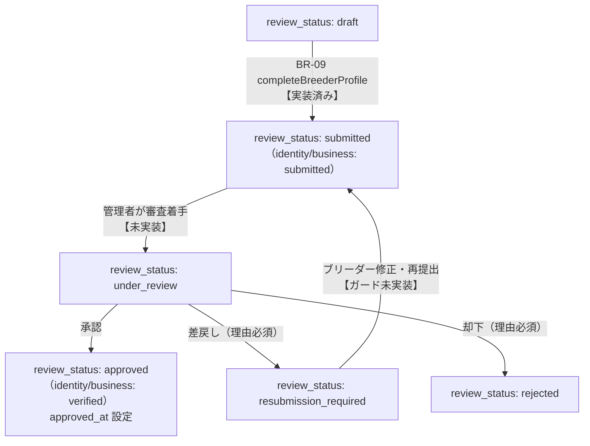

# 管理者ブリーダー審査 実装前調査

| 項目   | 内容                                                                   |
| ------ | ---------------------------------------------------------------------- |
| 作業日 | 2026-08-25                                                             |
| 対象   | 管理者によるブリーダー申請審査（第1期）                                |
| 種別   | **調査・設計整理のみ**（コード・DB migration・commit 変更なし）        |
| 前提   | AD-10/AD-11 犬猫掲載審査実装済み、BR-09 プロフィール・書類提出実装済み |

---

## 結論

| 観点          | 結論                                                                                                                                                     |
| ------------- | -------------------------------------------------------------------------------------------------------------------------------------------------------- |
| 画面 ID       | **既存 ID なし**。Decision No.99 の AD 採番に従い **AD-01（一覧）/ AD-02（詳細）** を新規提案する（犬猫審査 AD-10/11 とは十の位で分離）                  |
| DB スキーマ   | `breeders` の status 系カラムは **第1期に十分**。`approved_at` あり。**審査コメント・履歴用の列・テーブルは未存在**                                      |
| RLS           | admin の `breeders` SELECT / UPDATE は **既存 RLS で可能**（`is_admin()`）                                                                               |
| Storage       | `breeder-documents` は **private + 本人 RLS のみ**。管理者書類閲覧には **admin SELECT ポリシー追加が必須**                                               |
| RPC           | 承認・差戻し・却下は **複数カラムの原子更新 + 監査ログ** が必要なため、犬猫審査（AD-11）と同様 **専用 RPC を推奨**                                       |
| status 追加   | **新 status 値は不要**。既存 CHECK 値（`review_status` / `identity_verification_status` / `business_verification_status` / `membership_status`）のみ使用 |
| 最大論点      | **承認（`review_status=approved`）と `membership_status=active`（公開・Stripe）の切り分け** — Decision 未確定                                            |
| 第1期スコープ | 一覧・詳細・書類確認（Signed URL）・承認/差戻し/却下・有効期限表示・再提出確認まで。**メール・n8n・自動期限監視・Stripe は対象外**                       |
| 次工程        | **Decision 確定（membership / under_review 遷移）→ 画面設計書 AD-01/02 → Migration（Storage RLS + RPC + 任意ログ表）→ 実装**                             |

---

## 現在の実装状況

| 区分            | 項目                                           | 状態           | 備考                                                                             |
| --------------- | ---------------------------------------------- | -------------- | -------------------------------------------------------------------------------- |
| 設計済み        | `breeders` テーブル・status CHECK              | ✅             | [breeders.md](../05_データベース設計/breeders.md) Version 1.4                    |
| 設計済み        | AD-00 ダッシュボード                           | ✅             | ブリーダー審査は「今後追加予定」テキストのみ                                     |
| 設計済み        | AD-10 / AD-11（犬猫審査）                      | ✅             | **実装済み**。パターン流用対象                                                   |
| 設計済み        | BR-09 Step5 提出フロー                         | ✅             | `completeBreederProfile` → `review_status=submitted`                             |
| 設計済み        | Decision No.100（書類は犬猫審査では非表示）    | ✅             | ブリーダー審査側で原本確認                                                       |
| 設計済み        | Decision No.107（犬猫公開の breeder 前提条件） | ✅             | RPC 内で `review_status=approved` 等を検証                                       |
| 設計不足        | AD-01 / AD-02 画面設計書                       | ❌             | 画面 ID 未設計（[PU-02完了後調査](./2026-08-14_PU-02完了後_第1期次工程調査.md)） |
| 設計不足        | ブリーダー審査業務フロー（03_業務フロー）      | ❌             | 犬猫審査フローのみ記載                                                           |
| 設計不足        | `under_review` への遷移タイミング              | ❌             | DB に値はあるがアプリ未使用                                                      |
| 設計不足        | 差戻しコメント・却下理由の保存先               | ❌             | `rejection_reason` / `review_comment` 列なし                                     |
| 設計不足        | 審査履歴テーブル                               | ❌             | `pet_review_logs` に相当する `breeder_review_logs` なし                          |
| 実装済み        | admin 認証・`/admin/*` ガード                  | ✅             | Decision No.102、`requireAdmin()`                                                |
| 実装済み        | ブリーダー申請（`submitted`）                  | ✅             | `src/features/breeder-profile/service.ts`                                        |
| 実装済み        | admin による `breeders` SELECT（RLS）          | ✅             | Migration `20260804135800_create_breeders.sql`                                   |
| 一部実装        | admin による `breeders` UPDATE 経路            | ⚠️             | RLS 上は可能。本番審査 UI/RPC なし。**SEC-TEST スクリプトのみ**                  |
| 未実装          | ブリーダー審査一覧・詳細 UI                    | ❌             |                                                                                  |
| 未実装          | 管理者向け書類 Signed URL                      | ❌             | Storage admin ポリシーなし                                                       |
| 未実装          | ブリーダー審査 RPC                             | ❌             |                                                                                  |
| 未実装          | `resubmission_required` からの再提出ガード     | ❌             | 現状 `completeBreederProfile` は status チェックなし                             |
| DB 変更が必要   | `breeder-documents` admin Storage RLS          | **必須**       | 書類確認不可のまま                                                               |
| DB 変更が必要   | `breeder_review_logs`（または同等）            | **推奨**       | 差戻し理由・申請日時・監査                                                       |
| DB 変更が必要   | breeders status 遷移 Trigger                   | **推奨**       | 任意 status 変更の防止（pets と対称）                                            |
| RPC が必要      | 承認 / 差戻し / 却下                           | **推奨（強）** | 多カラム原子更新 + ログ                                                          |
| 既存 RLS で可能 | admin SELECT `breeders` 全件                   | ✅             |                                                                                  |
| テストのみ      | `prepare-sec-test-review-breeder.mts`          | ⚠️             | **本番禁止**。`submitted` → `approved` + verified を直 UPDATE                    |

---

## 既存設計

### 参照ドキュメント

| 資料                                                      | ブリーダー審査関連の要点                                                |
| --------------------------------------------------------- | ----------------------------------------------------------------------- |
| [第1期要件定義](../02_要件定義/第1期要件定義.md)          | 管理者は「審査・運用管理」。ブリーダー審査画面の詳細記載なし            |
| [03_業務フロー](../03_業務フロー/README.md)               | **犬猫掲載審査フローのみ**。ブリーダー審査フロー未記載                  |
| [04_画面設計 README](../04_画面設計/README.md)            | AD-00 / AD-10 / AD-11 のみ。ブリーダー審査 ID なし                      |
| [AD-00](../04_画面設計/AD-00_管理者ダッシュボード.md)     | 「ブリーダー審査」は今後追加予定（リンクなし）                          |
| [AD-10 / AD-11](../04_画面設計/AD-10_犬猫掲載審査一覧.md) | **犬猫審査**。ブリーダー `review_status` は AD-11 でラベル表示のみ      |
| [BR-09](../04_画面設計/BR-09_ブリーダープロフィール.md)   | 提出時 `review_status=submitted`、書類は Signed URL（管理者確認は将来） |
| [breeders.md](../05_データベース設計/breeders.md)         | status 定義・必須項目・Storage・法的注記                                |
| [権限設計](../07_権限設計/README.md)                      | admin 正本、`breeder-documents` admin は「別途（将来）」                |
| [DecisionLog](../01_設計変更管理/DecisionLog.md)          | No.43/45/100/101/107 が関連                                             |

### AD-10 / AD-11 との関係

| 観点     | 犬猫掲載審査（AD-10/11）                                                   | ブリーダー審査（提案 AD-01/02）       |
| -------- | -------------------------------------------------------------------------- | ------------------------------------- |
| 審査対象 | `pets.status = under_review`                                               | `breeders.review_status` が審査待ち系 |
| 書類画像 | **表示しない**（No.100）                                                   | **詳細でのみ Signed URL 表示**        |
| 操作     | RPC `approve_pet_for_publish` / `return_pet_review`                        | 同等 RPC を新設（`breeders` 更新）    |
| 前提関係 | 犬猫公開承認時に breeder が **approved + verified + 登録期限内**（No.107） | ブリーダー承認が **犬猫公開の前提**   |
| 再利用   | `requireAdmin()`、`features/admin/` 構成、Signed URL 発行パターン          | 同上                                  |

Decision No.100 により、**本人確認書類・登録証の原本確認はブリーダー審査側の責務**であり、AD-11 では状態ラベルのみ表示する。

---

## DB 状況

### `public.breeders` — 審査関連カラム

| カラム                                 | 用途                      | 第1期 admin 審査での扱い                               |
| -------------------------------------- | ------------------------- | ------------------------------------------------------ |
| `identity_document_path`               | 本人確認書類 Storage パス | 詳細のみ。Signed URL で表示                            |
| `business_license_path`                | 登録証 Storage パス       | 詳細のみ。Signed URL で表示                            |
| `identity_verification_status`         | 本人確認状態              | 承認時 `verified`、却下時 `rejected` 等                |
| `business_verification_status`         | 登録証確認状態            | 同上。期限切れは `expired`（既存 CHECK）               |
| `review_status`                        | 総合審査状態              | 承認 / 差戻し / 却下の主軸                             |
| `membership_status`                    | 利用状態                  | **承認操作では触らない方針を推奨**（後述 Stripe 境界） |
| `registration_expires_at`              | 登録有効期限              | 詳細表示 + 承認前チェック                              |
| `approved_at`                          | 承認日時                  | 承認 RPC で `now()` 設定                               |
| `phone`, `postal_code`, `address_line` | 連絡先・詳細住所          | **詳細のみ**（一覧に出さない）                         |

### 存在しない列（調査結果）

| 想定用途           | 調査結果                                                        |
| ------------------ | --------------------------------------------------------------- |
| `rejection_reason` | **コードベース・Migration ともに未存在**                        |
| `review_comment`   | **未存在**（犬猫審査は `pet_review_logs.comment` を使用）       |
| `reviewed_at`      | **未存在**（`approved_at` / `updated_at` のみ）                 |
| `submitted_at`     | **未存在**（pets と同様、ログ表または `updated_at` 代替が課題） |

### admin 操作と RLS

Migration `20260804135800_create_breeders.sql`:

| ポリシー              | 操作   | 条件                                       |
| --------------------- | ------ | ------------------------------------------ |
| `breeders_select_own` | SELECT | `auth.uid() = user_id` **OR** `is_admin()` |
| `breeders_update_own` | UPDATE | USING / WITH CHECK 同上                    |

→ admin JWT から **直接 UPDATE 可能**。ただし犬猫審査と同様、**任意カラム変更を許す設計は非推奨**（専用 RPC + 必要なら Trigger）。

### SEC-TEST スクリプト（本番機能ではない）

`scripts/prepare-sec-test-review-breeder.mts` は Phase B で admin JWT により以下のみ UPDATE:

- `review_status: approved`
- `identity_verification_status: verified`
- `business_verification_status: verified`

`membership_status` / `approved_at` は **更新しない**。犬猫審査 RPC テスト用の一時データ準備専用。

---

## RLS 状況

| リソース                    | admin SELECT             | admin UPDATE    | 備考                             |
| --------------------------- | ------------------------ | --------------- | -------------------------------- |
| `public.breeders`           | ✅ `is_admin()`          | ✅ `is_admin()` | 直接 UPDATE 可能だが RPC 化推奨  |
| `storage.breeder-documents` | ❌                       | ❌              | **ブロッカー** — 書類確認不可    |
| `storage.pet-photos`        | ✅（Migration 作成済み） | ❌              | AD-11 で Signed URL パターン確立 |

Service Role をブラウザ / 通常 Server Action で使う設計は **なし**（Decision No.102 / 権限設計と整合）。

---

## Storage 状況

| 項目     | 内容                                                                                        |
| -------- | ------------------------------------------------------------------------------------------- |
| バケット | `breeder-documents`（**private**）                                                          |
| パス規則 | `breeders/{userId}/identity/...`, `breeders/{userId}/license/...`                           |
| 現行 RLS | 本人 `{userId}` 配下のみ SELECT / INSERT / UPDATE                                           |
| admin    | **ポリシー未作成**（[breeders.md](../05_データベース設計/breeders.md)「別途ポリシー追加」） |

### 推奨: 管理者書類閲覧（pet-photos パターン踏襲）

1. Migration で `breeder_documents_storage_select_admin` を追加
   - 条件: `bucket_id = 'breeder-documents'` AND `is_admin()`
2. Server 側 `requireAdmin()` 後、**admin セッション JWT** で `createSignedUrl()` / `createSignedUrls()`
3. 有効期限は AD-11 と同程度（例: 短時間 TTL）
4. 一覧画面では **書類サムネイル・パスを表示しない**

---

## status 一覧（既存値のみ — 新規追加禁止）

### `review_status`

| 値                      | 説明             | 想定主体                                             |
| ----------------------- | ---------------- | ---------------------------------------------------- |
| `draft`                 | 下書き           | 初期 / 未申請                                        |
| `submitted`             | 提出済み         | ブリーダー `completeBreederProfile` **（実装済み）** |
| `under_review`          | 審査中           | **未実装** — 管理者が審査着手時                      |
| `approved`              | 承認             | 管理者承認                                           |
| `rejected`              | 却下             | 管理者却下（再申請不可想定）                         |
| `resubmission_required` | 修正・再提出依頼 | 管理者差戻し                                         |

### `identity_verification_status` / `business_verification_status`

| 値           | 説明                                         |
| ------------ | -------------------------------------------- |
| `unverified` | 未確認                                       |
| `submitted`  | 提出済み（申請時に設定 **実装済み**）        |
| `verified`   | 確認済み（承認時に設定）                     |
| `rejected`   | 却下                                         |
| `expired`    | 期限切れ（**business のみ** CHECK 定義あり） |

### `membership_status`

| 値          | 説明                         |
| ----------- | ---------------------------- |
| `pending`   | 利用開始前（**初期値**）     |
| `active`    | 利用中（**公開 View 条件**） |
| `suspended` | 停止中                       |
| `canceled`  | 解約済み                     |

---

## 推奨画面構成

### 画面 ID 提案（Decision No.99 準拠）

| 画面 ID   | 画面名             | URL                                   | 根拠                                               |
| --------- | ------------------ | ------------------------------------- | -------------------------------------------------- |
| **AD-01** | ブリーダー審査一覧 | `/admin/breeders/reviews`             | AD-00〜09 は未使用。犬猫審査 AD-10/11 より前の番号 |
| **AD-02** | ブリーダー審査詳細 | `/admin/breeders/reviews/[breederId]` | AD-10/11 と対称                                    |

AD-00 に **運用メニューカード**を追加（AD-10 と同パターン）。

### AD-01 一覧 — 表示項目（機微情報を出さない）

| 項目           | データソース                                                   | 備考                                     |
| -------------- | -------------------------------------------------------------- | ---------------------------------------- |
| 屋号・事業所名 | `business_name`                                                | 空なら代表者名                           |
| 代表者名       | `representative_name`                                          |                                          |
| 都道府県       | `prefecture`                                                   | 市区町村は任意（一覧は都道府県までで可） |
| 審査状態       | `review_status`                                                | ラベル表示                               |
| 本人確認状態   | `identity_verification_status`                                 | ラベルのみ                               |
| 登録証確認状態 | `business_verification_status`                                 | ラベルのみ                               |
| 登録期限       | `registration_expires_at`                                      | **日付のみ**。期限切れ警告色             |
| 申請日時       | `breeder_review_logs` 最新 `submitted` **または** `updated_at` | ログ表未作成時は暫定                     |
| 詳細へ         | —                                                              | AD-02                                    |

**一覧に出さない:** `phone`, `postal_code`, `address_line`, 書類パス, 書類画像, Stripe 関連, `user_id`

### 取得条件（案）

```text
review_status IN ('submitted', 'under_review', 'resubmission_required')
AND deleted_at IS NULL
ORDER BY 申請日時 ASC（古い順 — AD-10 No.106 と同思想）
```

`approved` / `rejected` は **別タブまたはフィルタは第2期**（第1期は審査待ち中心）。

### AD-02 詳細 — 表示項目

| セクション       | 項目                                                                       |
| ---------------- | -------------------------------------------------------------------------- |
| 基本情報         | 屋号、代表者、電話、公開メール、Web                                        |
| 所在地           | 郵便番号、都道府県、市区町村、番地（**admin のみ**）                       |
| 第一種動物取扱業 | 種別、番号、自治体、**有効期限**（期限切れ警告）                           |
| プロフィール     | 紹介、繁殖/健康/飼育方針                                                   |
| 本人確認         | 状態ラベル + **書類プレビュー（Signed URL）**                              |
| 登録証           | 状態ラベル + **画像/PDF プレビュー（Signed URL）** + Step3 入力との照合 UI |
| 審査状態         | `review_status`, `membership_status`（参照のみ）, `approved_at`            |
| 審査履歴         | `breeder_review_logs`（将来）                                              |
| 操作             | 承認 / 差戻し（理由必須）/ 却下（理由必須）                                |

### 実装パターン（AD-10/11 流用）

| レイヤー | 想定パス                                                                                         |
| -------- | ------------------------------------------------------------------------------------------------ |
| Route    | `src/app/(admin)/admin/breeders/reviews/`                                                        |
| Feature  | `src/features/admin/` に breeder review モジュール追加、または `admin/breeder-reviews/` サブ分割 |
| Loader   | `requireAdmin()` + repository SELECT                                                             |
| Action   | `requireAdmin()` + `.rpc()`                                                                      |
| 定数     | `ADMIN_BREEDER_REVIEWS_PATH` 等                                                                  |

---

## 推奨業務フロー

既存 status のみ使用。新 status **追加しない**。



### 管理者チェックリスト（第1期 — 画面上的な確認順）

1. 本人確認書類の提出有無・内容確認（**書類種別の適否は法的確認事項**）
2. 第一種動物取扱業登録証の提出・記載内容確認（**管轄自治体確認が必要な判断あり**）
3. `registration_expires_at` が **今日以降**か（No.107 と同基準: `>= CURRENT_DATE`）
4. プロフィール・登録情報の整合（Step3 入力 vs 登録証画像）
5. 承認 / 差戻し / 却下

### `under_review` 遷移タイミング（未決定 → 推奨）

| 案  | 内容                                                       | 推奨度                           |
| --- | ---------------------------------------------------------- | -------------------------------- |
| A   | AD-02 初回表示時に `submitted` → `under_review` を自動更新 | 中（実装簡単、ログ要）           |
| B   | 管理者が「審査開始」ボタンで明示遷移                       | **高**（操作意図が明確）         |
| C   | 一覧表示時点では `submitted` のまま、承認操作のみ          | 低（「審査中」状態が使われない） |

**推奨: 案 B** — pets の `under_review` と語感を揃える。

### 再提出（`resubmission_required`）

- ブリーダーは BR-09 で修正・書類再アップロード後、`completeBreederProfile` 相当で **`submitted` に戻す**
- 現状 `completeBreederProfile` は **review_status ガードなし** → 実装時に `resubmission_required`（および必要なら `draft`）のみ再提出可とする
- `rejected` からの再申請可否は **運用ポリシー未決定**（第1期は不可を推奨）

### 承認後の利用可能状態

公開 View（PU-01/02）は **`review_status = approved` AND `membership_status = active`** を要求。

→ **承認だけでは一般公開されない**。`membership_status` は Stripe または別操作で `active` 化（後述）。

---

## 必要な DB 変更

| 優先         | 変更                                         | 理由                                                           |
| ------------ | -------------------------------------------- | -------------------------------------------------------------- |
| **必須**     | `breeder-documents` admin SELECT Storage RLS | 書類確認不可                                                   |
| **強く推奨** | `breeder_review_logs` テーブル新設           | 差戻し理由・却下理由・申請日時・監査（`pet_review_logs` 対称） |
| **推奨**     | breeders status 遷移 Trigger                 | admin/breeder の不正遷移防止                                   |
| **任意**     | `breeders.submitted_at` 列                   | ログ表があれば **不要**（No.98 パターン）                      |
| **不要**     | 新 status CHECK 値                           | 既存で足りる                                                   |
| **不要**     | `breeders` 大幅スキーマ変更                  | 現行カラムで第1期可能                                          |

### `breeder_review_logs` 案（設計案 — 未確定）

| 列              | 型          | 備考                                                                  |
| --------------- | ----------- | --------------------------------------------------------------------- |
| `id`            | uuid        | PK                                                                    |
| `breeder_id`    | uuid        | FK → breeders                                                         |
| `actor_user_id` | uuid        | `auth.uid()`                                                          |
| `action`        | text        | 例: `submitted`, `review_started`, `approved`, `returned`, `rejected` |
| `comment`       | text        | 差戻し・却下理由（必須操作時）                                        |
| `created_at`    | timestamptz | 申請日時・操作日時                                                    |

---

## 必要な RPC

| RPC（仮称）                                      | 遷移・副作用                                                            | 必要性     |
| ------------------------------------------------ | ----------------------------------------------------------------------- | ---------- |
| `start_breeder_review(p_breeder_id)`             | `submitted` or `resubmission_required` → `under_review` + log           | 推奨       |
| `approve_breeder_review(p_breeder_id)`           | → `approved`, identity/business → `verified`, `approved_at=now()` + log | **必須級** |
| `return_breeder_review(p_breeder_id, p_comment)` | → `resubmission_required` + log（comment 必須）                         | **必須級** |
| `reject_breeder_review(p_breeder_id, p_comment)` | → `rejected`, 必要なら verification → `rejected` + log                  | **必須級** |

共通要件（AD-11 RPC パターン）:

- `SECURITY DEFINER` + `SET search_path = public`
- 関数内で `auth.uid()` / `is_admin()` 再検証
- `REVOKE EXECUTE FROM PUBLIC, anon` / `GRANT EXECUTE TO authenticated`
- **Service Role 不要**
- 承認前に `registration_expires_at IS NOT NULL AND >= CURRENT_DATE` を検証（No.107 と整合）
- **`membership_status` は第1期 RPC では更新しない**（Stripe 境界）

### 直接 UPDATE で足りるか

| 操作        | 直接 UPDATE                                            | 判定         |
| ----------- | ------------------------------------------------------ | ------------ |
| 一覧 SELECT | ✅ RLS で可                                            | RPC 不要     |
| 承認        | `review_status` + 2 verification + `approved_at` + log | **RPC 推奨** |
| 差戻し/却下 | `review_status` + log + comment                        | **RPC 推奨** |

---

## セキュリティ要件

| 要件                                 | 現状                       | 第1期対応                             |
| ------------------------------------ | -------------------------- | ------------------------------------- |
| admin のみ `/admin/breeders/*`       | ✅ `requireAdmin()`        | 新ルートも layout ガード              |
| buyer / breeder は管理者審査画面不可 | ✅ role redirect           | 維持                                  |
| Service Role をブラウザで使わない    | ✅ 未使用                  | 維持                                  |
| 書類は private + Signed URL          | ⚠️ admin ポリシーなし      | Migration 追加                        |
| 一覧で PII を最小化                  | —                          | 電話・住所・書類パス非表示            |
| 詳細 URL の ID 推測                  | —                          | 審査対象外 status は 404              |
| admin 兼 breeder アカウント          | pets Trigger で admin 優先 | breeders Trigger 設計時も同思想を検討 |
| SEC-TEST スクリプト                  | テスト専用                 | **アプリから呼ばない**                |

---

## 個人情報保護

| データ                        | 一覧   | 詳細（admin）   | 公開                   |
| ----------------------------- | ------ | --------------- | ---------------------- |
| `phone`                       | 非表示 | 表示可          | 非公開（No.44）        |
| `postal_code`, `address_line` | 非表示 | 表示可          | 非公開                 |
| `identity_document_path`      | 非表示 | Signed URL のみ | 非公開                 |
| `business_license_path`       | 非表示 | Signed URL のみ | 非公開                 |
| `representative_name`         | 表示可 | 表示可          | 公開 View には含めない |

書類プレビューは **iframe/img に短 TTL URL**、ダウンロードリンクの常設は避ける（第1期はブラウザ内確認のみ）。

---

## Stripe との境界

### 既存 Decision

| No. | 内容                                                            |
| --- | --------------------------------------------------------------- |
| 43  | 審査・登録証・**課金状態**を `breeders` で一元管理              |
| 45  | DB には Stripe ID / subscription_status のみ。請求正本は Stripe |

### 現状の実装・運用事実

| 項目                              | 状態                                                         |
| --------------------------------- | ------------------------------------------------------------ |
| `membership_status` 初期値        | `pending`                                                    |
| 公開 View 条件                    | `review_status=approved` **かつ** `membership_status=active` |
| `prepare-sec-test-review-breeder` | 承認時 **membership を触らない**                             |
| `prepare-sec-test-public-read`    | テストのみ admin が `pending` → `active`                     |
| Stripe 連携                       | **未実装**                                                   |
| 承認後の課金開始タイミング        | **Decision 未確定**                                          |

### 設計論点（今回 Stripe 実装はしない）

| 案                                 | 概要                                                        | メリ                        |
| ---------------------------------- | ----------------------------------------------------------- | --------------------------- |
| **承認後課金**                     | `approved` → ブリーダーが Stripe 登録 → Webhook で `active` | 未審査者に課金させない      |
| **課金後審査**                     | 先に `active`（または trialing）→ 審査                      | 収益先行、未承認公開リスク  |
| **承認と同時 active（第1期暫定）** | 承認 RPC で `membership_status=active`                      | Stripe 未実装時のテスト簡便 |

**推奨（第1期）:** Decision 確定まで **承認 RPC は `membership_status` を変更しない**（No.43 の「状態分離」を維持）。Stripe 実装時に **「承認済み `approved` のブリーダーのみ Checkout 可能」** とする。

**第1期テスト:** 既存 `prepare-sec-test-public-read.mts` と同様、**テスト専用**で `active` 化（本番 UI からは不可）。

---

## 法的確認事項

以下は **断定せず**、実装・運用文言では「弁護士または管轄自治体への確認が必要」と記録する。

| テーマ                                              | 記録                                                                                                |
| --------------------------------------------------- | --------------------------------------------------------------------------------------------------- |
| 本人確認書類の acceptable な種類                    | [breeders.md](../05_データベース設計/breeders.md) 既記載 — **弁護士または運営責任者への確認が必要** |
| 登録種別の適否                                      | **管轄自治体への確認が必要**                                                                        |
| オンライン画像のみでの登録証確認の足りるか          | **弁護士または管轄自治体への確認が必要**                                                            |
| 第一種動物取扱業の掲載・マッチングにおける表示義務  | **弁護士への確認が必要**                                                                            |
| 個人情報（書類・住所・電話）の admin 閲覧・保存期間 | **弁護士への確認が必要**（保管期限ポリシー未設計）                                                  |
| 却下・差戻し理由の記載内容（法的リスク）            | **弁護士への確認が必要**                                                                            |

---

## 第1期の実装範囲

### 含める（基本候補）

- AD-01 申請一覧（審査待ち系 status）
- AD-02 申請詳細
- 本人確認資料・登録証の Signed URL 確認
- 登録有効期限表示・期限切れ警告
- 承認 / 差戻し（`resubmission_required`）/ 却下（`rejected`）
- 再提出状態（`resubmission_required`）の表示
- AD-00 からの導線
- admin 専用 RPC + Storage RLS + セキュリティテスト

### 含めない（今回調査で分離）

| 機能                                   | 理由               |
| -------------------------------------- | ------------------ |
| Stripe Checkout / Webhook              | 別工程             |
| メール通知（承認・差戻し）             | 第1期必須ではない  |
| n8n 連携                               | 未要件             |
| 登録期限の自動監視・バッチ             | 第2期              |
| Dify                                   | BR-09 将来方針のみ |
| `membership_status` 本番 UI からの変更 | Stripe 設計待ち    |
| git commit / push                      | ユーザー指示       |

---

## 未決定事項

| #   | 論点                                            | 推奨                                                |
| --- | ----------------------------------------------- | --------------------------------------------------- |
| 1   | 承認と `membership_status=active` のタイミング  | Stripe 実装時 Decision。第1期は分離                 |
| 2   | `submitted` → `under_review` のトリガー         | 明示「審査開始」ボタン                              |
| 3   | `rejected` 後の再申請可否                       | 第1期は不可                                         |
| 4   | 差戻し時の verification status                  | `submitted` 維持 vs `unverified` 戻し — 要 Decision |
| 5   | 審査履歴テーブル action 値の正本                | `pet_review_logs` と揃えるか                        |
| 6   | AD-01 で `approved` / `rejected` 履歴を見せるか | 第1期は審査待ちのみ                                 |
| 7   | 画面 ID AD-01/02 の正式 Decision                | **確定（No.125）**                                  |

---

## 次工程

1. ~~DecisionLog 追記~~ → **完了（No.125〜134）**
2. ~~画面設計書 AD-01 / AD-02~~ → **完了**
3. ~~03_業務フロー~~ → **完了**
4. ~~`breeder_review_logs` DB 設計書~~ → **完了**
5. **DB Migration** — Storage admin RLS + `breeder_review_logs` + 審査 RPC 4 種
6. **実装** — `features/admin` 拡張、ルート、Server Action、E2E / SEC-TEST
7. **BR-09 改修** — `submitted` log 追記、再提出ガード（`resubmission_required` のみ）

---

## 関連ノート

- 画面設計: [[docs/04_画面設計/AD-01_ブリーダー審査一覧]] / [[docs/04_画面設計/AD-02_ブリーダー審査詳細]]
- DB設計: [[docs/05_データベース設計/breeder_review_logs]] / [[docs/05_データベース設計/breeders]]
- 設計判断: [[docs/01_設計変更管理/DecisionLog]]（No.125〜134）
- 前工程: 本調査
- 次工程: Migration → 実装

---

## 付録: 変更ファイル

| 種別                 | 内容                     |
| -------------------- | ------------------------ |
| 新規                 | 本ファイルのみ           |
| コード / DB / commit | **変更なし**（調査のみ） |
