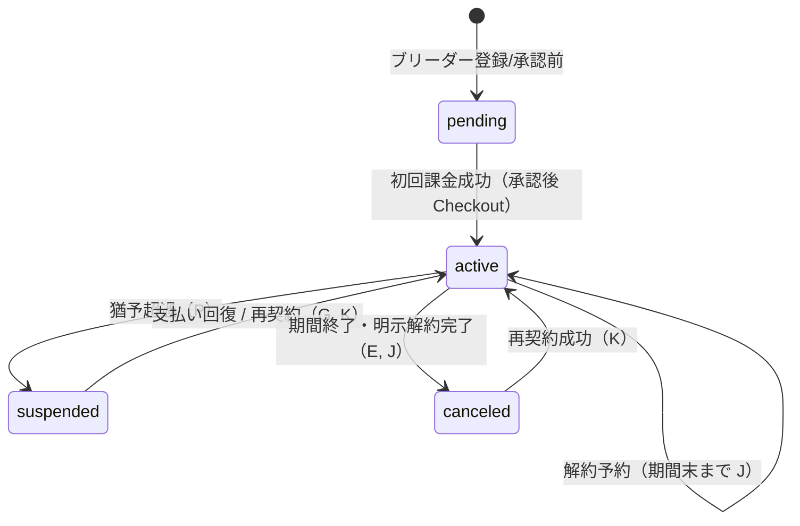

# Stripe Decision 確定前 — 価格監査・課金ルール整理

| 項目   | 内容                                                                           |
| ------ | ------------------------------------------------------------------------------ |
| 作業日 | 2026-08-26                                                                     |
| 種別   | **調査・Decision 準備のみ**                                                    |
| 禁止   | コード / DB / Migration / RPC / RLS / Stripe API / DecisionLog / commit / push |

> **2026-08-26 更新:** 本報告の候補は **DecisionLog No.139–148 で正式確定**。正本は DecisionLog および [Stripe 第1期実装計画](./2026-08-26_Stripe第1期実装計画.md)。

**関連:** [[2026-08-26_Stripe第1期課金設計事前調査]] / [[DecisionLog]] / [[pets テーブル]]

---

## 1. 今回の確定候補（ユーザー方針 A–P）

| ID  | 内容                                                       | 本報告での位置づけ               |
| --- | ---------------------------------------------------------- | -------------------------------- |
| A   | 管理価格は原則 **税抜正本**                                | Decision 候補（新規）            |
| B   | ブリーダー月額 **5,000 円（税抜）**                        | Decision 候補（新規）            |
| C   | 料金将来変更可、コード・DB・Webhook 固定禁止               | Decision 候補（新規）            |
| D   | **Stripe Price = 会費正本**                                | Decision 候補（No.45 具体化）    |
| E   | 明示的解約完了後 **`membership_status = canceled`**        | Decision 候補（新規）            |
| F   | 支払不良・一時利用停止 **`membership_status = suspended`** | Decision 候補（新規）            |
| G   | 支払い回復 **`membership_status = active`**                | Decision 候補（新規）            |
| H   | 無料期間 **なし**                                          | Decision 候補（新規）            |
| I   | 初回課金 **管理者承認後**                                  | Decision 候補（No.129/130 整合） |
| J   | 解約 **期間末**（即時解約しない）                          | Decision 候補（新規）            |
| K   | **再契約可能**                                             | Decision 候補（新規）            |
| L   | **Customer Portal 使用**                                   | Decision 候補（No.45 整合）      |
| M   | 請求書・領収書 **Stripe 委譲**                             | **参照 No.45**                   |
| N   | 支払い失敗時 **猶予期間を設ける**                          | Decision 候補（新規）            |
| O   | 猶予中 **`membership_status = active` 維持**               | Decision 候補（新規）            |
| P   | 猶予超過後 **`membership_status = suspended`**             | Decision 候補（新規）            |

---

## 2. 既存 `pets.price` READ ONLY 監査

**実施方法:** 管理者 JWT で `pets` を SELECT のみ（`deleted_at IS NULL`）。UPDATE / INSERT / DELETE **未実施**。

**監査日時:** 2026-08-26

### 2.1 集計

| 項目                        | 値                                   |
| --------------------------- | ------------------------------------ |
| **全 pets 件数**            | **15**                               |
| **price IS NOT NULL**       | **13**                               |
| **price IS NULL**           | **2**                                |
| **MIN(price)**              | **1**                                |
| **MAX(price)**              | **300,000**                          |
| **AVG(price)**（NULL 除外） | **123,077**                          |
| **distinct 件数**           | **4**                                |
| **distinct 値**             | `1`, `100,000`, `250,000`, `300,000` |

### 2.2 status 別件数

| status           | 件数 |
| ---------------- | ---- |
| `draft`          | 6    |
| `under_review`   | 4    |
| `published`      | 5    |
| `paused`         | 0    |
| `family_decided` | 0    |
| `closed`         | 0    |

**補足:** `pets` テーブルに **`review_status` 列は存在しない**（審査状態は `pets.status` の `under_review` 等で表現）。ユーザー指定の `review_status` は **`pets.status` で代替集計**した。

**archived 相当:** 専用 status なし。論理削除は `deleted_at`（今回対象外 0 件は未確認、監査条件は `deleted_at IS NULL` のみ）。

### 2.3 price ありデータ一覧

| pet_id     | name                         | management_name                         | species | status       | price   | created_at (UTC) |
| ---------- | ---------------------------- | --------------------------------------- | ------- | ------------ | ------- | ---------------- |
| 8b37cc46-… | タマちゃん                   | タマ                                    | dog     | under_review | 250,000 | 2026-08-06       |
| 8f920b2a-… | スバルさん                   | [SEC-TEST] Trigger Test Pet             | cat     | draft        | 300,000 | 2026-08-07       |
| 41f2b898-… | てすと                       | [SEC-TEST] Trigger Test Pet             | dog     | under_review | 1       | 2026-08-07       |
| 663f174b-… | 公開表示名のテスト           | [SEC-TEST-B] RLS Other Breeder Pet      | cat     | draft        | 1       | 2026-08-07       |
| abb5fb1c-… | Review RPC Approve Pet       | [SEC-TEST] Review RPC Approve Pet       | dog     | published    | 100,000 | 2026-08-10       |
| 079d446b-… | Review RPC Return Pet        | [SEC-TEST] Review RPC Return Pet        | dog     | draft        | 100,000 | 2026-08-10       |
| bb3c9725-… | テストちゃん                 | [SEC-TEST] Submit RPC With Photo Pet    | dog     | published    | 250,000 | 2026-08-12       |
| 6721b2ed-… | Review RPC Approve Pet #2    | [SEC-TEST] Review RPC Approve Pet #2    | dog     | published    | 100,000 | 2026-08-12       |
| 519b0992-… | Review RPC Approve Pet #3    | [SEC-TEST] Review RPC Approve Pet #3    | dog     | published    | 100,000 | 2026-08-12       |
| c8dd8c1c-… | Submit RPC With Photo Pet #2 | [SEC-TEST] Submit RPC With Photo Pet #2 | dog     | under_review | 100,000 | 2026-08-12       |
| d07c207b-… | Review RPC Approve Pet #4    | [SEC-TEST] Review RPC Approve Pet #4    | dog     | published    | 100,000 | 2026-08-12       |
| 2426059a-… | Submit RPC With Photo Pet #3 | [SEC-TEST] Submit RPC With Photo Pet #3 | dog     | under_review | 100,000 | 2026-08-12       |
| 28784ab4-… | Submit RPC With Photo Pet #4 | [SEC-TEST] Submit RPC With Photo Pet #4 | dog     | draft        | 100,000 | 2026-08-25       |

### 2.4 price なしデータ

| pet_id     | name              | management_name                    | status |
| ---------- | ----------------- | ---------------------------------- | ------ |
| 043b96e4-… | いそのタマ        | いそのタマ                         | draft  |
| ce4d8db1-… | No Photo Test Pet | [SEC-TEST] Submit RPC No Photo Pet | draft  |

### 2.5 データ性質の所見（DB 値のみでは税込/税抜断定不可）

| 分類                 | 件数                 | 備考                                                                                                          |
| -------------------- | -------------------- | ------------------------------------------------------------------------------------------------------------- |
| SEC-TEST / 自動投入  | 11+                  | `price: 100000` 固定（scripts）                                                                               |
| 手動・実ブラウザ系   | 2–3                  | タマ（250,000）、いそのタマ（NULL）、テストちゃん（250,000）                                                  |
| 境界テスト           | 2                    | `price = 1`                                                                                                   |
| **本番利用者データ** | **0 件（確認範囲）** | 接続先 Supabase は **第1期リリース前の開発環境**。一般ブリーダーの本番運用データは **未確認・おそらく不存在** |

---

## 3. 現行「税込」根拠の整理

**結論:** 既存 `price` は **税込意図で入力された可能性が高い** が、DB 数値だけでは断定しない。

| 根拠                 | 内容                                                                                                             |
| -------------------- | ---------------------------------------------------------------------------------------------------------------- |
| **入力 UI**          | `pet-draft-form-fields.tsx`: 説明文 **「円（税込）。未入力でも登録できます。」**                                 |
| **Decision No.34**   | 「**税込**販売価格は `pets.price`」と明記                                                                        |
| **設計書 `pets.md`** | `price` = **税込販売価格**                                                                                       |
| **テストデータ**     | `prepare-sec-test-*.mts` が `price: 100000` を INSERT。**税込/税抜ラベルなし**（No.34 前提の税込意図と解釈可能） |
| **実ブラウザ登録**   | タマちゃん 250,000 等 — UI が税込のため **税込入力の可能性が高い**                                               |

---

## 4. 税抜移行 3 案比較

| 比較軸           | 案A: 一括 `ROUND(price/1.10)`                          | 案B: 既存維持＋ブリーダー再入力 | 案C: 開発データクリア/再投入＋新規のみ税抜 |
| ---------------- | ------------------------------------------------------ | ------------------------------- | ------------------------------------------ |
| データ正確性     | △ 10% 固定前提。`price=1` が 1 のまま等 **異常値混在** | ◎ 人手確認                      | ◎ SEC-TEST はスクリプトで再生成            |
| 開発段階運用負荷 | ○ 一括 SQL                                             | × 件数増えると負荷大            | ○ 開発環境向け                             |
| 本番影響         | × 本番データがあると危険                               | ○                               | — 本番未稼働なら該当小                     |
| Migration 複雑度 | 中（データ UPDATE）                                    | 低（意味変更のみは **不可**）   | 低〜中（DELETE/UPDATE 方針 Decision 要）   |
| 誤変換リスク     | **高**（税率固定・端数・1 円テスト）                   | 低                              | **低**                                     |
| テスト影響       | 期待値全面見直し                                       | 中                              | prepare スクリプト修正で吸収               |

### 推奨移行案: **案C（開発データ再投入＋以降税抜統一）**

**理由（推測・提案）:**

1. 監査結果 **15 件すべて開発/SEC-TEST/手動検証** で、本番利用者データ **0 件**
2. 案A は `1` 円テストデータや将来税率変更に弱い
3. 案B は UI が税込のまま残る期間に **意味だけ変更すると公開価格が誤る**
4. 案C なら SEC-TEST は `price: 100000` を **税抜意図に合わせて scripts 修正** → 再 prepare。手動 2 件（タマ・いそのタマ）は **再入力 or 削除**

**本番リリース後に既存データがある場合:** 案C 単独は不可。**案B + 移行監査** または **案A + ブリーダー確認** を別 Decision とする。

---

## 5. Decision No.34 改定案

### 現行 No.34

> 税込販売価格は `pets.price`（integer、円単位）、補足説明は `pets.price_comment` に分離

### 改定後案

> **税抜**販売価格は `pets.price`（integer、円単位）。購入希望者向けの税込総額表示は **表示レイヤー** で行う。`price_comment` の分離は **維持**。

### DecisionLog 運用ルールと推奨方式

DecisionLog 冒頭:

> 番号は欠番を許容し、**時系列で追記**します。

| 方式                                                      | 評価                                             |
| --------------------------------------------------------- | ------------------------------------------------ |
| No.34 本文を直接書き換え                                  | ❌ 非推奨 — 履歴・参照リンク（PU-02 等）が壊れる |
| **新 Decision（例: No.139）で No.34 の price 意味を改定** | **✅ 推奨**                                      |

**推奨文案（Decision 候補）:**

- **Decision No.139（案）:** 「Decision No.34 における `pets.price` の意味を **税込から税抜に改定**する。`price` / `price_comment` の分離構造は維持。購入希望者向け税込表示は別 Decision で定義。」
- No.34 には **改定せず**、No.139 からリンク。

---

## 6. 価格表示ルール（画面別提案）

**前提:** データ正本 = 税抜。法令上の表示要件は **弁護士、税理士または専門家への確認が必要**。

| 画面                 | 主たる利用者         | 推奨表示                                              | 理由                                   |
| -------------------- | -------------------- | ----------------------------------------------------- | -------------------------------------- |
| **PU-01** 公開一覧   | 購入希望者           | **税込総額（主）**                                    | 一般向け。税抜のみは法令リスクの可能性 |
| **PU-02** 公開詳細   | 購入希望者           | **税込総額（主）** + `price_comment`                  | 同上。EC 大字体は設計上回避済み        |
| **BY-03** お気に入り | 購入希望者           | **PU-01 と同じ（税込主）**                            | 公開情報の一貫性                       |
| **BR-10** 犬猫一覧   | ブリーダー（事業者） | **税抜**                                              | 入力正本と一致                         |
| **BR-11** 登録・編集 | ブリーダー           | **入力: 税抜** + ヘルプ「公開画面では税込総額を表示」 | 正本入力                               |
| **AD-11** 審査       | 管理者               | **税抜（主）** + 税込参考（任意）                     | 審査・入力意図確認                     |

**両方表示:** 購入希望者向け（PU-01/02/BY-03）で **「税込 ○○円（税抜 ○○円）」** 等は **専門家確認後** に検討。第1期最小は **税込総額のみ** も候補。

---

## 7. 課金状態遷移（`membership_status` 正本候補）



### CHECK 制約との整合

Migration `20260804135800_create_breeders.sql`:

```sql
membership_status IN ('pending', 'active', 'suspended', 'canceled')
```

| 遷移       | CHECK 矛盾              |
| ---------- | ----------------------- |
| 上記すべて | **なし** — 4 値のみ使用 |

**`suspended` vs `canceled` の役割（確定候補）:**

| 状態            | 意味                                | 公開   | 再契約                    |
| --------------- | ----------------------------------- | ------ | ------------------------- |
| **`suspended`** | 支払不良・猶予超過等の **一時停止** | 非公開 | 可能（Portal / Checkout） |
| **`canceled`**  | ブリーダーが **明示解約し期間終了** | 非公開 | 可能（新 Checkout）       |

---

## 8. `subscription_status` マッピング案

**原則:** `subscription_status` = Stripe 参考値（No.45）。`membership_status` = WithTama 利用可否正本。**1:1 コピー禁止。**

| Stripe `subscription_status` | WithTama `subscription_status`（DB 記録） | WithTama `membership_status`（案） | 備考                                                                                                                                       |
| ---------------------------- | ----------------------------------------- | ---------------------------------- | ------------------------------------------------------------------------------------------------------------------------------------------ |
| （未契約）                   | `NULL`                                    | `pending`                          | 承認後・初回課金前                                                                                                                         |
| `trialing`                   | `trialing`                                | **`active` または `pending`**      | **第1期 H: trial なし** → Checkout で trial 付与しない。万一 DB に残る値は **`active` にマップしない**（`pending` 維持 or Webhook 非発火） |
| `active`                     | `active`                                  | **`active`**                       | 正常・猶予中（O）・解約予約中（J）も **Stripe 上は active のまま**                                                                         |
| `past_due`                   | `past_due`                                | **`active`（猶予 O）**             | Smart Retry 中                                                                                                                             |
| `unpaid`                     | `unpaid`                                  | **`suspended`（P）**               | 猶予超過                                                                                                                                   |
| `canceled`                   | `canceled`                                | **`canceled`（E）**                | 期間終了後の明示解約完了                                                                                                                   |

**解約予約中（`cancel_at_period_end = true`）:** Stripe `subscription_status` は **`active`** のまま → WithTama **`membership_status = active` 維持**（J, O と整合）。

---

## 9. 公開条件への影響

Migration `20260814120000` / `20260814130000` より:

```sql
b.review_status = 'approved'
AND b.membership_status = 'active'
AND p.status = 'published'
AND deleted_at IS NULL
```

| membership_status | 公開 View                  |
| ----------------- | -------------------------- |
| **`active`**      | **公開可**（他条件充足時） |
| **`pending`**     | **非公開**                 |
| **`suspended`**   | **非公開**                 |
| **`canceled`**    | **非公開**                 |

**維持方針:** `pets.status` / 犬猫審査状態は **課金都合で変更しない**（参照 No.96 犬猫審査 RPC 思想、事前調査 S-F）。

---

## 10. 支払い失敗猶予期間 — 候補比較（未確定 1 点）

| 比較軸              | **7 日**                                        | **14 日** | **Stripe Smart Retry 終了まで**           |
| ------------------- | ----------------------------------------------- | --------- | ----------------------------------------- |
| 運用の分かりやすさ  | ◎ 固定で説明容易                                | ◎ 同上    | △ Dashboard 設定に依存（説明要）          |
| Stripe 標準との整合 | × アプリ独自タイマー                            | × 同上    | **◎ `past_due` → `unpaid` に追従**        |
| ブリーダーへの影響  | 短い — 早く非公開                               | 中        | 長め（デフォルト retry 約 2–3 週間）      |
| 公開停止タイミング  | 7 日後 `suspended`                              | 14 日後   | **`unpaid` 時 `suspended`**               |
| 実装の簡単さ        | △ `last_payment_failed_at` + cron/scheduled job | △ 同上    | **◎ Webhook `subscription.updated` のみ** |
| 再開処理の簡単さ    | ○ 支払い成功 → `active`                         | ○ 同上    | ○ 同上                                    |

### 第1期推奨（推測・提案）: **Stripe Smart Retry 終了まで**

**内容:**

- 猶予中（O）: `subscription_status = past_due` の間 **`membership_status = active`**
- 猶予超過（P）: Stripe が **`unpaid`** に遷移した Webhook で **`membership_status = suspended`**
- **消費税率・日数をコードに固定しない**（Decision G 整合）

**代替:** 運営が「最大 14 日で必ず止めたい」場合は Stripe Dashboard で Smart Retry を 14 日以内に設定し、依然 **`unpaid` トリガー** で suspended 化（アプリに `14` を書かない）。

---

## 11. RLS セキュリティ — `breeders_update_own`

### 現状（再確認）

Migration `20260804135800_create_breeders.sql`:

```sql
CREATE POLICY breeders_update_own
  ON public.breeders FOR UPDATE
  USING (auth.uid() = user_id OR public.is_admin())
  WITH CHECK (auth.uid() = user_id OR public.is_admin());
```

**問題:** ブリーダー本人が **行全体 UPDATE 可能** → 以下を **直接書き換え可能**:

- `membership_status`
- `stripe_customer_id` / `stripe_subscription_id` / `stripe_price_id`（列追加後）
- `subscription_status`
- `subscription_current_period_end` / `cancel_at_period_end` / `last_payment_failed_at`（列追加後）
- `suspended_at`

**RLS 課題: あり（Stripe 実装前の最重要課題）**

### 対策候補比較

| 方式                                    | 概要                                                | 最小・安全                                   | 第1期向け   |
| --------------------------------------- | --------------------------------------------------- | -------------------------------------------- | ----------- |
| **A. column-level REVOKE**              | `authenticated` から特定列 UPDATE 禁止              | △ Supabase ロール構成次第                    | △           |
| **B. BEFORE UPDATE trigger**            | 保護列変更時に RAISE（`service_role` / admin 除外） | **◎ 1 Migration**                            | **✅ 推奨** |
| **C. Stripe 専用 RPC + RLS**            | 課金更新は RPC のみ                                 | ◎ だが Webhook + 全列保護には B 併用が現実的 | 補助        |
| **D. プロフィール用 View + INSTEAD OF** | 更新可能列を View に限定                            | × 変更量大                                   | ❌          |

### RLS 推奨対策: **B（BEFORE UPDATE trigger）+ Webhook は service_role**

**推奨内容（実装フェーズ）:**

1. `protect_breeders_billing_columns` trigger — 保護列が変わったら `auth.role() <> 'service_role' AND NOT is_admin()` で **EXCEPTION**
2. Webhook Route は **service_role**（サーバー env）で UPDATE
3. ブリーダープロフィール Server Action は **許可列のみ** PATCH（既存規律 + trigger 二重防御）

---

## 12. DB 変更候補（最終整理）

| オブジェクト                                   | 分類     | 理由                                                  |
| ---------------------------------------------- | -------- | ----------------------------------------------------- |
| **`stripe_webhook_events`**                    | **必須** | Webhook 冪等性（事前調査 §6）                         |
| **`breeders.stripe_price_id`**                 | **必須** | 契約時 Price スナップショット・料金改定追跡           |
| **`breeders.subscription_current_period_end`** | **必須** | BR-13 次回請求日表示                                  |
| **`breeders.last_payment_failed_at`**          | **推奨** | AD-02 表示・猶予開始記録（Smart Retry 方式でも有用）  |
| **`breeders.cancel_at_period_end`**            | **推奨** | 解約予約 UI（Stripe API 都度取得でも可だが UX 向上）  |
| **`billing_events`**                           | **不要** | 第1期過剰。Stripe Dashboard + webhook events で足りる |
| **`audit_logs`**                               | **不要** | 第1期過剰。`stripe_webhook_events` + 将来拡張         |

---

## 13. Decision 候補一覧（DecisionLog 追記用）

**運用:** 既存 Decision は **追記せず参照**。新規のみ列挙。番号は **No.139 以降** を想定（No.138 まで使用済み）。

| #   | Decision 候補                                                   | 既存参照                  |
| --- | --------------------------------------------------------------- | ------------------------- |
| 1   | Stripe を **第1期正式スコープ**（ブリーダー月額会費のみ）       | No.130 昇格               |
| 2   | 管理価格は原則 **税抜正本**（A）                                | —                         |
| 3   | ブリーダー月額 **5,000 円（税抜）** 現行基本（B）               | —                         |
| 4   | 料金 **将来変更可**、コード・DB・Webhook 固定禁止（C）          | —                         |
| 5   | **Stripe Price = 会費正本**（D）                                | **No.45**                 |
| 6   | 料金改定時 **旧料金維持 / 新料金移行は運営判断**                | 事前調査 I                |
| 7   | **`review_status=approved` と `membership_status=active` 分離** | **No.129, 130**           |
| 8   | **課金成功後 `membership_status=active`**                       | No.130 具体化             |
| 9   | 支払不良猶予超過 **`suspended`**（F, P）                        | —                         |
| 10  | 明示解約完了 **`canceled`**（E）                                | —                         |
| 11  | 解約 **期間末**、即時解約しない（J）                            | —                         |
| 12  | **再契約可能**（K）                                             | —                         |
| 13  | **無料 trial なし**（H）                                        | —                         |
| 14  | 初回課金 **管理者承認後**（I）                                  | No.129                    |
| 15  | **Customer Portal 利用**（L）                                   | No.45                     |
| 16  | 請求書・領収書 **Stripe 委譲**（M）                             | **No.45**                 |
| 17  | 猶予中 **`membership_status=active` 維持**（O）                 | —                         |
| 18  | 猶予 **Smart Retry 終了（`unpaid`）で suspended**               | §10 推奨                  |
| 19  | **`pets.price` = 税抜**（No.34 改定）                           | **No.34** → **No.139 案** |
| 20  | 購入希望者向け **税込総額は表示レイヤー**                       | —                         |
| 21  | 消費税率 **コード固定禁止**                                     | —                         |
| 22  | 公開 View は **`membership_status=active` 必須**                | Migration 済              |
| 23  | 課金都合で **`pets.status` / 犬猫審査状態を変更しない**         | No.96 思想                |
| 24  | **`breeders` 課金列は trigger で保護**                          | §11                       |
| 25  | 犬猫代金に Stripe **使用しない**                                | **No.122**                |
| 26  | 運営は犬猫販売主体 **にならない**                               | **No.122**                |
| 27  | 開発環境 `pets.price` 移行 **案C（再投入）**                    | §4                        |

---

## 14. 未決定事項

| #   | 項目                                  | 備考                                         |
| --- | ------------------------------------- | -------------------------------------------- |
| 1   | 猶予期間の **最終 Decision**          | 本報告推奨: Smart Retry / `unpaid`           |
| 2   | PU-01/02 **税込表示の法定要否・表記** | **弁護士、税理士または専門家への確認が必要** |
| 3   | Stripe Tax / Customer 住所要件        | **税理士または専門家への確認が必要**         |
| 4   | BR-13 URL（`/breeder/settings` 等）   | 実装 Design                                  |
| 5   | `trialing` が DB に入った場合の扱い   | 第1期 trial なし — **発生させない** を推奨   |

---

## 15. 次工程

1. **Decision 確定** — 本報告 §13 を DecisionLog に追記（No.139〜）
2. **猶予期間** — §10 推奨（Smart Retry / `unpaid`）の GO / NO-GO
3. **pets.price 移行** — 案C 実行計画（scripts 修正 + 手動 2 件）
4. **Stripe 実装設計** — Checkout / Webhook / BR-13 / trigger Migration
5. **表示レイヤー** — 税込 formatter + 専門家確認

---

## 16. 今回の変更確認

| 対象                   | 状態         |
| ---------------------- | ------------ |
| `src/`                 | **変更なし** |
| `supabase/migrations/` | **変更なし** |
| DecisionLog.md         | **変更なし** |
| Stripe API             | **未接続**   |
| 本報告 MD              | **新規作成** |
| git commit / push      | **未実施**   |

---

## 関連ドキュメント

- [[2026-08-26_Stripe第1期課金設計事前調査]]
- [[DecisionLog]] — No.34, 45, 96, 122, 129, 130, 138
- [[pets テーブル]]
- [[breeders テーブル]]
- [[権限設計 README]]
