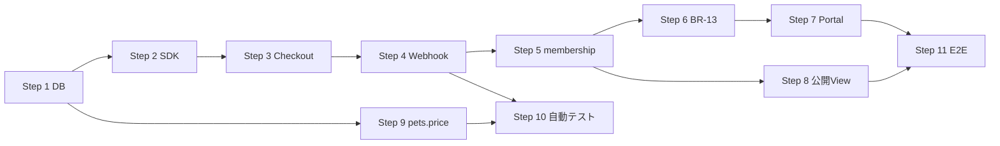

# Stripe 第1期 実装計画

| 項目   | 内容                                                        |
| ------ | ----------------------------------------------------------- |
| 作業日 | 2026-08-26                                                  |
| 状態   | **設計確定** / **実装未着手**                               |
| 正本   | [DecisionLog No.139–148](../01_設計変更管理/DecisionLog.md) |
| 前提   | 1 Step ずつ完了・検証してから次へ進む（一括実装しない）     |

**関連調査:** [事前調査](./2026-08-26_Stripe第1期課金設計事前調査.md) / [価格監査・課金ルール整理](./2026-08-26_StripeDecision確定前_価格監査課金ルール整理.md)

---

## 全体方針

| 項目         | 内容                                                               |
| ------------ | ------------------------------------------------------------------ |
| スコープ     | ブリーダー月額会費のみ（Decision No.139）                          |
| 料金正本     | Stripe Price、税抜（Decision No.143, 146）                         |
| 状態正本     | `membership_status`（Decision No.144）                             |
| セキュリティ | trigger 保護 + Webhook service_role + 署名 + 冪等性（No.147, 148） |
| 犬猫価格     | Step 9 で税抜入力・税込表示（No.140, 141, 142）                    |

## Step 依存関係



---

## Step 1 — DB / Migration / 課金列保護

| 項目         | 内容                                                                                 |
| ------------ | ------------------------------------------------------------------------------------ |
| **目的**     | 課金に必要な列・冪等性テーブルを追加し、ブリーダーによる課金列直接 UPDATE を禁止する |
| **Decision** | No.147, No.148                                                                       |

### 変更ファイル候補

| 種別      | パス                                                                         |
| --------- | ---------------------------------------------------------------------------- |
| Migration | `supabase/migrations/YYYYMMDD_stripe_billing_columns_and_webhook_events.sql` |
| Migration | `supabase/migrations/YYYYMMDD_protect_breeders_billing_columns_trigger.sql`  |
| 設計      | `docs/05_データベース設計/breeders.md`（列追加反映）                         |

### DB 変更

| オブジェクト                                             | 必須/推奨 |
| -------------------------------------------------------- | --------- |
| `stripe_webhook_events` テーブル                         | 必須      |
| `breeders.stripe_price_id`                               | 必須      |
| `breeders.subscription_current_period_end`               | 必須      |
| `breeders.last_payment_failed_at`                        | 推奨      |
| `breeders.cancel_at_period_end`                          | 推奨      |
| `protect_breeders_billing_columns` BEFORE UPDATE trigger | 必須      |

### セキュリティ

- trigger: `service_role` / `is_admin()` のみ課金列変更可
- 既存 `breeders_update_own` は維持、trigger で二重防御

### テスト

- Migration 適用後、ブリーダー JWT で `membership_status` UPDATE → **失敗**
- service_role で UPDATE → **成功**
- 既存ブリーダープロフィール UPDATE（`business_name` 等）→ **成功**

### 完了条件

- [x] Migration 作成済み（`20260826173000_stripe_step1_billing_columns_and_protection.sql`）
- [ ] Migration 適用済み（リモート / ローカル）— `.env.local` に `SUPABASE_DB_URL` 未設定のため手動適用待ち
- [ ] trigger テスト PASS — Migration 適用後
- [x] 設計書 `breeders.md` / 権限設計 列定義更新
- [x] Step 1 専用テスト `npm run test:stripe-step1-billing`

### 依存 Step

なし（最初）

---

## Step 2 — Stripe SDK / server config

| 項目         | 内容                                                  |
| ------------ | ----------------------------------------------------- |
| **目的**     | サーバー専用 Stripe クライアントと env 検証を整備する |
| **Decision** | No.139, No.143                                        |

### 変更ファイル候補

| 種別 | パス                                                                   |
| ---- | ---------------------------------------------------------------------- |
| npm  | `package.json` — `stripe` 依存追加                                     |
| lib  | `src/lib/stripe/server.ts`（server-only）                              |
| lib  | `src/lib/stripe/config.ts` — server-only 再 export                     |
| lib  | `src/lib/stripe/env.ts` — env 読取（テスト用に Node からも import 可） |
| env  | `.env.example` — 既存キー確認                                          |

### DB 変更

なし

### セキュリティ

- `STRIPE_SECRET_KEY` / `STRIPE_WEBHOOK_SECRET` はサーバーのみ
- `STRIPE_BREEDER_PRICE_ID` はサーバーのみ（クライアント不可）
- Publishable key のみ `NEXT_PUBLIC_*`

### テスト

- 単体: env 欠落時に起動/呼び出しで明確なエラー
- `npm run test:stripe-step2-server-config`（Stripe API 実通信なし）

### 完了条件

- [x] `npm install stripe` 済み（`stripe@^22.6.0`）
- [x] server client 共有インスタンス（`getStripeServerClient`）整備
- [x] env 検証（`getStripeSecretKey` / `getStripeBreederPriceId` 等）
- [x] Secret が Client Bundle に含まれない（grep / build 確認）
- [x] Step 2 専用テスト **13 PASS**

### 実施結果（2026-08-27）

| 項目                     | 結果                                                                        |
| ------------------------ | --------------------------------------------------------------------------- |
| Step 2 テスト            | **13 PASS / 0 FAIL**                                                        |
| Step 1 回帰              | **21 PASS / 0 FAIL / 1 SKIP**                                               |
| BR-09 submit 回帰        | **41 PASS**                                                                 |
| BR-09 review 回帰        | **36 PASS**                                                                 |
| public-pet-read          | **22 PASS / 0 FAIL / 5 unverified**（`prepare:sec-test-review-breeder` 後） |
| lint / typecheck / build | **PASS**                                                                    |

詳細: [Stripe Step 2 SDK/server config 実装報告](./2026-08-27_Stripe-Step2_SDK-server-config_実装報告.md)

### 依存 Step

Step 1（列定義の確定。並行可能だが Step 1 完了推奨）

---

## Step 3 — Checkout Session

| 項目         | 内容                                                                 |
| ------------ | -------------------------------------------------------------------- |
| **目的**     | 承認済みブリーダーの初回（および再）課金 Checkout をサーバーから作成 |
| **Decision** | No.143, No.144, No.146                                               |

### 変更ファイル候補

| 種別    | パス                                                         |
| ------- | ------------------------------------------------------------ |
| Route   | `src/app/api/billing/checkout/route.ts` または Server Action |
| feature | `src/features/billing/`（新規） — service, validation        |
| auth    | `requireBreeder` + `review_status = approved` 検証           |

### DB 変更

なし（Checkout 完了は Step 4 Webhook で反映）

### セキュリティ

- line_items はサーバー組み立て。env の Price ID のみ
- `metadata.breeder_id` を Stripe Session に付与
- クライアントから amount / price_id 不可

### テスト

- 未承認ブリーダー → 403
- 承認済み pending → Checkout URL 返却
- Test card で Session 作成（Stripe Dashboard 確認）

### 完了条件

- [ ] Test Mode Checkout が完了画面まで到達
- [ ] `metadata.breeder_id` が Session に付いている

### 依存 Step

Step 2

---

## Step 4 — Webhook + 冪等性

| 項目         | 内容                                                     |
| ------------ | -------------------------------------------------------- |
| **目的**     | Stripe イベントを署名検証・冪等処理し、DB を更新する基盤 |
| **Decision** | No.148, No.144                                           |

### 変更ファイル候補

| 種別       | パス                                                       |
| ---------- | ---------------------------------------------------------- |
| Route      | `src/app/api/webhooks/stripe/route.ts`                     |
| lib        | `src/lib/stripe/webhook-handlers.ts`                       |
| lib        | `src/lib/stripe/membership-mapping.ts`                     |
| repository | `src/features/billing/repository.ts` — service_role UPDATE |

### DB 変更

`stripe_webhook_events` への INSERT（Step 1）

### セキュリティ

- raw body + `constructEvent`
- event.id 重複 → skip
- service_role のみ `breeders` 課金列 UPDATE

### 対象イベント（第1期最小）

| イベント                        | 用途                        |
| ------------------------------- | --------------------------- |
| `checkout.session.completed`    | 初回紐付け                  |
| `customer.subscription.updated` | 状態・期間更新              |
| `customer.subscription.deleted` | 解約完了                    |
| `invoice.payment_failed`        | `last_payment_failed_at` 等 |

### テスト

- Stripe CLI `stripe listen` + trigger
- 同一 event 再送 → 二重更新なし
- 署名不正 → 400

### 完了条件

- [ ] 4 イベントが handler に到達
- [ ] 冪等性テスト PASS

### 依存 Step

Step 1, Step 2

---

## Step 5 — membership_status 連携

| 項目         | 内容                                            |
| ------------ | ----------------------------------------------- |
| **目的**     | Webhook 処理で Decision No.144 の状態遷移を実装 |
| **Decision** | No.144                                          |

### 変更ファイル候補

| 種別    | パス                                                           |
| ------- | -------------------------------------------------------------- |
| lib     | `src/lib/stripe/membership-mapping.ts` — マッピング表の実装    |
| webhook | handlers 内で `membership_status` / `subscription_status` 更新 |

### マッピング（正本）

| 条件                                               | `membership_status`  |
| -------------------------------------------------- | -------------------- |
| Checkout 成功（初回）                              | `pending` → `active` |
| `past_due`                                         | `active` 維持        |
| `unpaid`                                           | `suspended`          |
| 支払い回復 → `active`                              | `active`             |
| 解約予約中（Stripe active + cancel_at_period_end） | `active` 維持        |
| 期間終了 `canceled`                                | `canceled`           |
| 再契約成功                                         | `active`             |

### DB 変更

Step 1 列の更新のみ

### セキュリティ

- 特定 Price 金額 / ID 一致で active 化 **しない**
- Subscription 有効性 + Product 検証

### テスト

- Test Mode: 成功 → active
- 支払い失敗シミュレーション → past_due 中 active → unpaid で suspended
- `pets.status` が変更されていないこと

### 完了条件

- [ ] 全遷移が mapping 単体テストで PASS
- [ ] Webhook 結合で active / suspended / canceled 確認

### 依存 Step

Step 4

---

## Step 6 — BR-13 課金画面

| 項目         | 内容                                   |
| ------------ | -------------------------------------- |
| **目的**     | ブリーダー向け課金 UI と Checkout 導線 |
| **Decision** | No.143, No.144, No.145                 |

### 変更ファイル候補

| 種別    | パス                                                       |
| ------- | ---------------------------------------------------------- |
| page    | `src/app/breeder/settings/billing/page.tsx`                |
| feature | `src/features/billing/components/breeder-billing-view.tsx` |
| layout  | 設定ナビ（必要なら）                                       |
| BR-06   | `resubmission-required-banner` 同様の課金 CTA バナー       |

### DB 変更

なし（読取 + Checkout トリガーのみ）

### セキュリティ

- 表示用 Price はサーバー retrieve
- Checkout は Server Action / Route 経由のみ

### テスト

- `scripts/test-breeder-billing-page.mts`（新規）
- 各 membership_status で表示分岐

### 完了条件

- [ ] BR-13 設計書と UI 一致
- [ ] 承認済み pending から Checkout 開始可能
- [ ] BR-06 CTA から BR-13 へ遷移

### 依存 Step

Step 3, Step 5（状態表示の正確性）

---

## Step 7 — Customer Portal

| 項目         | 内容                                     |
| ------------ | ---------------------------------------- |
| **目的**     | Portal Session 作成と BR-13 からのリンク |
| **Decision** | No.145                                   |

### 変更ファイル候補

| 種別           | パス                            |
| -------------- | ------------------------------- |
| Route / Action | Portal Session 作成             |
| UI             | BR-13「支払い設定・解約」リンク |

### DB 変更

なし

### セキュリティ

- `stripe_customer_id` は DB からサーバー解決
- 他 breeder の customer 不可

### テスト

- active ブリーダー → Portal URL
- Portal から解約予約 → Webhook で cancel_at_period_end 反映

### 完了条件

- [ ] Test Mode Portal でカード変更・解約予約可能
- [ ] 解約予約中も membership active（Decision No.144）

### 依存 Step

Step 6

---

## Step 8 — 公開 View 連携確認

| 項目         | 内容                                                             |
| ------------ | ---------------------------------------------------------------- |
| **目的**     | `membership_status` 変更が公開 View に正しく反映されることを検証 |
| **Decision** | No.144                                                           |

### 変更ファイル候補

| 種別   | パス                                                 |
| ------ | ---------------------------------------------------- |
| テスト | `scripts/test-public-pet-read.mts` 拡張              |
| テスト | membership pending / suspended / canceled ケース追加 |

### DB 変更

なし（既存 View 維持）

### 公開条件（再確認）

```
review_status = approved
AND membership_status = active
AND pets.status = published
AND deleted_at IS NULL
```

### テスト

| membership  | 期待   |
| ----------- | ------ |
| `pending`   | 非公開 |
| `active`    | 公開可 |
| `suspended` | 非公開 |
| `canceled`  | 非公開 |

### 完了条件

- [ ] SEC-TEST / 手動データで 4 状態確認
- [ ] `pets.status = published` のまま非公開になること（課金停止時）

### 依存 Step

Step 5

---

## Step 9 — pets.price 税抜対応

| 項目         | 内容                                                           |
| ------------ | -------------------------------------------------------------- |
| **目的**     | 入力 UI を税抜に、公開 UI を税込表示レイヤーに。開発データ案 C |
| **Decision** | No.140, No.141, No.142, No.146                                 |

### 変更ファイル候補

| 種別    | パス                                                                    |
| ------- | ----------------------------------------------------------------------- |
| UI      | `pet-draft-form-fields.tsx` — ラベル税抜                                |
| lib     | `src/features/pets/list-format.ts` — 公開/ブリーダー表示 formatter 分離 |
| 公開 UI | `public-pet-card`, `public-pet-detail-view`, `buyer-favorite-pet-card`  |
| scripts | `prepare-sec-test-*.mts` — price 税抜意図、再 prepare                   |
| 設計    | 画面設計書（実装済み反映）                                              |

### DB 変更

**案 C:** 開発データ再投入（一括 `/1.10` 変換は **しない**）。本番は別 Decision。

### セキュリティ

- 税率をコードに `0.10` 固定 **しない**（No.146）。第1期は設定税率ソースを Decision / 専門家確認後に実装

### テスト

- ブリーダー入力 → DB 税抜保存
- PU-01/02 税込表示（モック税率 or Stripe Tax 連携後）
- SEC-TEST regression

### 完了条件

- [ ] UI ラベル「税抜」
- [ ] 公開画面が税込総額表示（専門家確認前は TODO 明記可）
- [ ] prepare スクリプト再実行でテスト PASS

### 依存 Step

Step 1（並行可能。Stripe 課金とは独立）

---

## Step 10 — 自動テスト

| 項目         | 内容                                                                |
| ------------ | ------------------------------------------------------------------- |
| **目的**     | billing / webhook / membership / price の regression スクリプト整備 |
| **Decision** | 全体                                                                |

### 変更ファイル候補

| 種別         | パス                                  |
| ------------ | ------------------------------------- |
| scripts      | `test-stripe-webhook-idempotency.mts` |
| scripts      | `test-membership-mapping.mts`         |
| scripts      | `test-breeder-billing-page.mts`       |
| package.json | npm scripts 追加                      |

### テスト範囲

- mapping 単体
- trigger セキュリティ（Step 1）
- 公開 READ（Step 8）
- pets.price 表示（Step 9）

### 完了条件

- [ ] CI で実行可能（Stripe Test Mode キーは CI secret）
- [ ] 主要 path が PASS

### 依存 Step

Step 4, Step 5, Step 8, Step 9

---

## Step 11 — Stripe Test Mode E2E

| 項目         | 内容                                                                                   |
| ------------ | -------------------------------------------------------------------------------------- |
| **目的**     | 承認 → Checkout → active → 公開 → 失敗 → suspended → 回復 / 解約 → canceled の一連 E2E |
| **Decision** | No.144                                                                                 |

### シナリオ（案）

1. ブリーダー `approved` + `pending`
2. Checkout 成功 → `active` → 公開 pets 表示
3. Test clock / 失敗カード → `past_due`（active 維持）→ `unpaid`（suspended）→ 非公開
4. 支払い回復 → `active` → 再公開
5. Portal 解約予約 → 期間末 → `canceled`

### 変更ファイル候補

| 種別    | パス                                                    |
| ------- | ------------------------------------------------------- |
| docs    | `docs/09_開発履歴/YYYY-MM-DD_Stripe第1期E2E完了報告.md` |
| scripts | E2E 手順書 or 半自動スクリプト                          |

### 完了条件

- [ ] 上記シナリオが Test Mode で再現
- [ ] 完了報告 MD 作成

### 依存 Step

Step 7, Step 8, Step 10

---

## 実装前チェックリスト（共通）

| #   | 項目                                                                     |
| --- | ------------------------------------------------------------------------ |
| 1   | Stripe Dashboard: Product / Price（税抜, `tax_behavior: exclusive`）作成 |
| 2   | Smart Retry 設定確認（Decision No.144）                                  |
| 3   | Customer Portal 設定（Decision No.145）                                  |
| 4   | 税理士・弁護士確認（Tax / 表示 — Decision No.140, 146）                  |
| 5   | `.env.local` Test Mode キー                                              |

---

## 関連ドキュメント

- [DecisionLog No.139–148](../01_設計変更管理/DecisionLog.md)
- [BR-13 ブリーダー課金設定](../04_画面設計/BR-13_ブリーダー課金設定.md)
- [breeders テーブル](../05_データベース設計/breeders.md)
- [pets テーブル](../05_データベース設計/pets.md)
