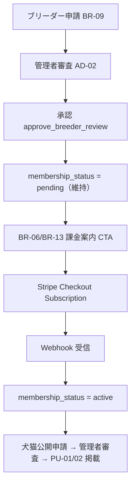
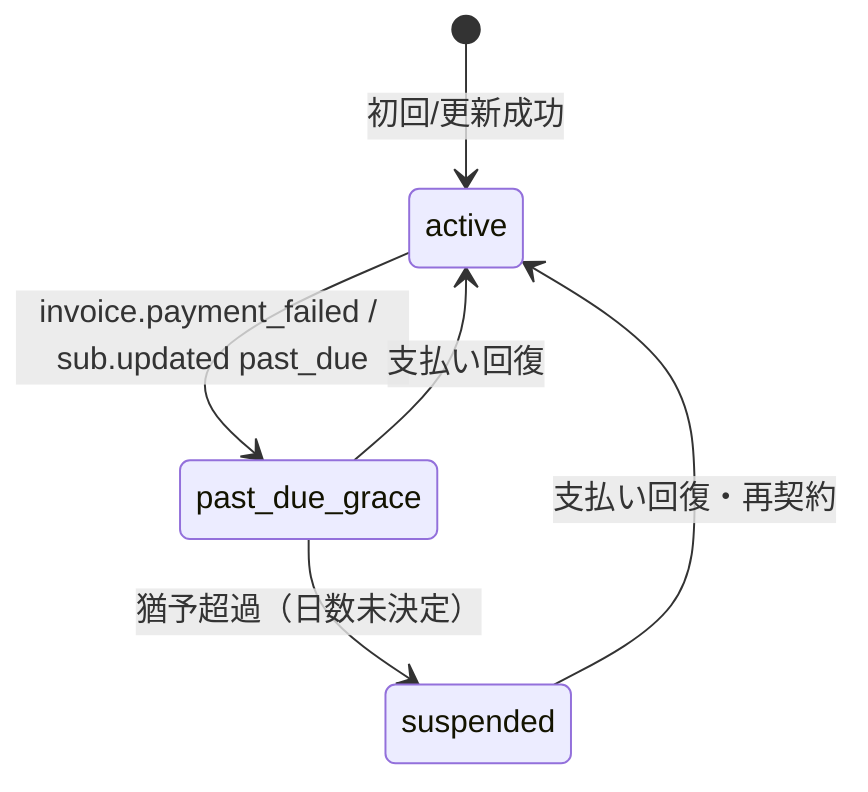

# Stripe 第1期課金設計 事前調査

| 項目   | 内容                                                                                         |
| ------ | -------------------------------------------------------------------------------------------- |
| 作業日 | 2026-08-26（初版） / **2026-08-26 追記①**（料金変更） / **2026-08-26 追記②**（**税抜統一**） |
| 種別   | **調査のみ**（コード・DB・Stripe API 接続・commit / push 変更なし）                          |
| 目的   | 第1期 Stripe 正式採用 Decision 案と実装設計案の作成                                          |

> **2026-08-26 更新:** Stripe 第1期の主要 Decision は **DecisionLog No.139–148 で正式確定**。本ドキュメントは事前調査の記録。正本は DecisionLog。

**基本方針（ユーザー提示 — 2026-08-26 税抜統一）**

- **価格データの正本は原則「税抜」**（ブリーダー会費・犬猫価格・将来の有料サービス）
- 購入希望者: **無料**
- ブリーダー: **月額会費**（**現在の基本料金は 5,000 円（税抜）**。将来変更可能 — **コード/DB/Webhook に固定しない**）
- Stripe は **ブリーダー月額会費のみ**（犬猫代金決済には **使用しない**）
- 運営会社は **犬猫販売主体にならない**
- **Stripe Price をブリーダー会費の料金管理正本**とする（Decision No.45 と整合）
- **表示は別レイヤー:** データ=税抜、購入希望者向け画面は法令上必要な **税込総額表示を別途**（Decision 案 F）

---

## 1. 現状確認（実コード・DB・Decision）

### 1.1 breeders テーブル Stripe 関連列

Migration: `supabase/migrations/20260804135800_create_breeders.sql`

| カラム                   | 型          | 初期値    | CHECK 値                                                            |
| ------------------------ | ----------- | --------- | ------------------------------------------------------------------- |
| `membership_status`      | text        | `pending` | `pending`, `active`, `suspended`, `canceled`                        |
| `stripe_customer_id`     | text        | NULL      | 部分 UNIQUE（NULL 以外）                                            |
| `stripe_subscription_id` | text        | NULL      | 部分 UNIQUE（NULL 以外）                                            |
| `subscription_status`    | text        | NULL      | NULL 可。`trialing`, `active`, `past_due`, `unpaid`, `canceled`     |
| `suspended_at`           | timestamptz | NULL      | 利用停止日時（課金停止時に設定する想定だが **Webhook 連携未実装**） |

**不足列（現時点）:** `subscription_current_period_end`, `cancel_at_period_end`, `last_payment_failed_at`, `stripe_price_id`（契約時 Price スナップショット — §3.4 / §9 参照）。

### 1.2 公開 View の条件

Migration: `20260814120000_add_public_pet_list_read_access.sql`, `20260814130000_add_public_pet_detail_read_views.sql`

```sql
-- is_publicly_listable_pet / published_*_public 共通
p.status = 'published'
AND p.deleted_at IS NULL
AND b.deleted_at IS NULL
AND b.review_status = 'approved'
AND b.membership_status = 'active'
```

**犬猫の `pets.status` は課金条件に含まれない。** ブリーダー側 `membership_status != active` だけで公開 View から除外される。

### 1.3 審査 RPC と membership の関係

| RPC / 処理                     | membership_status | 根拠 Migration / Decision          |
| ------------------------------ | ----------------- | ---------------------------------- |
| `approve_breeder_review`       | **変更しない**    | No.129 / No.130                    |
| `submit_breeder_application`   | **変更しない**    | No.129 / No.130                    |
| `resubmit_breeder_application` | **変更しない**    | No.137                             |
| `submit_pet_for_review`        | **チェックなし**  | 承認前でも申請可能（公開は別条件） |

承認後の典型状態: `review_status = approved`, `membership_status = pending`（E2E 実績: BR-09 完了報告）。

### 1.4 既存 Stripe コード

| 項目                      | 状態                                                                 |
| ------------------------- | -------------------------------------------------------------------- |
| npm `stripe` パッケージ   | **未インストール**                                                   |
| `src/lib/stripe/`         | **未作成**（ProjectStructure に予約のみ）                            |
| API ルート                | `src/app/api/health/route.ts` のみ。**Webhook なし**                 |
| AD-02 表示                | `subscriptionStatusLabel`（読取）— `admin-breeder-review-detail.tsx` |
| BR-13 `/breeder/settings` | **ルート未作成**                                                     |
| SEC-TEST 手動 active 化   | `scripts/prepare-sec-test-public-read.mts`（本番 Stripe 代替）       |

### 1.5 .env.example

```
NEXT_PUBLIC_STRIPE_PUBLISHABLE_KEY=
STRIPE_SECRET_KEY=
STRIPE_WEBHOOK_SECRET=
STRIPE_BREEDER_PRICE_ID=          # 現在有効な新規契約用 Price ID（サーバー側のみ）
STRIPE_BREEDER_PRODUCT_ID=        # 任意: Product 検証用
```

**5,000 円は env にもコードにも数値として埋め込まない。** 金額表示は Stripe Price API またはサーバーが Price を retrieve した結果から生成する。`STRIPE_BREEDER_PRICE_ID` は **「現在有効な Price へのポインタ」** であり、固定金額のハードコードではない。料金改定時は **新 Price を作成し env を差し替える**（§3.3）。

### 1.6 既存 Decision（Stripe 関連）

| No. | 内容                                                              | 本件との関係                        |
| --- | ----------------------------------------------------------------- | ----------------------------------- |
| 34  | 犬猫 `pets.price` は **税込**（円 integer）                       | **変更候補（Decision 案 E）→ 税抜** |
| 43  | 審査・課金状態を `breeders` status 列で管理                       | **参照**                            |
| 45  | DB は `stripe_*` + `subscription_status` のみ。請求正本は Stripe  | **参照**                            |
| 122 | サイト内犬猫売買・代金決済は第1期対象外。運営は販売主体にならない | **参照（G/H 相当）**                |
| 129 | 承認時 `membership_status` 変更しない                             | **参照（C 相当）**                  |
| 130 | 承認と `membership_status=active` を分離。課金後に active 化      | **参照（C/D 相当）**                |

**未 Decision:** 第1期 Stripe 正式採用（S-A）、税抜統一 A–G、Webhook 詳細、猶予期間、Customer Portal 等（§12–13）。

### 1.7 RLS 上の注意（現状ギャップ）

`breeders_update_own` は **ブリーダー本人が行全体を UPDATE 可能**（Stripe 列含む）。実装時は **Stripe 列の直接 UPDATE を禁止**（Trigger / 専用 RPC / Service Role サーバー経由のみ）する設計が必須（§10）。

---

## 2. 第1期課金フロー案 — 既存設計との整合

### 2.1 基本フロー



### 2.2 矛盾チェック

| チェック項目               | 結果        | 根拠                                                          |
| -------------------------- | ----------- | ------------------------------------------------------------- |
| 承認後も `pending`         | ✅ 一致     | No.129 / No.130、`approve_breeder_review`                     |
| Checkout 後 `active`       | ✅ 整合     | No.130「将来 Stripe 後に active」                             |
| 公開 View は `active` 必須 | ✅ 一致     | Migration 実装済み                                            |
| 購入希望者課金なし         | ✅ 一致     | `buyers.membership_status` デフォルト `active`、Stripe 列なし |
| 犬猫代金に Stripe 不使用   | ✅ 一致     | No.122、Checkout は breeder Price のみ                        |
| 審査承認だけでは掲載不可   | ✅ 意図通り | 本番リリースのゲートとして機能                                |

**結論:** 提示フローは **Decision No.129 / No.130 および公開 View 実装と矛盾しない**。

---

## 3. 月額料金 — 可変 Price 設計

### 3.1 基本方針（固定値禁止）

| 原則             | 内容                                                                                           |
| ---------------- | ---------------------------------------------------------------------------------------------- |
| 価格データ正本   | **税抜**（税込を DB 正本にしない）                                                             |
| 現在の基本料金   | **月額 5,000 円（税抜）**（Stripe Dashboard 上の初期 Price 設定値。アプリに数値固定しない）    |
| 将来の料金変更   | **いつでも可能**（§3.3 immutable Price 方式）                                                  |
| ハードコード禁止 | 5,000 / 税率 10% 等を **コード・DB CHECK・Webhook 条件に埋め込まない**                         |
| 料金の正本       | **Stripe Price**（unit_amount = 税抜。Decision No.45 整合）                                    |
| 消費税の請求     | Stripe Price **`tax_behavior: exclusive`** + Stripe Tax または Tax Rate（§17.4）               |
| UI 表示          | 固定「5,000円」禁止。Stripe Price retrieve で **税抜額**を取得。税込は **表示用計算**（§17.3） |

### 3.2 初回ローンチ時の設定（参考）

| 項目     | 内容                                                                |
| -------- | ------------------------------------------------------------------- |
| 対象     | ブリーダーのみ                                                      |
| 参考金額 | 月額 **5,000 円（税抜）**（Stripe Dashboard で Price A として作成） |
| 課金方式 | Stripe Subscription（月次）                                         |
| 新規契約 | サーバーが **現在有効な** `STRIPE_BREEDER_PRICE_ID` を参照          |

### 3.3 Stripe Price 切替方式（immutable Price）

**既存 Price の金額書き換えは行わない。** 料金改定は **新 Price 作成 + 新規契約の参照先切替**。

```
【初回】
Product: WithTama Breeder Membership
Price A: 5,000円/月（税抜, tax_behavior: exclusive）← STRIPE_BREEDER_PRICE_ID
         Checkout/Invoice 時に Stripe が消費税を加算

【料金改定 5,000 → 6,000（税抜）】
Price A: 5,000円/月（税抜）— 既存 Subscription 用に維持
Price B: 6,000円/月（税抜）← STRIPE_BREEDER_PRICE_ID を B に差替（新規契約のみ）

【アプリ側】
新規 Checkout → env の現在有効 Price ID のみ。automatic_tax 等は Stripe 側設定
Webhook → 金額・税率ではなく Subscription 有効性で判定（§3.6）
```

**サーバー側設定構造（案）:**

| 設定                                | 用途                                                            |
| ----------------------------------- | --------------------------------------------------------------- |
| `STRIPE_BREEDER_PRICE_ID`           | **新規契約**に使う現在有効 Price                                |
| `STRIPE_BREEDER_PRODUCT_ID`（任意） | Checkout/Webhook で Product 所属を検証                          |
| 将来                                | DB `billing_config` や管理画面は第1期不要。env 差し替えで足りる |

料金改定の運用手順（第1期）: Stripe Dashboard で Price B 作成 → env 更新 → デプロイ。コード変更なし。

### 3.4 既存契約者への料金改定（将来対応）

第1期では **既存契約者一括移行 UI は作らない**。Stripe Dashboard / API で運用。

| 方式                | 内容                                                             | 設計上の対応                                        |
| ------------------- | ---------------------------------------------------------------- | --------------------------------------------------- |
| **A. 旧料金維持**   | 既存 Subscription は Price A のまま。新規のみ Price B            | Stripe 標準動作。**追加実装不要**                   |
| **B. 新料金へ移行** | 既存 Subscription を Price B に更新（`subscription_items` 変更） | Stripe API / Dashboard。**アプリ UI 不要**（第1期） |

**両方将来対応可能にする要点:**

- Webhook が **特定 Price ID / 金額に依存しない**（§3.6）
- `breeders.stripe_subscription_id` を正として Subscription を Stripe から retrieve
- 契約時 Price は **`breeders.stripe_price_id` にスナップショット保存**（推奨 — §9.2）。旧料金契約の識別・BR-13「ご契約プラン」表示に有用
- 請求金額の正本は Stripe のまま（No.45）。DB の `stripe_price_id` は **参照用スナップショット**のみ

### 3.5 Checkout・料金表示

| 項目                  | 設計                                                                                          |
| --------------------- | --------------------------------------------------------------------------------------------- |
| Checkout Session 作成 | **サーバーのみ**。`line_items: [{ price: CURRENT_PRICE_ID, quantity: 1 }]`                    |
| クライアント入力禁止  | `amount` / `price` / `price_id` を **リクエスト body から受け取らない**                       |
| BR-13 料金表示        | サーバーが Stripe Price retrieve → **税抜額** + **税込総額（表示用）** を DTO で返す（§17.3） |
| BR-06 CTA             | 「月額会費のお支払いを開始」— **金額は動的取得または BR-13 経由**                             |

**Loader 案:** `loadBreederBillingPageData()` が `currentListPrice`（表示用）と `subscriptionPrice`（契約中 Price、active 時）を返す。

### 3.6 Webhook — 金額ではなく Subscription 有効性

**禁止:** 「5,000 円を支払ったから `active`」のような **金額・特定 Price ID 一致**による判定。

**推奨判定（案）:**

1. `event` から `subscription_id` / `customer_id` を取得
2. DB の `breeders.stripe_subscription_id` / `stripe_customer_id` と **厳密紐付け**
3. Stripe Subscription を retrieve（または event payload）し、以下を確認:
   - `status` ∈ `{ active, trialing }` → `membership_status = active`（マッピング表に従う）
   - `status` ∈ `{ past_due, unpaid }` → 猶予ポリシーに従い `active` 維持 or `suspended`
   - `status = canceled` → `suspended` / `canceled`
4. **Product 検証（任意）:** `subscription.items.data[0].price.product === STRIPE_BREEDER_PRODUCT_ID` — WithTama ブリーダー会員 Product であることのみ確認。**Price 金額は検証しない**
5. 契約確定時に `stripe_price_id = subscription.items.data[0].price.id` を保存（スナップショット）

これにより Price A（5,000 税抜）契約も Price B（6,000 税抜）契約も **同一 Webhook ロジック**で処理可能。

### 3.7 税務・表示（既存 Decision 調査）

| 項目            | 既存 Decision          | 状態                                       |
| --------------- | ---------------------- | ------------------------------------------ |
| 犬猫販売価格    | **No.34（税込）**      | **Decision 案 E で税抜へ変更候補** — §17   |
| 会費の税抜/税込 | **税抜統一（本報告）** | Stripe Price `exclusive` + Tax             |
| 消費税表示      | **なし**               | **Decision 要**（Stripe Price 設定に依存） |
| 請求書・領収書  | **なし**               | **Decision 要**（Stripe 発行 vs 自社）     |
| インボイス対応  | **なし**               | **税理士または専門家への確認が必要**       |

**注意:** 法的・税務的判断は本調査では断定しない。Price 作成前に専門家確認を推奨。

---

## 4. 状態設計 — Stripe と WithTama の分離

### 4.1 原則

- **`subscription_status`** … Stripe Subscription の状態を **参考値として記録**（No.45 範囲内）
- **`membership_status`** … WithTama **利用可否**（公開 View・運用上の正本）
- **1:1 コピー禁止。** アプリ側マッピング関数で決定する。

### 4.2 正常系

| イベント                | subscription_status（DB）     | membership_status（DB）  |
| ----------------------- | ----------------------------- | ------------------------ |
| Checkout 完了・初回成功 | `active`（または `trialing`） | `pending` → **`active`** |
| 月次更新成功            | `active`                      | **`active`**（維持）     |

### 4.3 支払い失敗（案）



| 段階                       | subscription_status   | membership_status（案）       |
| -------------------------- | --------------------- | ----------------------------- |
| 支払い失敗直後             | `past_due`            | **`active` 維持（猶予期間）** |
| 猶予超過（**日数未決定**） | `past_due` / `unpaid` | **`suspended`**               |
| 回復                       | `active`              | **`active`**                  |

**推測/提案:** Stripe デフォルトの retry 期間（約 2〜3 週間）に合わせる案があるが、**運営判断が必要**。猶予中も公開維持 vs 即 `suspended` はトレードオフ（UX vs 回収リスク）。

### 4.4 解約（案）

| 段階                      | 動作                                                                        |
| ------------------------- | --------------------------------------------------------------------------- |
| ブリーダーが解約操作      | Stripe `cancel_at_period_end = true`（**即時解約しない**）                  |
| 期間終了まで              | `subscription_status = active`、`membership_status = **active** 維持**      |
| `current_period_end` 到達 | `subscription_status = canceled`、`membership_status = **suspended**`（案） |
| 公開 View                 | `membership_status != active` で **自動除外**                               |
| `pets.status`             | **`published` のまま**（Decision 案 S-F）                                   |
| 再契約                    | 新 Checkout または Portal から Subscription 再作成 → `active` 復帰          |

**`canceled` vs `suspended`:** DB CHECK に両方あり。解約完了は **`suspended`**（再契約可能）または **`canceled`**（明示的解約済み）の使い分けを Decision 要。

---

## 5. 掲載停止設計

### 5.1 比較

| 方式                              | メリット                                 | デメリット                                   | 推奨         |
| --------------------------------- | ---------------------------------------- | -------------------------------------------- | ------------ |
| **A. 公開 View のみ除外**（現状） | `pets.status` 不変、再 active で即復掲載 | ブリーダー一覧では「掲載中」表示のまま       | **✅ 優先**  |
| B. `pets.status` を `paused` 等へ | ブリーダー UI と一致                     | **課金都合で審査状態を変更**（F 違反リスク） | ❌ 非推奨    |
| C. 管理者再審査必須               | 品質担保                                 | 運用負荷大、再 active の UX 悪化             | ❌ 第1期不要 |

**推奨:** **方式 A を維持**（Decision 案 S-F）。`is_publicly_listable_pet()` の `membership_status = active` 条件のみで十分。`pets.review_status` / `pets.status` は **課金 Webhook から更新しない**。

---

## 6. Stripe Webhook — 第1期最小構成

| イベント                        | 使用        | 目的                                                | DB 更新（案）                                                                                                                                                      | 冪等性                       |
| ------------------------------- | ----------- | --------------------------------------------------- | ------------------------------------------------------------------------------------------------------------------------------------------------------------------ | ---------------------------- |
| `checkout.session.completed`    | **✅ 使用** | 初回 Checkout 完了。Customer/Subscription ID 紐付け | `stripe_customer_id`, `stripe_subscription_id`, `stripe_price_id`（契約 Price）, `subscription_status`, **Subscription 有効性に基づき** `membership_status→active` | `event.id` で processed 管理 |
| `customer.subscription.created` | ❌ 不使用   | `updated` で足りる                                  | —                                                                                                                                                                  | —                            |
| `customer.subscription.updated` | **✅ 使用** | 状態変更・期間更新・`cancel_at_period_end`          | `subscription_status`, `subscription_current_period_end`（列追加時）, `membership_status` マッピング                                                               | 同上                         |
| `customer.subscription.deleted` | **✅ 使用** | 期間終了後の完全解約                                | `subscription_status=canceled`, `membership_status=suspended`, `suspended_at`                                                                                      | 同上                         |
| `invoice.paid`                  | ❌ 不使用   | 更新成功は `subscription.updated` で捕捉可能        | —                                                                                                                                                                  | —                            |
| `invoice.payment_failed`        | **✅ 使用** | 猶予開始・`last_payment_failed_at` 記録             | `subscription_status=past_due`, 猶予後 `membership_status→suspended`（ポリシー次第）                                                                               | 同上                         |

**第1期は 4 イベント。** `created` / `invoice.paid` は省略可。

### 6.1 冪等性・再送

| 対策                      | 内容                                                                                                                     |
| ------------------------- | ------------------------------------------------------------------------------------------------------------------------ |
| 署名検証                  | `STRIPE_WEBHOOK_SECRET` + `stripe.webhooks.constructEvent`                                                               |
| processed events テーブル | `stripe_event_id` (PK), `event_type`, `processed_at`, `payload_hash`（**新規 Migration 推奨**）                          |
| 更新順序                  | `event.created` と DB `updated_at` 比較。古い event は skip                                                              |
| 状態巻き戻し防止          | `membership_status` 遷移を明示的状態機械で制限                                                                           |
| 監査                      | Webhook 処理結果を `breeder_review_logs` ではなく **課金専用ログ**（将来 `audit_logs` または `billing_events` テーブル） |

---

## 7. セキュリティ設計

| 要件                                    | 設計                                                                                                                   |
| --------------------------------------- | ---------------------------------------------------------------------------------------------------------------------- |
| Webhook 署名検証                        | 必須。raw body で検証                                                                                                  |
| Service Role ブラウザ露出禁止           | Webhook / Checkout 作成は **Server Route / Server Action のみ**                                                        |
| Stripe Secret Key 露出禁止              | `STRIPE_SECRET_KEY` はサーバーのみ                                                                                     |
| Price ID 改ざん防止                     | Checkout 作成時 **サーバーが env の現在有効 Price ID のみ使用**。クライアントから `price_id` / `amount` を受け取らない |
| Checkout 金額をクライアント信用しない   | line_items はサーバー組み立て。amount は **Stripe Price オブジェクト**から Stripe が決定                               |
| Webhook の Price 依存禁止               | **特定 Price ID / 5,000 円一致で active 化しない**。Subscription 状態 + Product 検証（§3.6）                           |
| breeder_id をクライアントのみ信用しない | セッション JWT → `auth.uid()` → `breeders.user_id` で breeder 特定                                                     |
| Checkout 前提条件                       | `review_status=approved` かつ `membership_status in (pending, suspended, canceled)` 等をサーバー検証                   |
| Customer 紐付け                         | `metadata.breeder_id` + DB `stripe_customer_id` 二重確認                                                               |
| Webhook 冪等性                          | §6.1                                                                                                                   |
| breeders RLS                            | Stripe 列の **breeder 直接 UPDATE 禁止**（Trigger または column revoke）                                               |
| 監査ログ                                | Webhook 処理・Checkout 開始・解約操作を記録                                                                            |

---

## 8. 画面設計（最小）

### 8.1 BR-13 ブリーダー設定 / 課金（新規）

| 要素                      | 内容                                                                                  |
| ------------------------- | ------------------------------------------------------------------------------------- |
| 現在の会員状態            | `membership_status` ラベル（pending / active / suspended / canceled）                 |
| 審査状態                  | `review_status=approved` でない場合は課金不可メッセージ                               |
| 月額料金                  | **動的表示:** 税抜額 + 税込総額（Stripe Price / Tax から。固定文字列禁止）            |
| 契約中プラン（active 時） | 契約時 `stripe_price_id` に基づく Stripe Price retrieve、または Subscription から取得 |
| 支払い開始                | 「月額会費のお支払いを開始」→ Checkout Session 作成                                   |
| 次回請求日                | `subscription_current_period_end`（列追加 or Stripe API 都度取得）                    |
| 支払い状態                | `subscription_status` ラベル                                                          |
| 解約                      | Customer Portal へリンク（**Portal 採用時**）                                         |
| 再契約                    | `suspended`/`canceled` 時に Checkout 再開                                             |
| Customer Portal           | **推奨**（カード変更・請求履歴・解約を Stripe 委譲 — No.45 整合）                     |

**URL:** `/breeder/settings` または `/breeder/settings/billing`（Decision 要）

### 8.2 BR-06 ダッシュボード CTA

| 条件                                                      | 表示（案）                                                        |
| --------------------------------------------------------- | ----------------------------------------------------------------- |
| `review_status=approved` かつ `membership_status=pending` | **「月額会費のお支払いを開始してください」バナー + BR-13 リンク** |
| `membership_status=suspended`                             | 「お支払いに問題があります。設定から確認してください」            |
| `membership_status=active`                                | 表示なし（または次回請求日サマリー）                              |

**推奨:** 承認直後 CTA は **必要**（No.130 分離設計上、承認 alone では掲載不可のため）。

### 8.3 管理者（AD-02 拡張最小）

| 項目                  | WithTama 画面              | Stripe Dashboard で十分 |
| --------------------- | -------------------------- | ----------------------- |
| `membership_status`   | ✅ 既存                    | —                       |
| `subscription_status` | ✅ 既存                    | —                       |
| Stripe Customer ID    | **追加推奨**（リンク）     | ✅                      |
| 次回請求日            | 追加推奨                   | ✅                      |
| 支払い失敗状態        | `subscription_status` で可 | ✅                      |
| 請求履歴・領収書      | **不要**（No.45）          | ✅                      |
| 返金操作              | **不要**                   | ✅                      |

---

## 9. DB 変更案

### 9.1 既存列で足りるもの

| 用途                             | 列                                                                                  |
| -------------------------------- | ----------------------------------------------------------------------------------- |
| Stripe Customer                  | `stripe_customer_id` ✅                                                             |
| Stripe Subscription              | `stripe_subscription_id` ✅                                                         |
| 契約時 Price（スナップショット） | **推奨追加** `stripe_price_id` — No.45 整合（請求正本は Stripe、ID のみキャッシュ） |
| Stripe 課金状態                  | `subscription_status` ✅                                                            |
| 利用状態                         | `membership_status` ✅                                                              |
| 停止日時                         | `suspended_at` ✅                                                                   |

### 9.2 追加推奨（必要最小）

| 列 / テーブル                              | 必要性   | 理由                                                                                             |
| ------------------------------------------ | -------- | ------------------------------------------------------------------------------------------------ |
| `breeders.stripe_price_id`                 | **推奨** | 契約時 Price ID スナップショット。旧料金契約識別・BR-13 表示。No.45 範囲内（金額は Stripe 正本） |
| `breeders.subscription_current_period_end` | **推奨** | 次回請求日・期間末解約 UX。No.45 の範囲内キャッシュ                                              |
| `public.stripe_webhook_events`             | **推奨** | Webhook 冪等性（`event_id` PK）                                                                  |
| `breeders.cancel_at_period_end`            | 任意     | Portal/API 都度取得でも可。UX 簡素化なら追加                                                     |
| `breeders.last_payment_failed_at`          | 任意     | 猶予判定用。`invoice.payment_failed` 時のみ                                                      |
| `billing_events` / `audit_logs`            | 任意     | 第1期はアプリログ + Stripe Dashboard でも可                                                      |

**追加しない:** 請求金額履歴テーブル、Price 金額の DB 列、`allowed_prices` マスタ（No.45 / 可変 Price 設計と冗長）。Product 以外の Stripe オブジェクト ID 乱立。

### 9.4 料金変更時の整合性チェックリスト

| 要件                               | 設計での対応                                                           |
| ---------------------------------- | ---------------------------------------------------------------------- |
| 既存 Subscription が壊れない       | Price A を archive せず維持。既存 sub は Price A のまま                |
| 過去契約金額が失われない           | Stripe が Invoice 履歴を保持。DB は `stripe_price_id` スナップショット |
| 新規契約だけ新料金                 | env `STRIPE_BREEDER_PRICE_ID` → Price B のみ Checkout に使用           |
| 既存契約者を新料金へ移行可能       | Stripe Dashboard/API で Subscription item 更新（第1期 UI なし）        |
| Webhook が 5,000 円 Price に非依存 | §3.6 — Subscription status + Product 検証のみ                          |

### 9.3 RLS 変更候補

| 変更                                       | 理由                                         |
| ------------------------------------------ | -------------------------------------------- |
| breeders UPDATE から Stripe 列を保護       | 現状 RLS では breeder が `stripe_*` を書ける |
| `stripe_webhook_events` admin/service のみ | Webhook 処理専用                             |
| 公開 View / `is_publicly_listable_pet`     | **変更不要**（現行で十分）                   |

---

## 10. 必要 API（実装時）

| API / 処理                               | 認証         | 概要                                          |
| ---------------------------------------- | ------------ | --------------------------------------------- |
| `POST /api/stripe/checkout`              | breeder JWT  | Checkout Session 作成（Subscription mode）    |
| `POST /api/stripe/webhook`               | Stripe 署名  | Webhook 処理                                  |
| `POST /api/stripe/portal`                | breeder JWT  | Customer Portal Session 作成（Portal 採用時） |
| `syncBreederBillingFromStripe()`（内部） | Service Role | Webhook から breeders 更新                    |

**RPC 追加案（任意）:** `apply_breeder_billing_update(...)` — SECURITY DEFINER で Stripe 列 + membership のみ更新（RLS 迂回を RPC に閉じる）。

---

## 11. テスト設計（Stripe Test Mode）

**Stripe CLI 必須:** `stripe listen --forward-to localhost:3000/api/stripe/webhook`

| #   | シナリオ            | 確認内容                                                             |
| --- | ------------------- | -------------------------------------------------------------------- |
| 1   | 管理者承認          | `membership_status=pending` 維持                                     |
| 2   | Checkout 開始       | `review_status=approved` のみ成功                                    |
| 3   | 支払い成功          | Webhook → `active`, `stripe_*` 設定                                  |
| 4   | active 化           | `membership_status=active`                                           |
| 5   | 犬猫一般公開        | PU-01/02 に掲載、`is_publicly_listable_pet=true`                     |
| 6   | 支払い失敗          | テストカード / `invoice.payment_failed`                              |
| 7   | suspended（猶予後） | `membership_status=suspended`                                        |
| 8   | 公開停止            | View 0 件、`pets.status` は `published` 維持                         |
| 9   | 支払い回復          | `membership_status=active` 復帰                                      |
| 10  | active 復帰         | PU-01/02 再掲載                                                      |
| 11  | 解約（期間末）      | `cancel_at_period_end` → 期間中 active 維持                          |
| 12  | 期間終了            | `subscription.deleted` → suspended、公開停止                         |
| 13  | 再契約              | 新 Checkout（**現在有効 Price**）→ active 復帰 → 公開復帰            |
| 14  | 料金改定（将来）    | Price B 作成 → env 切替 → 新規 Checkout が B になる。旧契約は A 維持 |

**npm script 案:** `test:breeder-billing-e2e.mts`（既存 SEC-TEST パターン踏襲）。

---

## 12. Decision 案

### 12.1 価格・税（税抜統一）— Decision 候補

| ID    | 案                                                                                                          | 既存 Decision | 新規/参照                         |
| ----- | ----------------------------------------------------------------------------------------------------------- | ------------- | --------------------------------- |
| **A** | **WithTama で管理する価格は原則として税抜価格を正本とする**（ブリーダー会費・犬猫価格・将来の有料サービス） | —             | **新規**                          |
| **B** | **ブリーダー月額会費の現在の基本料金は 5,000 円（税抜）とする**                                             | —             | **新規**（旧 B を税抜明示に更新） |
| **C** | **料金は将来変更可能とし、コード・DB・Webhook に固定しない**                                                | 料金可変方針  | **新規**                          |
| **D** | **Stripe Price をブリーダー会費料金管理の正本とする**                                                       | **No.45**     | **新規**（No.45 具体化）          |
| **E** | **Decision No.34 を変更し、`pets.price` は税抜価格とする**（税込正本を廃止）                                | **No.34**     | **新規**（No.34 改定）            |
| **F** | **ユーザー向け表示は別問題とし、法令上必要な税込総額表示を表示レイヤーで行う**                              | —             | **新規**                          |
| **G** | **消費税率をアプリケーションコードに固定せず、税率変更に対応可能な構成とする**                              | —             | **新規**                          |
| **I** | **料金改定時、既存契約者の旧料金維持 / 新料金移行は料金改定ごとに運営判断**（第1期 UI なし）                | —             | **新規**                          |

### 12.2 Stripe 課金フロー — Decision 候補（§2 以前）

| ID  | 案                                                            | 既存 Decision   | 新規/参照 |
| --- | ------------------------------------------------------------- | --------------- | --------- |
| S-A | Stripe を第1期正式スコープに含める（ブリーダー月額会費のみ）  | No.130          | **新規**  |
| S-C | `review_status=approved` と `membership_status=active` を分離 | **No.129, 130** | **参照**  |
| S-D | Stripe 課金成功 Webhook 後に `membership_status=active`       | No.130          | **新規**  |
| S-E | 未払い/解約時は公開 View から除外                             | Migration 済    | **新規**  |
| S-F | 犬猫の `review_status` / `pets.status` を課金都合で変更しない | —               | **新規**  |
| S-G | 犬猫代金に Stripe を使用しない                                | **No.122**      | **参照**  |
| S-H | 運営会社は犬猫販売主体にならない                              | **No.122**      | **参照**  |

**docs/00_WithTamaホーム.md 更新:** Decision A 確定後、第1期スコープ外リストから Stripe を削除する必要あり。

---

## 13. 未決定事項（ユーザー判断）

| #   | 項目                                                        | 備考                                                                  |
| --- | ----------------------------------------------------------- | --------------------------------------------------------------------- |
| 1   | 購入希望者向け PU-01/02 の **税込総額表示の要否・表記形式** | **弁護士、税理士または専門家への確認が必要**                          |
| 2   | 無料期間（trial）                                           | 基本案: **なし**                                                      |
| 3   | 初回課金タイミング                                          | 基本案: **管理者承認後、任意のタイミングで Checkout**（強制期限なし） |
| 4   | 支払い失敗猶予期間                                          | **未決定**（推測/提案: 7〜14 日 or Stripe retry 完了まで）            |
| 5   | 解約                                                        | 基本案: **期間末解約**（即時解約なし）                                |
| 6   | 再契約方法                                                  | Checkout 再開 + Customer Portal（**Portal 採用を推奨**）              |
| 7   | Customer Portal                                             | **推奨: 使用**（No.45 と整合、自社 UI 最小化）                        |
| 8   | 請求書/領収書                                               | **Stripe 委譲を推奨**（No.45）。インボイス要件は専門家確認            |
| 9   | 解約後 membership 値                                        | `suspended` vs `canceled` の使い分け                                  |
| 10  | 猶予中の membership                                         | `active` 維持 vs 即 `suspended`                                       |

---

## 14. 実装規模・リスク

| 項目       | 評価       | 理由                                                   |
| ---------- | ---------- | ------------------------------------------------------ |
| 実装規模   | **大**     | Checkout + Webhook + BR-13 + BR-06 CTA + RLS + テスト  |
| 実装リスク | **中〜高** | 外部サービス、Webhook 冪等性、RLS ギャップ、本番鍵管理 |

---

## 15. 今回の変更確認

| 対象                   | 初版     | 追記①（料金可変） | 追記②（税抜統一）   |
| ---------------------- | -------- | ----------------- | ------------------- |
| `src/`                 | **なし** | **なし**          | **なし**            |
| `supabase/migrations/` | **なし** | **なし**          | **なし**            |
| DecisionLog.md         | **なし** | **なし**          | **なし**            |
| Stripe API 接続        | **なし** | **なし**          | **なし**            |
| 本報告 MD              | 新規作成 | §3 拡充等         | **§12.1, §17 追加** |
| git commit / push      | 未実施   | 未実施            | **未実施**          |

---

## 16. 料金変更対応 — 設計適合性

| 観点                                | 判定                               |
| ----------------------------------- | ---------------------------------- |
| 料金変更対応                        | **PASS**                           |
| 金額ハードコード（設計上）          | **なし**                           |
| Stripe Price 切替                   | **immutable Price + env 差替**     |
| 既存契約者・旧料金維持 / 新料金移行 | **可能**                           |
| 税抜統一（データ正本）              | **PASS**（Decision 案 A–G で整理） |

---

## 17. 税抜統一 — 影響調査（Decision E 確定前）

### 17.1 現状と方針のギャップ

| 項目              | 現状（実コード・Decision No.34）                                          | 新方針                                                   |
| ----------------- | ------------------------------------------------------------------------- | -------------------------------------------------------- |
| `pets.price` 意味 | **税込**（DecisionLog / `pets.md`）                                       | **税抜**（Decision 案 E）                                |
| ブリーダー会費    | 未実装。調査上 5,000 円参考                                               | **5,000 円（税抜）**、Stripe Price 正本                  |
| 入力 UI ラベル    | `pet-draft-form-fields.tsx`: **「円（税込）」**                           | **「円（税抜）」** 等に変更（実装時）                    |
| 表示関数          | `formatPetPrice` / `formatAdminPetPrice`: 数値 + 「円」のみ（税表記なし） | 公開画面は **税込総額表示レイヤー**追加（Decision 案 F） |

### 17.2 既存 `pets.price` データへの影響

| リスク                             | 内容                                                                                                                                                                          |
| ---------------------------------- | ----------------------------------------------------------------------------------------------------------------------------------------------------------------------------- |
| **意味だけ変更するとデータが誤る** | 現行 DB 値は **税込前提で入力・保存**されている可能性が高い（UI が「税込」、No.34）。Decision E を **意味変更のみ**で適用すると、公開表示価格が実態より **約 10% 低く**見える |
| SEC_TEST データ                    | `prepare-sec-test-*.mts` は `price: 100000` — 税込/税抜の区別なし                                                                                                             |
| 本番 E2E データ                    | ブリーダー手入力値。税込意図で登録された行があると **変換 Migration が必要**                                                                                                  |

**Decision E 確定時の必須作業（実装フェーズ、今回は未実施）:**

1. **データ監査** — 既存 `pets.price` 件数・分布の READ ONLY 確認
2. **移行方針 Decision** — 例: `ROUND(price / 1.10)` で税抜換算 vs ブリーダー再入力 vs 新規のみ税抜
3. **Migration + データ更新スクリプト**（方針確定後のみ）
4. **`price_excludes_tax` フラグ列**は **原則不要**（全件税抜に統一するため）。移行期のみ一時列は検討可

### 17.3 画面・表示レイヤー（データ ≠ 表示）

**原則:** DB / Stripe = **税抜正本**。購入希望者向け = **表示用に税込総額を算出**。

| 画面                         | 現状                         | 影響（Decision E/F 後）                                                       |
| ---------------------------- | ---------------------------- | ----------------------------------------------------------------------------- |
| **BR-10/11 登録・編集**      | `price` 入力、「円（税込）」 | ラベル **税抜**、ヘルプに「公開画面では税込総額を表示」                       |
| **AD-11 審査**               | `formatAdminPetPrice(price)` | 税抜 + （任意）税込参考表示                                                   |
| **PU-01 一覧**               | `formatPetPrice(pet.price)`  | **購入希望者向けは税込総額を主表示**（Decision 案 F）。税抜は非表示 or 副表示 |
| **PU-02 詳細**               | 同上 + `price_comment`       | 同上。`price_comment` は維持                                                  |
| **BY-03 お気に入り**         | `formatPetPrice`             | PU-01 と同じ表示ポリシー                                                      |
| **BR-10 一覧（ブリーダー）** | `formatPetPrice`             | **税抜表示**（事業者向け）                                                    |
| **BR-13 課金**               | 未実装                       | Stripe Price から税抜 + Invoice 税込                                          |

**表示用 DTO 案（実装時）:**

```typescript
type PublicPriceDisplay = {
  amountExcludingTax: number; // pets.price（税抜正本）
  taxAmount: number; // Stripe Tax / Tax Rate API または設定税率で算出
  amountIncludingTax: number; // 購入希望者向け主表示
};
```

**法令:** 日本国内の購入希望者向け公開価格表示（総額表示・二重価格表示等）について **弁護士、税理士または専門家への確認が必要**。本調査では表示要件を断定しない。

### 17.4 検索・ソート・API

| 項目                      | 現状                                                  | 影響                                                              |
| ------------------------- | ----------------------------------------------------- | ----------------------------------------------------------------- |
| PU-01 価格帯検索          | **第1期対象外**（設計書 §含まない）                   | 将来実装時は **税抜 `pets.price` で比較**（データ正本に合わせる） |
| 価格ソート                | サーバー固定（`published_at`）。価格ソート **未実装** | 将来も税抜基準                                                    |
| 公開 View                 | `price` 列をそのまま公開                              | 列の意味が税抜に変わるのみ。View 定義変更 **不要**                |
| `docs/06_API設計/pets.md` | `price` 記載あり、税込/税抜 **未明記**                | Decision E 後に **税抜**と明記                                    |
| Validation                | `validation.ts`: 0 以上 integer                       | ロジック変更 **不要**（意味のみ変更）                             |

### 17.5 DB・Migration・RPC・RLS

| 項目                 | 今回             | Decision E 確定後（予定）                         |
| -------------------- | ---------------- | ------------------------------------------------- |
| `pets.price` 型      | integer, NULL 可 | **変更なし**（意味のみ税抜）                      |
| CHECK 制約           | 0 以上（あれば） | 変更なし                                          |
| データ Migration     | **未実施**       | **要** — 既存税込データの換算 or 再入力方針に依存 |
| RPC（submit_pet 等） | `price` 透過     | 変更なし                                          |
| RLS                  | 変更なし         | 変更なし                                          |
| `breeders` Stripe 列 | 既存             | 変更なし（会費は Stripe 正本）                    |

### 17.6 テスト

| 対象                                                       | 影響                                                                  |
| ---------------------------------------------------------- | --------------------------------------------------------------------- |
| `test-public-pets-page.mts` / `test-public-pet-detail.mts` | `price` 列 SELECT のみ。意味変更後は **期待値・表示アサーション更新** |
| `prepare-sec-test-*.mts`                                   | `price: 100000` を **税抜意図**に合わせて見直し                       |
| 新規                                                       | 税込表示 formatter の単体テスト（税率モック）                         |
| Stripe E2E                                                 | Price exclusive + tax line on Invoice の確認                          |

### 17.7 設計書更新対象（Decision 確定後）

| ファイル                           | 更新内容                        |
| ---------------------------------- | ------------------------------- |
| `DecisionLog.md`                   | No.34 改定 or 新 No. で税抜統一 |
| `docs/05_データベース設計/pets.md` | `price` 説明を税抜に            |
| `docs/04_画面設計/PU-01`, `PU-02`  | 購入希望者向け税込表示          |
| `docs/04_画面設計/BR-10`, `BR-11`  | 入力は税抜                      |
| `docs/06_API設計/pets.md`          | price 意味                      |
| 本報告                             | —                               |

### 17.8 Stripe 消費税設定 — 方式比較

| 方式                               | 概要                                  | 税率固定                                | 将来の税率変更         | 第1期推奨   |
| ---------------------------------- | ------------------------------------- | --------------------------------------- | ---------------------- | ----------- |
| **A. Stripe Tax（automatic_tax）** | Checkout/Subscription で自動計算      | **コードに固定しない**                  | Stripe 側更新          | **✅ 推奨** |
| **B. Tax Rate オブジェクト**       | Price に `default_tax_rates` を紐付け | Rate は Stripe 管理。新 Rate 作成で改定 | 新 Tax Rate + 新 Price | 次点        |
| **C. アプリ内 `TAX_RATE=0.10`**    | 表示用税込計算                        | **❌ 非推奨**（Decision 案 G 違反）     | デプロイ必要           | ❌          |
| **D. DB 税率マスタ**               | `tax_rates` テーブル                  | DB 更新で対応可                         | Migration 要           | 第1期過剰   |

**Stripe 推奨構成（第1期）:**

- Price: `currency: jpy`, `unit_amount: 500000`（= 5,000 円）, **`tax_behavior: exclusive`**
- Checkout Session / Subscription: **`automatic_tax: { enabled: true }`**（Stripe Tax 有効化前提）
- Customer 住所収集: 日本向け tax 計算に必要な場合あり — **税理士または専門家への確認が必要**

**ブリーダー向け BR-13 表示:** Stripe Price（税抜）+ 次回 Invoice 見込み（税込）は Stripe API または Checkout プレビューで取得。**10% をコードに書かない。**

### 17.9 影響サマリー表

| レイヤ               | 変更要否（Decision E 後） | 備考                      |
| -------------------- | ------------------------- | ------------------------- |
| `pets.price` DB 意味 | **要（ポリシー）**        | 型・列名は不変            |
| 既存データ           | **要（移行検討）**        | 税込→税抜換算 Decision 要 |
| 犬猫登録/編集 UI     | **要**                    | ラベル・ヘルプ            |
| PU-01/02 表示        | **要**                    | 税込総額表示レイヤー      |
| 価格検索/ソート      | **不要**（第1期未実装）   | 将来は税抜基準            |
| Stripe Price         | **要**                    | exclusive + Tax           |
| Webhook              | **不要**（金額非依存）    | 既存方針維持              |
| テスト               | **要**                    | 期待値・SEC_TEST          |
| Migration            | **データ移行は要検討**    | スキーマ変更は最小        |

---

## 関連ドキュメント

- [[docs/09_開発履歴/2026-08-26_BR-09完了後_第1期残機能調査]]
- [[docs/05_データベース設計/breeders]]
- [[docs/05_データベース設計/pets]] — No.34 / `price` 税込記載
- [[docs/01_設計変更管理/DecisionLog]] — No.34, 43, 45, 122, 129, 130
- [[docs/03_業務フロー/README]] — Stripe 境界
