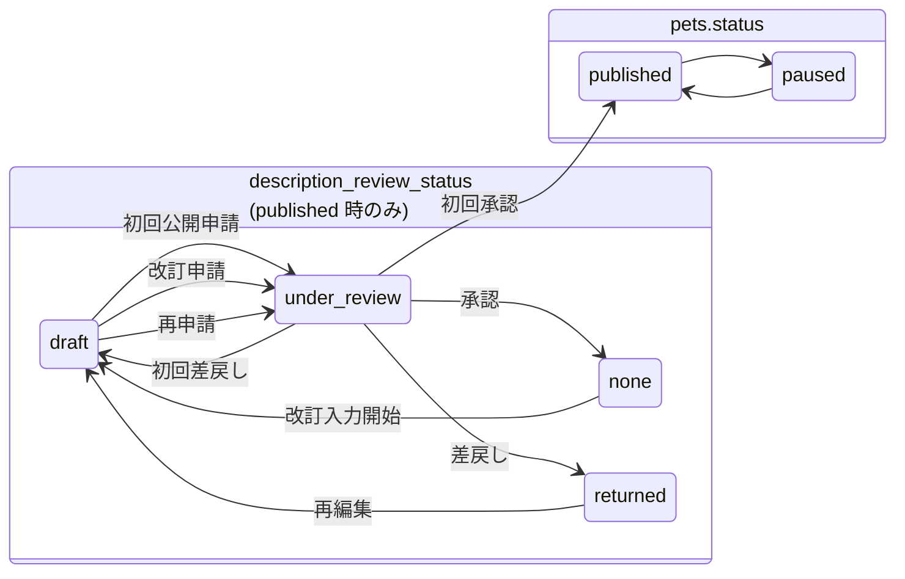
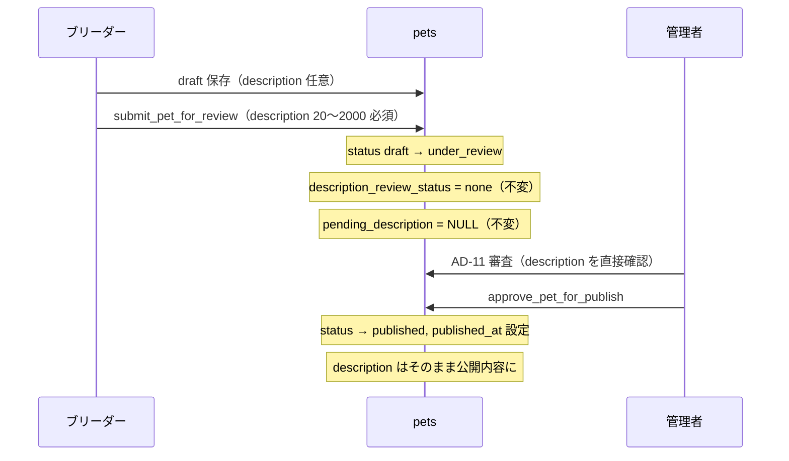
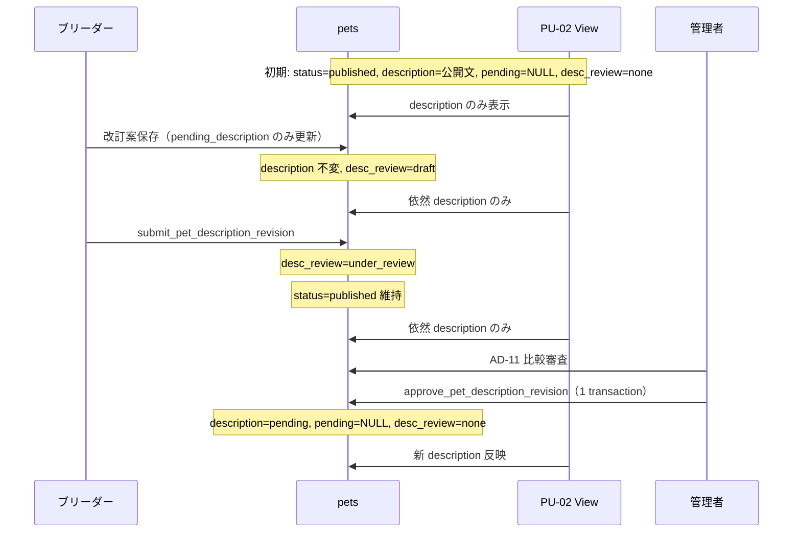
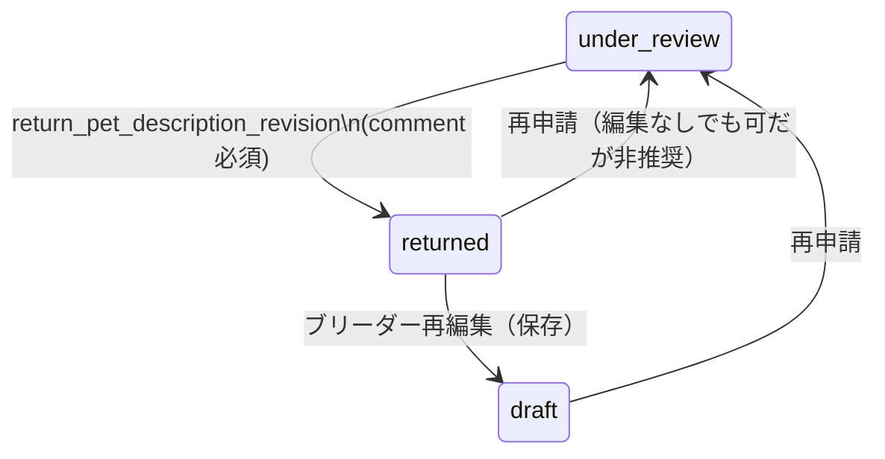
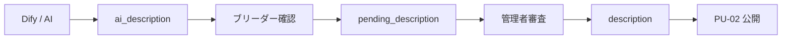

# 犬猫紹介文 公開後改訂審査 DB・業務フロー設計

| 項目     | 内容                                                         |
| -------- | ------------------------------------------------------------ |
| 作業日   | 2026-09-04                                                   |
| 種別     | **設計のみ**（コード / Migration / commit / push 変更なし）  |
| 基準 HEAD | `bef2be3`                                                   |
| 前提     | [BR-11 実装報告（STOP）](./2026-09-04_BR-11_犬猫紹介文description編集_実装報告.md) / [実装前調査](./2026-09-04_BR-11_犬猫紹介文description編集_実装前調査報告.md) |

---

## 1. 目的

公開済み（`published`）犬猫の **紹介文（`description`）改訂** を、掲載継続のまま管理者審査経由で行えるようにする DB・業務フローを設計する。

**第1期の制約:**

- revision テーブルによる本格バージョン管理は行わない
- `pets.pending_description` + `pets.description_review_status` の **最小 2 列追加** を第一候補とする
- `published → under_review` の **status 遷移は使用しない**（公開 View が `status = published` 必須のため）
- Migration は **今回作成しない**（設計案のみ）

---

## 2. 現行構造

### 2.1 `public.pets`（関連列）

| カラム            | 型          | 役割                         |
| ----------------- | ----------- | ---------------------------- |
| `description`     | `text` NULL | 公開紹介文（単一ソース）     |
| `ai_description`  | `text` NULL | AI 下書き（第1期未使用）     |
| `status`          | `text`      | 掲載ライフサイクル           |
| `published_at`    | timestamptz | 初回公開日時                 |

Migration: `20260804132200_update_pets_v1_1.sql`

### 2.2 status 遷移（trigger）

`20260810110000_extend_pets_status_trigger_for_admin.sql`:

| 主体    | 許可遷移                                      |
| ------- | --------------------------------------------- |
| breeder | `draft` → `under_review`                      |
| admin   | `under_review` → `published` / `draft`        |

`published → under_review` **未許可**。設計正本 `docs/05_データベース設計/pets.md` も再審査遷移なし。

### 2.3 RPC

| RPC                      | 用途                                   |
| ------------------------ | -------------------------------------- |
| `submit_pet_for_review`  | `draft` → `under_review` + log submitted |
| `approve_pet_for_publish`| `under_review` → `published` + log approved |
| `return_pet_review`      | `under_review` → `draft` + log returned（`published_at IS NOT NULL` 拒否） |

### 2.4 RLS

`20260807120000_harden_pets_rls.sql`:

- `pets_update_breeder_own` — 本人行を **status 問わず UPDATE 可**
- status 制限は trigger のみ。**description 直接 UPDATE も現状可能**（問題点）

### 2.5 公開 View

| View                           | description | 条件                |
| ------------------------------ | ----------- | ------------------- |
| `published_pets_public`        | **含まない** | `status = published` |
| `published_pet_detail_public`  | **`p.description`** | 同上          |

Migration: `20260814120000_*`, `20260814130000_*`

### 2.6 審査ログ

`pet_review_logs` — action: `submitted` / `returned` / `approved`（初回掲載審査専用）

### 2.7 管理画面

| 画面  | 現状取得条件                          |
| ----- | ------------------------------------- |
| AD-10 | `pets.status = 'under_review'`        |
| AD-11 | 同上。`description` 単一表示          |
| BR-11 | description 入力 UI **なし**          |

---

## 3. 問題点

| # | 問題 | 影響 |
| - | ---- | ---- |
| 1 | `description` が単一列 | 公開中と審査待ちを同時保持不可 |
| 2 | 公開 View が `description` 直参照 | UPDATE 即 PU-02 反映 |
| 3 | `published → under_review` 不可 | status ベース再審査不可 |
| 4 | RLS で breeder が `description` 直接 UPDATE 可 | UI 制限だけでは DB 迂回可能 |
| 5 | `pending_description` 列なし | 改訂ステージング不可 |
| 6 | 改訂審査状態列なし | 編集中 / 審査待ち / 差戻し区別不可 |

---

## 4. 採用候補

### 案1（推奨）: `pending_description` + `description_review_status`

| 列                         | 意味                                           |
| -------------------------- | ---------------------------------------------- |
| `description`              | 承認済み・公開可                               |
| `pending_description`      | 改訂案（審査対象）                             |
| `description_review_status`| 改訂審査のサブ状態（`pets.status` とは独立） |

`pets.status` は `published` のまま維持。

### 案2: `pet_description_revisions` テーブル

履歴・複数版・将来 AI 連携に強いが、第1期 3〜4 か月方針に対し **過剰**（§21 詳述）。

**本設計は案1を第一候補として詳細化する。**

---

## 5. DB設計

### 5.1 新規列

#### `pending_description`

| 属性           | 値 |
| -------------- | -- |
| 型             | `text` |
| NULL           | YES（デフォルト `NULL`） |
| CHECK（長さ）  | `pending_description IS NULL OR char_length(pending_description) <= 2000` |
| 意味           | ブリーダーが入力した **未承認の改訂案** |
| 更新者         | breeder（保存 RPC / 制限付き UPDATE）、admin（承認 RPC で NULL 化） |
| Public View    | **含めない** |
| 初回掲載時     | **常に NULL**（不使用） |

#### `description_review_status`

| 属性           | 値 |
| -------------- | -- |
| 型             | `text` |
| NULL           | NOT NULL |
| default        | `'none'` |
| CHECK          | `description_review_status IN ('none', 'draft', 'under_review', 'returned')` |
| 意味           | 紹介文 **改訂審査** の状態（`pets.status` とは別軸） |
| 更新者         | breeder（保存・申請 RPC）、admin（承認・差戻し RPC） |
| Public View    | **含めない** |

### 5.2 列間不変条件（CHECK / trigger で担保）

```text
-- status が published 以外のとき
description_review_status = 'none'
AND pending_description IS NULL

-- description_review_status = 'none' のとき（全 status）
pending_description IS NULL

-- description_review_status IN ('under_review', 'returned') のとき
status = 'published'
AND pending_description IS NOT NULL
AND btrim(pending_description) <> ''

-- description_review_status = 'under_review' のとき
status = 'published'   -- 初回 under_review とは別概念
```

`draft`（改訂編集中）のときは `pending_description` が NULL でも可（保存前）だが、**申請時**は非 NULL 必須。

### 5.3 既存列の再定義

| 列            | 再定義後の意味 |
| ------------- | -------------- |
| `description` | 管理者承認済み・**現在公開してよい**紹介文 |
| `status`      | 掲載ライフサイクル（改訂審査では **原則変更しない**） |

---

## 6. status 設計

### 6.1 2 軸の責務分離



| 軸 | 対象 | 値 |
| -- | ---- | -- |
| `pets.status` | 犬猫全体の掲載状態 | `draft` / `under_review` / `published` / … |
| `description_review_status` | **公開後**の紹介文改訂のみ | `none` / `draft` / `under_review` / `returned` |

**命名注意:** 両方に `under_review` があるが **意味が異なる**。

- `pets.status = under_review` → 初回掲載審査（犬猫全体）
- `description_review_status = under_review` → 紹介文改訂審査（`pets.status = published` 前提）

UI では `pets.status` Badge と改訂 Badge を **別表示** する（BR-11 §10）。

### 6.2 `description_review_status` 各値

| 値            | 意味 | `pending_description` | ブリーダー操作 |
| ------------- | ---- | --------------------- | -------------- |
| `none`        | 改訂なし | NULL              | 改訂入力開始可 |
| `draft`       | 改訂編集中 | 任意（NULL 可）   | 保存・申請可   |
| `under_review`| 改訂審査待ち | 必須            | 編集不可（閲覧のみ） |
| `returned`    | 改訂差戻し | **保持**（第一候補） | 再編集・再申請可 |

**`draft` vs 編集途中:** `pending_description` のみでは「未保存の空」と「保存済み下書き」を区別しにくいが、第1期は **`description_review_status = draft`** で「改訂ワークフロー中（未申請）」とする。未入力なら `none` のままでよい。

---

## 7. 初回掲載フロー

**既存フローを極力維持。`pending_description` は不使用。**



### 7.1 現行 RPC / trigger / View との整合

| 要素 | 整合性 |
| ---- | ------ |
| `submit_pet_for_review` | **拡張のみ** — RPC 内で `description` 20〜2000 文字 validation 追加。status 遷移は現状維持 |
| `approve_pet_for_publish` | **変更不要** — `under_review` → `published`。`description` をそのまま公開 |
| `return_pet_review` | **変更不要** — 初回差戻しのみ |
| status trigger | **変更不要** |
| `published_pet_detail_public` | **変更不要** — 承認後 `description` が公開 |
| AD-10 / AD-11（初回） | **現状どおり** — `status = under_review` |

**結論: 初回掲載は `description` 直審査で現行設計と完全整合。新列は `none` / NULL のまま触らない。**

---

## 8. 公開後改訂フロー



### 8.1 公開中データ保護

| タイミング | PU-01 | PU-02 | 根拠 |
| ---------- | ----- | ----- | ---- |
| 改訂保存後 | 掲載継続 | **旧 `description`** | View は `description` のみ、`status=published` 維持 |
| 改訂審査中 | 同上 | **旧 `description`** | `pending_description` は View 非含有 |
| 承認後 | 同上 | **新 `description`** | 原子的 UPDATE |

**未審査 `pending_description` が Public に出ないこと**は、View 定義不変 + 列非含有で担保（§15）。

---

## 9. 差戻しフロー

### 9.1 採用方針（第一候補）

**`pending_description` を保持し、ブリーダーが修正できる方式**（ユーザー第一候補と一致）。



| 項目 | 値 |
| ---- | -- |
| `description` | **変更しない**（公開中内容維持） |
| `pending_description` | **保持**（差戻し対象の改訂案） |
| `description_review_status` | `returned` |
| 差戻し理由 | `pet_review_logs.comment`（新 action、§16） |
| ブリーダー BR-11 | 差戻し理由表示 + 改訂案 textarea 編集可 + 再申請 |

### 9.2 代替案（第1期非推奨）

差戻し時に `pending_description = NULL` → ブリーダー再入力。

| 比較 | 保持方式 | NULL クリア方式 |
| ---- | -------- | --------------- |
| ブリーダー UX | 差戻し箇所をベースに修正可能 | 全文再入力 |
| AD-11 再審査 | 前回案との diff 継続可能 | 毎回新規 |
| 実装 | シンプル | やや簡単 |

**第1期は保持方式を推奨。**

### 9.3 差戻し後の `description_review_status` 遷移

再編集保存時: `returned` → `draft`（または `returned` のまま保存も可だが、`draft` に戻す方が状態機械が明確）。

再申請時: → `under_review`。

---

## 10. BR-11

### 10.1 表示仕様

| `pets.status` | `description_review_status` | UI |
| ------------- | --------------------------- | -- |
| `draft` | `none` | **紹介文 textarea**（`description`）。保存任意、max 2000 |
| `under_review` | `none` | **紹介文 read-only**（`description`）。編集不可 |
| `published` | `none` | **現在公開中**（read-only）+ **変更案 textarea**（`pending_description`） |
| `published` | `draft` | 同上。変更案編集可 |
| `published` | `under_review` | 現在公開中 + 審査中変更案（read-only）+ Badge「紹介文変更審査中」 |
| `published` | `returned` | 現在公開中 + 差戻し変更案（編集可）+ 差戻し理由 + 再申請ボタン |

**初回 `draft` では `pending_description` を表示・使用しない。**

### 10.2 ボタン

| 状態 | ボタン |
| ---- | ------ |
| `draft` | 「変更を保存」（既存）+ 「公開申請」（既存、description 必須化） |
| `published` + `none`/`draft`/`returned` | 「変更案を保存」+ 「紹介文変更を申請」 |
| `published` + `under_review` | 申請ボタン非表示 |

### 10.3 既存 BR-11 との実現可能性

**可能。** `PetDraftFormFields` / `pet-edit-form` を status + `description_review_status` で分岐。新コンポーネント `PetDescriptionRevisionSection` を追加する程度。大規模 UI 変更は不要。

### 10.4 BR-08

共有 `PetDraftFormFields` に `description` を追加すれば BR-08 にも表示される。**Step 追加は不要。** 新規登録時 description 空でも draft 保存可（既存仕様）。

---

## 11. AD-10

### 11.1 方針: **同一 AD-10 一覧に統合（案 A）**

別一覧（案 B）は第1期では画面増加のため **非推奨**。

### 11.2 取得条件（拡張）

```sql
WHERE deleted_at IS NULL
  AND (
    status = 'under_review'                                    -- 初回掲載
    OR (status = 'published' AND description_review_status = 'under_review')  -- 紹介文変更
  )
```

### 11.3 表示列追加

| 列 | 値 |
| -- | -- |
| 審査種別 | `新規掲載`（`status = under_review`）/ `紹介文変更`（`published` + desc review under_review） |
| 申請日時 | 初回: 最新 `action = 'submitted'` / 改訂: 最新 `action = 'description_submitted'` |

ソート: 申請日時昇順（Decision No.106 準拠。種別混在でも FIFO）。

### 11.4 実装影響

`listUnderReviewPetsForAdmin()` を拡張 + `getLatestSubmittedAtByPetIds` を action 種別対応。AD-10 コンポーネントに審査種別 Badge 追加。**新画面不要。**

---

## 12. AD-11

### 12.1 方針: **同一 AD-11 を審査種別で分岐拡張**

URL は `/admin/pets/reviews/[petId]` のまま。

### 12.2 初回掲載審査（現状維持）

- 前提: `status = under_review`
- 紹介文: `description` 単一表示
- 操作: `approve_pet_for_publish` / `return_pet_review`

### 12.3 紹介文変更審査（新規モード）

- 前提: `status = published` AND `description_review_status = under_review`
- 表示:

```text
現在公開中の紹介文
------------------
{description}

変更後の紹介文
------------------
{pending_description}
```

- 操作: `approve_pet_description_revision` / `return_pet_description_revision`
- 犬猫基本情報・写真は read-only 参照（変更対象外）
- 審査履歴: 初回 + 改訂ログを時系列表示

### 12.4 拡張可能性

`admin-pet-review-detail.tsx` はセクション構造済み。**比較 UI 追加 + AdminPetReviewActions 分岐**で実現可能。新画面不要。

---

## 13. RPC

### 13.1 方針

既存 3 RPC（初回掲載）を **そのまま維持**し、改訂審査用に **新規 3 RPC を追加**。既存 RPC への条件分岐追加は複雑化・回帰リスクのため **非推奨**。

### 13.2 既存 RPC 拡張（最小）

| RPC | 変更 |
| --- | ---- |
| `submit_pet_for_review` | `description` validation（trim 20〜2000）追加のみ |

### 13.3 新規 RPC

#### `save_pet_description_revision_draft(p_pet_id, p_pending_description)`

| 項目 | 内容 |
| ---- | ---- |
| 主体 | breeder |
| 前提 | `status = 'published'`, `description_review_status IN ('none', 'draft', 'returned')` |
| 処理 | `pending_description` 更新（空白のみ → NULL 扱いは **申請時**のみ。下書きは NULL 可）、`description_review_status = 'draft'`（`none` から遷移） |
| **禁止** | `description` 変更 |
| validation | max 2000 |

#### `submit_pet_description_revision(p_pet_id)`

| 項目 | 内容 |
| ---- | ---- |
| 主体 | breeder |
| 前提 | `status = 'published'`, `description_review_status IN ('draft', 'returned')` |
| validation | `pending_description` trim 20〜2000、同一文章拒否（§17） |
| 処理 | `description_review_status = 'under_review'` + log `description_submitted` |
| **禁止** | `description` / `status` 変更 |

#### `approve_pet_description_revision(p_pet_id)`

| 項目 | 内容 |
| ---- | ---- |
| 主体 | admin |
| 前提 | `status = 'published'`, `description_review_status = 'under_review'`, `pending_description IS NOT NULL` |
| 処理（**1 transaction**） | ① session flag 設定 ② `description = pending_description` ③ `pending_description = NULL` ④ `description_review_status = 'none'` ⑤ log `description_approved` |
| ブリーダー再検証 | Decision No.107 相当（任意だが推奨） |

#### `return_pet_description_revision(p_pet_id, p_comment)`

| 項目 | 内容 |
| ---- | ---- |
| 主体 | admin |
| 前提 | 同上 |
| 処理 | `description_review_status = 'returned'`、`pending_description` **保持**、log `description_returned`（comment 必須） |
| **禁止** | `description` 変更 |

### 13.4 原子的承認（必須）

```sql
-- 疑似コード（設計案）
BEGIN;
  PERFORM set_config('app.allow_published_description_update', 'true', true);
  UPDATE pets SET
    description = pending_description,
    pending_description = NULL,
    description_review_status = 'none',
    updated_by = auth.uid(),
    updated_at = now()
  WHERE id = p_pet_id
    AND status = 'published'
    AND description_review_status = 'under_review'
    AND pending_description IS NOT NULL;
  INSERT INTO pet_review_logs (... 'description_approved' ...);
COMMIT;
```

---

## 14. RLS / trigger

### 14.1 問題の再確認

`pets_update_breeder_own` により breeder は **published 行の `description` を直接 UPDATE 可能**。アプリ UI だけでは不十分。

### 14.2 推奨方式: **BEFORE UPDATE trigger + RPC session flag**

Supabase / PostgreSQL / 現行構成（status trigger 既存）に **最も自然**。

| 方式 | 評価 |
| ---- | ---- |
| trigger + session flag | **推奨** — 既存 `enforce_pets_status_transition` と同パターン |
| RPC 経由のみ（RLS 変更なし） | 不十分 — PostgREST 直接 UPDATE を防げない |
| column-level privilege | Supabase PostgREST との相性が悪い。RLS 主体の設計と不一致 |
| RLS 式で列制限 | PostgreSQL RLS は列単位制御不可 |

### 14.3 trigger 設計案: `enforce_pets_description_update`

```sql
-- 設計案（疑似）
IF OLD.status = 'published' AND NEW.description IS DISTINCT FROM OLD.description THEN
  IF current_setting('app.allow_published_description_update', true) IS DISTINCT FROM 'true' THEN
    RAISE EXCEPTION 'cannot update description on published pet outside approval RPC';
  END IF;
END IF;

-- breeder による description_review_status 直接昇格禁止
IF NOT public.is_admin() THEN
  IF OLD.description_review_status IS DISTINCT FROM NEW.description_review_status THEN
    IF current_setting('app.allow_description_review_status_change', true) IS DISTINCT FROM 'true' THEN
      RAISE EXCEPTION 'description review status must be changed via RPC';
    END IF;
  END IF;
END IF;
```

各 RPC の冒頭で `set_config(..., true)`（transaction-local）を設定。

### 14.4 breeder が UPDATE 可能な列（published 時）

| 列 | 直接 UPDATE |
| -- | ----------- |
| `description` | **禁止**（trigger） |
| `pending_description` | **RPC 経由推奨**（下書き保存 RPC）。直接 UPDATE も trigger で `description` 以外かつ review_status 不変なら許可する案も可 |
| `description_review_status` | **RPC 経由のみ**（trigger） |
| その他（price 等） | 第1期: **別 Decision**（公開後の価格変更も再審査対象か）。本設計スコープ外 |

**第1期最小:** published 時の breeder UPDATE は **改訂 RPC 2 本に集約**し、汎用 `updatePetDraft` から `description` / `pending_description` / `description_review_status` を **分離**する。

### 14.5 admin

admin の `description` 直接 UPDATE も原則禁止（監査性）。承認は **RPC のみ**。

---

## 15. Public View

### 15.1 変更方針

**View 定義変更は不要**（`description` のみ SELECT 済み）。

### 15.2 テスト可能な要件

| ID | 要件 |
| -- | ---- |
| PV-1 | `published_pet_detail_public` の列一覧に `pending_description` **が含まれない** |
| PV-2 | `published_pets_public` に `pending_description` **が含まれない** |
| PV-3 | `description_review_status` が Public View / DTO **に含まれない** |
| PV-4 | `description_review_status = under_review` の pet でも PU-02 は **`description`（旧文）** を返す |
| PV-5 | 承認 RPC 完了後のみ PU-02 が新 `description` を返す |
| PV-6 | `public-repository.ts` / `PublicPetDetail` 型に pending 系フィールド **を追加しない** |

### 15.3 anon / authenticated の pets 直 SELECT

`published_pets_public` 経由が正。authenticated の `pets_select_public_published` も `status = published` のみ — `pending_description` は行に存在するが **View 経由アクセスを強制**すれば Public UI には出ない。防御深層化として View 非含有を正とする。

---

## 16. pet_review_logs

### 16.1 既存ログの利用評価

**利用可能（action 拡張）。** 新テーブル不要。

| 観点 | 評価 |
| ---- | ---- |
| action CHECK | **拡張必要** — 3 値追加 |
| comment | 差戻し理由に **そのまま利用可** |
| pet_id / actor / timestamp | そのまま |
| 追記のみ | そのまま |
| AD-10 申請日時 | 新 action の最新 `created_at` を使用 |

### 16.2 追加 action（案）

| action | 主体 | comment |
| ------ | ---- | ------- |
| `description_submitted` | breeder | NULL 可 |
| `description_approved` | admin | NULL 可（第1期） |
| `description_returned` | admin | **必須** |

CHECK 拡張:

```sql
action IN (
  'submitted', 'returned', 'approved',
  'description_submitted', 'description_returned', 'description_approved'
)
```

`description_returned` 時 comment 必須 CHECK を追加。

### 16.3 RLS 拡張

| ポリシー | 拡張 |
| -------- | ---- |
| `pet_review_logs_insert_submitted_breeder` | `action IN ('submitted', 'description_submitted')` |
| `pet_review_logs_insert_admin_review` | `action IN ('returned', 'approved', 'description_returned', 'description_approved')` |

**ログ本文に `pending_description` は保存しない**（第1期）。承認後の `description` のみが公開文。差戻し時の内容は `pets.pending_description` が正。将来 revision 表導入時にログへスナップショット追加を検討。

### 16.4 初回 vs 改訂の履歴区別

AD-11 審査履歴テーブルで `action` 表示名をマッピング:

| action | 表示 |
| ------ | ---- |
| `submitted` | 公開申請 |
| `approved` | 公開承認 |
| `returned` | 差戻し |
| `description_submitted` | 紹介文変更申請 |
| `description_approved` | 紹介文変更承認 |
| `description_returned` | 紹介文変更差戻し |

---

## 17. Validation

### 17.1 保存時（draft / 改訂下書き）

| ルール | 初回（`description`） | 改訂（`pending_description`） |
| ------ | ----------------------- | ------------------------------- |
| 必須 | 任意 | 任意（下書き） |
| 最大 | 2000 | 2000 |
| 空白のみ | NULL 保存 | NULL 可（下書き）。申請時は NG |
| 最小 | なし | なし（申請時のみ 20） |

### 17.2 公開申請（初回）

`submit_pet_for_review` — `description` trim 後 **20〜2000 必須**。

エラー例: 「紹介文を20文字以上入力してください。」

### 17.3 公開後変更申請

`submit_pet_description_revision` — `pending_description` trim 後 **20〜2000 必須**。

### 17.4 同一文章拒否（推奨）

```text
btrim(pending_description) = btrim(description)
→ 申請拒否
```

エラー: 「現在公開中の紹介文と変更がありません。」

**採用推奨。** 無意味な審査キュー増加を防ぐ。DB CHECK には入れず RPC / アプリ validation で十分。

### 17.5 2001 文字以上

保存・申請ともに validation error。

---

## 18. AI将来対応



| 項目 | 評価 |
| ---- | ---- |
| フロー適合 | **可能** — AI 出力 → `ai_description`、ブリーダー承認で `pending_description` へコピー → 既存改訂審査 |
| 第1期 | Dify 未実装。`ai_description` / `ai_generated_at` は **触らない** |
| 案1 vs 案2 | 案1でも第2期 AI 連携可能。複数 AI 案比較が必要になったら revision 表へ移行 |

---

## 19. Migration案

**今回は作成しない。** 将来 1 本（または 2 本）の Migration に集約する設計案。

### 19.1 変更一覧

| 種別 | 内容 |
| ---- | ---- |
| **column** | `ALTER TABLE pets ADD COLUMN pending_description text NULL` |
| **column** | `ALTER TABLE pets ADD COLUMN description_review_status text NOT NULL DEFAULT 'none'` |
| **CHECK** | `description_review_status` 許可値 |
| **CHECK** | `pending_description` 長さ <= 2000 |
| **CHECK** | 列間不変条件（§5.2） |
| **trigger** | `enforce_pets_description_update`（published description 保護 + review_status 保護） |
| **RPC** | `save_pet_description_revision_draft` |
| **RPC** | `submit_pet_description_revision` |
| **RPC** | `approve_pet_description_revision` |
| **RPC** | `return_pet_description_revision` |
| **RPC 拡張** | `submit_pet_for_review` — description validation |
| **log** | `pet_review_logs` action CHECK 拡展 + RLS 拡展 + returned comment CHECK 拡展 |
| **View** | **変更不要**（pending 非含有を維持） |

### 19.2 疑似 DDL（設計案・確定実装ではない）

```sql
-- 設計案のみ
ALTER TABLE public.pets
  ADD COLUMN IF NOT EXISTS pending_description text,
  ADD COLUMN IF NOT EXISTS description_review_status text NOT NULL DEFAULT 'none';

ALTER TABLE public.pets
  ADD CONSTRAINT pets_description_review_status_check
    CHECK (description_review_status IN ('none', 'draft', 'under_review', 'returned'));

ALTER TABLE public.pets
  ADD CONSTRAINT pets_pending_description_length_check
    CHECK (pending_description IS NULL OR char_length(pending_description) <= 2000);

-- 列間不変条件は CONSTRAINT または trigger で実装
```

### 19.3 適用順序（参考）

1. 列追加 + CHECK
2. description 保護 trigger
3. pet_review_logs 拡張
4. 新 RPC 4 本 + submit 拡張
5. アプリ層（BR-11 / AD-10 / AD-11 / validation / tests）

---

## 20. テスト計画

| CASE | 内容 | 層 |
| ---- | ---- | -- |
| A | draft description 保存 | service / integration |
| B | 初回公開申請（description 必須） | RPC |
| C | 初回承認 → published | RPC |
| D | published 改訂保存 → **description 維持** | RPC + DB assert |
| E | pending_description 保存 | RPC |
| F | 変更審査申請 → desc_review=under_review | RPC |
| G | 審査中 PU-02 **旧 description** | public-repository / View |
| H | 管理者承認 → description 切替 | RPC atomic |
| I | 承認後 pending NULL + desc_review=none | DB assert |
| J | 差戻し → returned + pending 保持 | RPC |
| K | 差戻し後再編集 | service |
| L | 再申請 | RPC |
| M | breeder による published **description 直接 UPDATE 拒否** | trigger / integration |
| N | 他ブリーダー pet 変更拒否 | RLS 既存 + RPC |
| O | pending_description Public View 非公開 | View column test |
| P | 同一文章申請拒否 | RPC validation |

**既存テスト再利用:** CASE N（ownership）、Public View 基盤、pet review RPC テスト harness。

---

## 21. revision table との比較

| 比較軸 | 案1: pending + review_status | 案2: pet_description_revisions |
| ------ | ---------------------------- | -------------------------------- |
| 実装量 | **S〜M** | M〜L |
| Migration 複雑度 | **低**（2 列 + trigger + RPC） | 中（新表 + FK + index + RLS） |
| RLS | pets trigger 中心 | 新表 RLS + pets 連携 |
| 管理画面 | AD-10/11 **拡張** | クエリ JOIN 追加 |
| 将来拡張 | 1 件 pending のみ | **複数版・履歴・diff** に強い |
| 履歴 | logs のみ（本文は pets 列） | **テーブルに全版保存** |
| 第1期 3〜4 か月 | **適合** | 過剰 |
| 保守性 | **シンプル** | 中長期は有利 |
| AI 連携 | 十分 | より自然 |

---

## 22. リスク

| リスク | 緩和 |
| ------ | ---- |
| `under_review` 名称衝突（status vs desc_review） | UI ラベル明確化、コード内型分離 |
| trigger / session flag 漏れ | RPC テスト + CASE M |
| AD-10 混在キュー肥大 | 審査種別 Badge + 同一 FIFO |
| 公開後 price 等の直接変更 | 別 Decision（本設計スコープ外） |
| `paused` 中の改訂 | 第1期は `published` のみ。paused は **未対応**（未決定事項） |
| ログに改訂本文なし | 差戻し・再審査は `pending_description` 参照。将来 revision 表 |

---

## 23. 未決定事項

| # | 項目 | 推奨 |
| - | ---- | ---- |
| 1 | `paused` 状態での紹介文改訂 | 第1期は **published のみ**。paused は再開時に検討 |
| 2 | 公開後 price / 写真変更の再審査 | 別 Decision |
| 3 | 改訂申請中の基本情報編集可否 | BR-11 既存フィールドは **published でも編集可とするか**要 Decision |
| 4 | `save_*_draft` を RPC 1 本 vs アプリ UPDATE | **RPC 推奨**（trigger 整合） |
| 5 | 承認時 Decision No.107 再検証 | **推奨**（ブリーダー資格失効時の扱い） |
| 6 | action 命名 `description_*` vs `desc_*` | **`description_*`**（可読性） |

---

## 24. 推奨案

**案1: `pending_description` + `description_review_status`**

理由:

1. 第1期要件（公開維持 + 再審査 + AD-11 比較）を **最小 Migration** で満たす
2. 公開 View **変更不要**
3. `pets.status` 設計を **壊さない**
4. 既存 `pet_review_logs` を **action 拡張**で再利用
5. AD-10 / AD-11 を **拡張**するだけで画面増なし
6. revision 表は第2期（AI 複数案・履歴要件）で検討

---

## 25. 結論

公開後紹介文改訂審査は、**`pending_description` + `description_review_status` + 新規 RPC 3〜4 本 + description 保護 trigger + pet_review_logs action 拡張** により、Migration 1 回程度で実装可能。

**初回掲載**は既存フロー（`description` 直審査、`pending` 不使用）と完全整合。

**公開後改訂**は `status = published` 維持のまま、PU-02 には常に **`description` のみ**表示。承認時に原子的切替。

次ステップ: DecisionLog 追記 → Migration 実装 → BR-11 / AD-10 / AD-11 / tests（[実装報告 STOP](./2026-09-04_BR-11_犬猫紹介文description編集_実装報告.md) の再開）。

---

## 関連

- [BR-11 実装報告（STOP）](./2026-09-04_BR-11_犬猫紹介文description編集_実装報告.md)
- [BR-11 実装前調査](./2026-09-04_BR-11_犬猫紹介文description編集_実装前調査報告.md)
- [pets テーブル](../05_データベース設計/pets.md)
- [pet_review_logs](../05_データベース設計/pet_review_logs.md)
- [AD-10](../04_画面設計/AD-10_犬猫掲載審査一覧.md) / [AD-11](../04_画面設計/AD-11_犬猫掲載審査詳細.md) / [BR-11](../04_画面設計/BR-11_犬猫情報編集.md)
